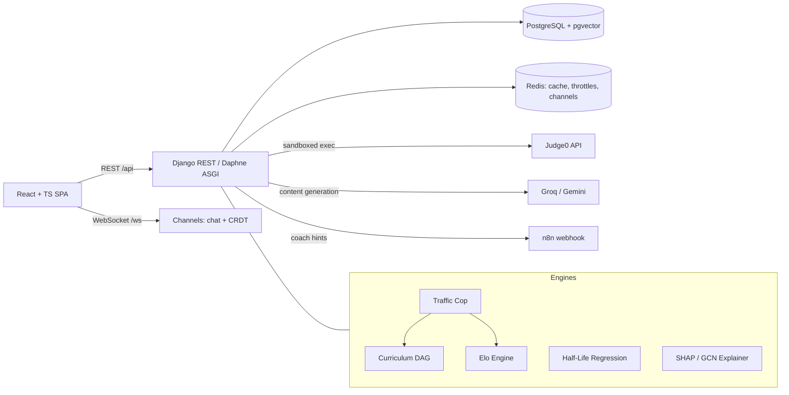

# SparkLM — Adaptive AI Learning Platform

[](https://github.com/Kurapati-Sai-Suhas/SparkLM/actions)

SparkLM is a full-stack learning platform whose core is an **adaptive competitive-programming Coding Hub**: instead of serving a static problem list, it models each student's skill (Elo), memory (spaced-repetition half-life), and curriculum position (prerequisite DAG), then routes them to the next problem that maximizes learning — and explains *why* it chose it.

Built with Django REST Framework + Channels (ASGI), React + TypeScript, and PostgreSQL.

---

## Why it's different

Platforms like LeetCode treat every user identically. SparkLM makes three bets:

1. **Routing should be earned by data.** A probabilistic *Traffic Cop* inspects the mean and variance of your last 20 submissions. Erratic or struggling? You get Elo-matched flat practice to rebuild confidence. Consistent? You advance through a prerequisite curriculum graph. Every decision is logged with its predicted success probability and closed out with the real outcome — and a retraining pipeline learns which engine actually works for which students.
2. **Grades should reflect engineering quality, not just correctness.** The Elo engine reads Judge0's execution telemetry: an O(n) solution under 60 ms earns a 1.5× rating multiplier; a memory-hungry brute force gets penalized. Re-solving an old problem earns exactly zero (anti-farming), while still refreshing your spaced-repetition schedule.
3. **Recommendations should explain themselves.** Every served problem ships with an explainability payload — a four-axis radar (time, space, logic, recency), the dominant factor (real SHAP attributions over a trained graph network when enabled), and a concrete coaching line: *"Your weakest area is Hash Table (55%) — practice hash-map lookups that replace nested loops."*

## Feature highlights

| Area | What's inside |
|---|---|
| **Adaptive routing** | Hybrid Traffic Cop (heuristic + trained outcome model), 19-node curriculum DAG with DB-enforced acyclicity, Elo-nearest problem selection, placeholder-content quarantine |
| **Skill modeling** | Elo with efficiency multipliers and anti-farming clamps, per-topic mastery (accuracy ≥ 80% over ≥ 3 reviews), inactivity decay with double-charge protection |
| **Memory modeling** | SM-2 style half-life regression `P(t) = 2^(−t/h)`, graph-decay cross-pollination (failing a foundation penalizes dependent topics) |
| **Explainability** | SHAP over a trained PyTorch-Geometric GCN (feature-flagged), torch-free heuristic fallback with identical schema, weak-topic coach recommendations |
| **Grading pipeline** | Judge0 sandbox, per-language harnesses (Python/Java/JavaScript generic + per-question wrappers), normalized output comparison, honest status mapping (TLE/compile/runtime) |
| **AI coach** | Escalating hints on consecutive failures: Socratic nudge (3) → pseudocode (5) → worked example (7+), via n8n/LLM webhook with resilient fallbacks |
| **Content pipeline** | 2,900+ problem bank maintained by quota-aware, idempotent LLM batch commands (generation, validation gates, multi-language starter code, backfill, restore) |
| **Collaboration** | JWT-authenticated WebSocket group chat, CRDT (Yjs) collaborative editor, study groups, quizzes, flashcards, document RAG, visual search |
| **Ops discipline** | 50-test offline suite (all third parties mocked, incl. threaded race tests), CI with a Postgres service container, scoped API throttling (incl. spoof-resistant auth brute-force brake), composite index catalog, monthly-partitioned submissions table with self-healing maintenance, row-locked learner-state transactions (race-free Elo/mastery updates), environment-driven config, tested backup/restore |

## Architecture



## Quickstart (local development)

**Prerequisites:** Python 3.12, Node 20, Docker Desktop.

```bash
# 1. Database
docker compose up -d          # Postgres (pgvector) on :5432

# 2. Backend
cd backend
python -m venv .venv && .venv/Scripts/activate    # Windows (source .venv/bin/activate on Unix)
pip install -r requirements.txt
cd LearnLM
# create .env with your API keys (see table below)
python manage.py migrate
python manage.py seed_dsa_dag # build the curriculum graph
python manage.py createsuperuser
python manage.py runserver    # or: daphne LearnLM.asgi:application

# 3. Frontend (new terminal)
cd studysphere-ai-11
npm install
npm run dev                   # http://localhost:5173
```

### Environment variables

| Variable | Required | Purpose |
|---|---|---|
| `SECRET_KEY` | prod | Django/JWT signing (startup refuses the dev fallback in production) |
| `DJANGO_DEBUG`, `DJANGO_ALLOWED_HOSTS` | prod | `false` + real hosts in production |
| `POSTGRES_DB/USER/PASSWORD/HOST/PORT` | — | Defaults match the Docker compose file |
| `REDIS_URL` | prod | Shared cache, throttle store, and channel layer (multi-instance) |
| `JUDGE0_API_KEY`, `JUDGE0_API_HOST` | yes | Code execution (RapidAPI) |
| `GROQ_API_KEY`, `GEMINI_API_KEY` | yes | Content generation and AI study tools |
| `N8N_WEBHOOK_URL` | optional | LLM coach hints (fallback hints without it) |
| `ENABLE_SHAP_XAI` | optional | Real SHAP attributions (needs the heavy ML extras) |
| `VITE_API_URL`, `VITE_WS_URL` | frontend | Backend origins at build time |

## Content pipeline

The problem bank is maintained by idempotent management commands — all dry-run-friendly, all resume automatically after the daily LLM quota:

| Command | Purpose |
|---|---|
| `seed_dsa_dag` | (Re)build the curriculum DAG over existing topics — never cascades into question data |
| `reseed_questions --topic "Tree" --delay 2` | Generate full content + test cases + 4-language starter code for placeholder questions |
| `backfill_boilerplate` | Add missing language stubs to already-seeded questions (~5× cheaper than regeneration) |
| `restore_questions` | Re-import missing rows for named topics from the canonical CSV |
| `cleanup_question_bank --apply` | Remove junk topics with their questions (dry-run by default) |
| `calculate_decay` | Checkpointed inactivity Elo decay sweep |
| `retrain_ai` | Retrain the routing classifier on real recommendation outcomes (≥100 required) |
| `ensure_submission_partitions` | Keep monthly partitions of the submissions table ahead of the calendar; relocates any rows stranded in the DEFAULT partition (idempotent, run monthly) |

## Testing

```bash
cd backend/LearnLM
python -m pytest groups common # 50 tests, fully offline (Judge0 + LLMs mocked)
```

The suite covers routing telemetry and thresholds, mastery rules, grading statuses, the anti-farming guard, coach escalation, XAI schema guarantees, cache invalidation (including queryset deletes), every content-ops command, and the physical schema itself (partition routing, index catalog, partition maintenance). CI runs it against a real Postgres service container on every push. After pulling schema changes, refresh your local test database once with `--create-db` (the default `--reuse-db` keeps the old schema).

## Deployment

Everything is configuration, not code: set the environment variables above and deploy. Reference zero-cost stack: **Neon** (Postgres) + **Upstash** (Redis) + **Render** (Daphne web service) + **Vercel** (SPA). Note: the optional ML extras (torch, shap, transformers) add ~2 GB — deploy with `ENABLE_SHAP_XAI=false` on small instances; the heuristic explainer keeps the identical response schema.

A full Software Requirements Specification (25 pages: requirements, algorithms, data model, future scope, architecture roadmap) lives in [`docs/SparkLM_SRS.docx`](docs/SparkLM_SRS.docx).

## Roadmap

- **Review Queue** — a daily "due for review" list computed from each topic's memory half-life (the spaced-repetition payoff)
- Elo-matched 1v1 duels; post-solve LLM code review feeding the IRT latents
- Router prediction-accuracy dashboard on the existing recommendation/outcome logs
- Async grading queue (Celery) with per-test-case progress over WebSockets
- Migration off the deprecated `google-generativeai` SDK; generated-question verification harness

## Author

**Kurapati Sai Suhas** — [GitHub](https://github.com/Kurapati-Sai-Suhas) · [LinkedIn](https://www.linkedin.com/in/sai-suhas-kurapati-52b1482bb/)
