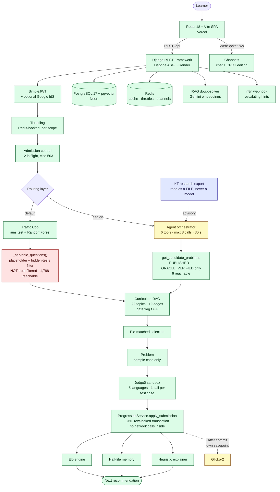
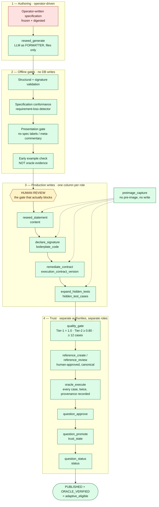

# SparkLM — Adaptive AI Learning Platform

[](https://github.com/Kurapati-Sai-Suhas/SparkLM/actions)
[](https://spark-lm-3y3e.vercel.app)

SparkLM is an adaptive coding-practice platform: it models a student's skill (Elo, weighted by runtime/memory efficiency) and memory (a spaced-repetition half-life curve), then routes them through a prerequisite curriculum DAG using a hybrid statistical/ML engine — a Wald–Wolfowitz runs-test streakiness check backing a RandomForest classifier — rather than a static problem list. Code runs in a sandboxed Judge0 pipeline across 5 languages; every recommendation ships with an explainability payload — a four-axis breakdown, the dominant factor, and a coaching line. Built on Django REST Framework + Channels, React/TypeScript, and PostgreSQL with pgvector, covered by a ~3,400-test suite that mocks every third party (Judge0, Groq, Gemini) for a fully offline CI run.

**The current engineering focus is not the adaptive engine — it is the evidence the engine learns from.** Milestone 2 / P2.7 exists because an adaptive system trained on unverified answer keys learns confidently wrong things. So the platform now carries an explicit **content-trust architecture**: a question lifecycle, a trust lifecycle, an approved-reference oracle, a mutation-tested hidden-test quality gate, and column-scoped database roles so that no single credential can both change a question and declare it verified. Today **6 of 2,926 questions are `ORACLE_VERIFIED`**, and only verified questions may teach the learner model. Everything else is served, graded, and deliberately ignored by the adaptive layer.

---

## Why it's different

Platforms like LeetCode treat every user identically. SparkLM makes three bets:

1. **Routing should be earned by data.** A probabilistic *Traffic Cop* inspects the mean and the streakiness (Wald–Wolfowitz runs test) of your last 20 submissions. Oscillating pass/fail or struggling? You get Elo-matched flat practice to rebuild confidence. Consistent — or breaking through after a failure streak? You advance through a prerequisite curriculum graph. Every decision is logged with its predicted success probability and closed out with the real outcome — and a retraining pipeline learns which engine actually works for which students.
2. **Grades should reflect engineering quality, not just correctness.** The Elo engine reads Judge0's execution telemetry: an O(n) solution under 60 ms earns a 1.5× rating multiplier; a memory-hungry brute force gets penalized. Re-solving an old problem earns exactly zero (anti-farming), while still refreshing your spaced-repetition schedule.
3. **Recommendations should explain themselves.** Every served problem ships with an explainability payload — a four-axis radar (time, space, logic, recency), the dominant factor, and a concrete coaching line: *"Your weakest area is Hash Table (55%) — practice hash-map lookups that replace nested loops."* This is a deterministic heuristic over the learner's own feature tensor. A SHAP-over-GCN branch used to sit in front of it and was removed in M1/P1.1 — see feature 7.

## Feature highlights

| Area | What's inside |
|---|---|
| **Adaptive routing** | Hybrid Traffic Cop (heuristic + trained outcome model), curriculum DAG over 22 topics with DB-enforced acyclicity (17 topics carry edges, 19 edges total), Elo-nearest problem selection, placeholder-content quarantine |
| **Skill modeling** | Elo with efficiency multipliers and anti-farming clamps, per-topic mastery (accuracy ≥ 80% over ≥ 3 reviews), inactivity decay with double-charge protection |
| **Memory modeling** | SM-2 style half-life regression `P(t) = 2^(−t/h)`, graph-decay cross-pollination (failing a foundation penalizes dependent topics), **Review Queue**: practiced topics ranked by predicted recall with due-for-review flags and effective mastery (skill × retention) |
| **Explainability** | Deterministic four-axis attribution over the learner feature tensor, dominant-factor selection, weak-topic coach recommendations. Torch-free and always on — the SHAP/GCN branch was deleted in M1/P1.1 |
| **Grading pipeline** | Judge0 sandbox, per-language harnesses (Python/Java/JavaScript generic + per-question wrappers), normalized output comparison, honest status mapping (TLE/compile/runtime) |
| **AI coach** | Escalating hints on consecutive failures: Socratic nudge (3) → pseudocode (5) → worked example (7+), via n8n/LLM webhook with resilient fallbacks |
| **Content pipeline** | 2,900+ problem bank maintained by quota-aware, idempotent LLM batch commands (generation, validation gates, multi-language starter code, backfill, restore) |
| **Collaboration** | JWT-authenticated WebSocket group chat, CRDT (Yjs) collaborative editor, study groups, quizzes, document RAG, visual search |
| **Auth** | Google Sign-In (server-verified ID token, account linked by email) alongside password auth with enforced complexity (length + uppercase + number + symbol), case-insensitive unique username/email |
| **Content trust** *(current focus)* | Question lifecycle (DRAFT → PENDING_REVIEW → PUBLISHED), trust lifecycle (UNVERIFIED → ORACLE_VERIFIED), approved-reference oracle with two-agreeing-runs provenance, mutation-tested hidden-test quality gate, ten column-scoped Postgres roles, pre-image capture and rollback for every content write |
| **Ops discipline** | ~3,400-test offline suite (all third parties mocked, incl. threaded race tests), CI with a Postgres service container, scoped API throttling (incl. spoof-resistant auth brute-force brake), composite index catalog, monthly-partitioned submissions table with self-healing maintenance, row-locked learner-state transactions (race-free Elo/mastery updates), Sentry error tracking + per-request access log, environment-driven config, tested backup/restore |

## Architecture

Two diagrams, because there are two systems. The **request path** is what a
learner touches. The **content-trust pipeline** runs offline and decides what
the request path is allowed to serve.

### Request path



| | |
|---|---|
| 🟩 **LIVE** | Everything a learner touches today |
| 🟨 **SHADOW / FLAGGED** | `Glicko-2` writes real state that **nothing reads**. The `agent orchestrator` is wired and reachable but `AGENT_ORCHESTRATOR_ENABLED` defaults to `false` |
| 🟦 **RESEARCH** | The KT signal is read from an **offline file export**. No model runs in the request path |
| 🟥 **KNOWN GAP** | `_servable_questions()` filters on deliverability, not trust — 1,788 reachable, 6 verified. The agent path does **not** have this gap |

### Content-trust pipeline (offline)



**Every stage above has a working command and 6 questions have been through
all of them.** The red box is the bottleneck: only 5 operator specifications
exist in the repository, so the pipeline starves at its first step. That is
human authoring time, not compute.

---

## Content trust architecture (Milestone 2 / P2.7) — CURRENT

> **Read this first if you are touching question content.** The adaptive engine
> is only as good as the answer keys it grades against, and most of this
> repository's recent work is about establishing which questions are trustworthy
> rather than making the recommender cleverer.

### The pipeline

Diagrammed above under [Architecture](#content-trust-pipeline-offline).
Four authorities in sequence, each writing exactly one column, with a
human review gate between generation and any production write. The
sections below define each lifecycle it moves a question through.


### Question lifecycle — CURRENT

`DRAFT → PENDING_REVIEW → PUBLISHED` (plus `BLOCKED`), written only by
`question_status`. A database CHECK constraint forbids `DRAFT` +
`ORACLE_VERIFIED`; the rest is enforced procedurally by that single writer.

### Trust lifecycle — CURRENT

`UNVERIFIED → ORACLE_VERIFIED`, written only by `question_promote`. Status and
trust have **different writers and different database roles on purpose**: a
role that could set both could publish a question *and* declare it verified,
which is the separation this milestone exists to create.

### Reference-solution lifecycle — CURRENT

`DRAFT → IN_REVIEW → APPROVED` (or `REJECTED`), plus a separate `is_active`
flag. A reference is **canonical** when it is approved, active, and its
approval provenance is intact — and only a canonical reference may mint
answers. `ReferenceSolution.is_canonical` is what the oracle checks, and a
database constraint keeps `review_state`, `approved_by`, `approved_at` and
`source_hash` moving together.

### Hidden-test quality gate — CURRENT

`python manage.py quality_gate` scores a suite by **mutation testing**, not by
counting cases:

| Requirement | Value |
|---|---|
| Tier-1 (misconception mutants) kill rate | **1.0** — every one must die |
| Tier-2 (mechanical mutants) effective kill rate | **≥ 0.80** |
| Minimum hidden tests | 12 (`hidden_tests.MIN_HIDDEN_TESTS`; a hard floor for `validate_suite`, advisory in the oracle pipeline) |
| `EQUIVALENT` exclusion | only with a written `equivalence_argument` |

An **equivalent-mutant canary** — a provably correct mutant — is included as a
validity control: if the canary is reported "killed", the harness itself is
broken. That check is what caught the Judge0 Python 3.8 incident below.

### Oracle architecture — CURRENT

`oracle_execute` runs each hidden case against the canonical reference
**twice**; disagreement is `NONDETERMINISTIC` and fails — no majority vote, no
first-wins. Every run is recorded as an `OracleExecution`, including failures,
so a later reviewer can distinguish "we never tried" from "we tried and it
would not settle".

**Early example check ≠ full oracle verification.** A separate offline module
(`groups/reseed_example_check.py`) executes a *generated example* against an
unreviewed `REFERENCE_CANDIDATE` to catch obviously wrong examples before
anything is written. It is deliberately not evidence:

| | full oracle | early example check |
|---|---|---|
| reference | APPROVED, ACTIVE, provenance intact | `REFERENCE_CANDIDATE`, unreviewed |
| coverage | every hidden case | one example |
| determinism | two agreeing runs required | one run; not established |
| provenance | `OracleExecution` rows written | **nothing written, anywhere** |
| can support `ORACLE_VERIFIED` | yes | **no — nothing in the lifecycle** |

Its verdict strings (`EXAMPLE_PASS`, `EXAMPLE_WRONG_OUTPUT`, …) are tested to
collide with **no** lifecycle value, so an early result cannot be fed into
approval or promotion by mistake.

### Serving and adaptive boundary — CURRENT

Two different boundaries, often confused:

- **Serving** currently excludes only placeholder content and questions with
  no hidden tests. It is **not** gated on `PUBLISHED` — that decision was taken
  deliberately while the verified population is tiny. Both the recommender and
  the direct-id endpoints share one `_servable_questions()` definition.
- **Adaptive eligibility** *is* strict: `is_adaptive_eligible` requires
  `PUBLISHED` **and** `ORACLE_VERIFIED`.

`CodeSubmission.adaptive_eligible` is **frozen onto the row at submission
time** and never recomputed — so verifying a question later cannot
retroactively turn past evidence into trusted evidence.

### Reseed architecture — IN PROGRESS

1,137 questions still carry a templated placeholder instead of a statement.
The reseed pipeline replaces them, and its central design decision is that
**the LLM is a formatter, not a source of truth**:

`operator-verified specification` → `reseed_generate` (statement + signature,
one call, so prose and parameters cannot drift) → structural, conformance and
presentation gates → human review → `reseed_statement` → `declare_signature` →
`remediate_contract` → `expand_hidden_tests` → `quality_gate` →
`oracle_execute` → `question_approve` → `question_promote` → `question_status`.

**Why an operator specification at all?** A title-only generator was measured
at **3/5 semantically correct**: it produced "GCD of all elements" where the
question wanted "GCD of the smallest and largest", and widened "two adjacent
cells" to "any cell". A census of every local source (database, pre-M2 backup,
git history, the seed CSVs) found **no authoritative specification anywhere**,
and the canonical upstream is not accessible to automation. So specifications
are written by an operator, frozen, digested, and verified by a human before
anything is generated from them.

### Reseed safety architecture — CURRENT

| Mechanism | What it guarantees |
|---|---|
| **Pre-image capture** (`preimage_capture`) | Every content write is preceded by an immutable snapshot; `preimage_rollback` restores it. No pre-image, no write. |
| **`ReseedLedger`** | Orchestration state only — which stage to attempt next. Carries **no digest, no status, no trust_state**, and no trust or serving code imports it. A test asserts a lying ledger changes nothing. |
| **Ten column-scoped roles** | `learnlm_remediate_rw` writes `content`; `learnlm_boilerplate_rw` writes `boilerplate_code`; `learnlm_hidden_test_rw`, `learnlm_contract_rw`, `learnlm_oracle_rw`, `learnlm_approve_rw`, `learnlm_promote_rw`, `learnlm_status_rw`, `learnlm_preimage_rw`, plus read-only `learnlm_census_ro`. Each gate refuses an **over-granted** role, not just an under-granted one. |
| **`learnlm_reseed_rw`** | Coordinates the ledger and can write *nothing else* — no question column, no audit action. The coordinator is the least privileged participant. |
| **No `expected_output` writer** | `EXPECTED_OUTPUT_REPAIR` is a declared action class with **no command that writes it**, deliberately. Expected outputs come from the oracle or not at all. A test asserts no writer exists. |
| **No LLM hidden tests** | The reseed authoring step writes `content` and `boilerplate_code` only. Hidden tests are authored later, by a different authority, and bound against the declared signature. |
| **Append-only audit** | `RemediationAction` is append-only in the model *and* in the database — UPDATE/DELETE are forbidden to every role that appends to it. |

### Discoveries worth knowing — CURRENT

- **Judge0 Python runtime.** Execution was on Python 3.8.1 (`language_id 71`),
  which cannot parse PEP 585 generics (`list[list[str]]`) — 772 of 2,926
  starters used that syntax and could not run at all. Now **3.11.2
  (`language_id 92`)**, configurable via `JUDGE0_PYTHON_LANGUAGE_ID`. It was a
  *selection*, not an upgrade: 3.11 was already available on the same endpoint.
- **Generated examples can be wrong while every gate passes.** q2027 shipped
  `colors = "AABAA" → true`; the middle character is `B`, so the first player
  has no legal move and the answer is `false`. Structural, conformance and
  presentation validation all passed it. This is why the early example check
  exists — and why example *explanations* are still reviewed by a human.
- **Contract v1 cannot bind a single-container argument.** q1974 declares
  `findGreatestCommonDivisorOfArray(nums: list[int])`; the v1 generic harness
  sees a JSON list and splats it, calling the method with three arguments.
  Any reseeded question whose method takes a single list **needs contract v3**
  (which wraps arguments in a canonical envelope) before an example or a hidden
  test can execute.

### Verified pilot questions — CURRENT

| Question | Title | Status | Trust | Contract | Hidden tests | Adaptive-eligible |
|---|---|---|---|---|---|---|
| **q1436** | Destination City | `PUBLISHED` | `ORACLE_VERIFIED` | v3 | 13 | yes |
| **q1940** | Sum of Digits of String After Convert | `PUBLISHED` | `ORACLE_VERIFIED` | v1 | 15 | yes |
| **q1974** | Find Greatest Common Divisor of Array | `PUBLISHED` | `ORACLE_VERIFIED` | v3 | 14 | yes |
| **q2057** | Check Whether Two Strings are Almost Equivalent | `PUBLISHED` | `ORACLE_VERIFIED` | v1 | 16 | yes |
| **q2290** | Count Number of Ways to Place Houses | `PUBLISHED` | `ORACLE_VERIFIED` | v1 | 14 | yes |
| **q3309** | Find the Index of the First Occurrence in a String | `PUBLISHED` | `ORACLE_VERIFIED` | v3 | 12 | yes |

These six are the entire verified population: each walked the full lifecycle —
reference approval, suite expansion, quality gate, oracle, approval, promotion,
publication — and they exist to prove the path works end to end.

q3309 and q1436 were the first two (P2.7). The pilot four (q1940, q1974, q2057,
q2290) followed in P2.19. q3309 and q1436 then had their **entire hidden suites
rotated** in P2.20 after the originals were found in public git history — 25
cases replaced, zero exposed inputs surviving.

> **This is 6 of 2,926.** Separately, `_servable_questions()` filters on
> deliverability rather than trust, so **1,788 questions are reachable by a
> learner today**. Verdicts from the untrusted 1,782 are contained — they are
> frozen `adaptive_eligible = False` and can never teach the learner model — but
> they are still shown to learners. Closing that gap is content work, not code.

### Reseed status — IN PROGRESS, not started in production

| | |
|---|---|
| Architecture, migrations, generator | implemented; schema at migration `0051` |
| Five pilot specifications | **operator-verified**, digests frozen |
| Offline artifacts | generated and gated |
| Early example verifier | ready |
| Contract census | **complete** |
| **Bulk reseed (controlled slice)** | **BLOCKED — never run** |
| **Full-bank reseed** | **NOT STARTED** |
| Questions taken end-to-end through the lifecycle | **6** |
| Draft specifications awaiting operator review | **24** (16 drafted, 5 blank, 3 structurally blocked) |

**Why the bulk slice is blocked.** A deterministic 24-question slice was
selected and every one was skipped for the same reason: **no operator-supplied
specification exists.** Only five specifications exist in the whole repository,
four of which are the already-published pilot. A specification invented from a
title generates a hidden suite, a reference and an oracle run that all
faithfully implement the wrong thing and pass every gate — which is how the
~1,100 unusable questions got here. See `docs/P2_21_BULK_SLICE_BLOCKED_NO_SPECIFICATIONS.md`
and `docs/P2_22_SPEC_DRAFT_REVIEW_PACK.md`.

**Also found while drafting:** some questions cannot run under the current
execution contract at all — DESIGN problems needing a stateful class with
several public methods, and problems taking a linked-list head the JSON argument
envelope cannot carry. 3 of 24 sampled, which projects to roughly 90–145 of the
1,136 candidates as an order of magnitude, not a measurement.

Still required before a bulk reseed: **operator-authored specifications**, and
**human review of reference implementations** — the ones used offline are
LLM-written and can reject an example but never bless one.

---

## Learner modelling — what is live, and what is not

Stated plainly, because it is easy to over-read the roadmap:

| Component | Status | Notes |
|---|---|---|
| **Elo skill rating** | **CURRENT — live** | Still the rating the UI shows and the selector matches on. Efficiency multipliers, anti-farming clamp, inactivity decay. |
| **Half-life regression (memory)** | **CURRENT — live** | `P(t) = 2^(−t/h)`, review queue, graph decay. |
| **Hybrid Traffic Cop router** | **CURRENT — live** | Runs-test streakiness + RandomForest over logged outcomes. |
| **Explainability payload** | **CURRENT — live, single path** | A deterministic heuristic over the learner feature tensor. **The SHAP-over-GCN branch was deleted in M1/P1.1** and is not feature-flagged — it is gone. It could never have run in production anyway: `render.yaml` installs `requirements.txt` only, so torch, shap and the GCN artifacts were absent from the web tier and the flag shipped `false`. Every response the frontend has ever rendered came from the heuristic. The response schema is unchanged, including a key still named `shap_values` — renaming it would break the SPA's radar chart for no gain. |
| **Glicko-2 two-sided rating** | **IN PROGRESS — shadow, UNARMED** | `groups/shadow.py` runs beside production on the same evidence so the two can be compared. It reaches no learner: the selector, the displayed rating and mastery are untouched. Consumes only `adaptive_eligible` submissions. |
| **Knowledge Tracing (BKT / DKT / Transformer / TA-GTKT)** | **RESEARCH — trained, NOT production-integrated** | Four models are trained in `kt_research/`, on the **public ASSISTments 2009–10 benchmark** — never on SparkLM data. No model runs in the request path, and nothing a learner sees is produced by one. `kt_readiness` / `kt_data_readiness` answer one question — *how many interactions are actually eligible for training?* — and gate on `NOT_READY` / `RESEARCH_READY` / `TRAINING_READY`. With **6 verified questions and 0 adaptive-eligible submissions**, the honest answer today is **not ready**, and that is a successful outcome for that phase rather than a failure. See `docs/P2_12_KT_BASELINES.md` and `docs/P2_13_TA_GTKT.md`. |
| **Graph / Memory-and-Forgetting Knowledge Tracing** | **RESEARCH — NOT IMPLEMENTED** | No model exists. SAKT and AKT are declared `NOT IMPLEMENTED` in `kt_research/models.py`. |

> **Do not read the KT modules as a production system.** The models in
> `kt_research/` are trained on a public benchmark and are structurally unable to
> import the application — a test walks every parsed import and fails on
> `groups`, `django`, `kt_dataset` or `LearnLM`. The modules in `groups/` are a
> data-readiness contract written *before* any model, precisely so that nobody
> trains a Transformer on verdicts produced by answer keys nobody has checked.

## Agent orchestrator — what it does and does not control

**Status: wired and reachable, `AGENT_ORCHESTRATOR_ENABLED` defaults to
`false`.** With the flag off, `POST /api/ai/agent/` answers from the
deterministic recommender — exactly the pre-agent behaviour.

A learner can ask an open question ("what should I work on and why?") and get
an answer composed from real backend state, instead of every phrasing needing
its own endpoint. The loop is `observe → plan → tool → result → next action →
final response`, in about thirty lines. **No LangChain, no LangGraph** — a
framework would add a dependency, a vocabulary and an upgrade treadmill in
exchange for indirection over `while`, and every guarantee below is something
that has to be tested regardless.

| | |
|---|---|
| Endpoint | `POST /api/ai/agent/` |
| Auth | `IsAuthenticated`, registered `SELF_SCOPED` in the authorization-matrix test |
| Throttle | `ClientIPScopedRateThrottle`, scope `agent` — **12/minute** |
| Provider | Groq via `PROVIDER_MODELS`, verified by **listing** models rather than generating |
| Bounds | `MAX_TOOL_CALLS = 8` · `TIMEOUT_SECONDS = 30.0` · `MAX_CONSECUTIVE_ERRORS = 3` |
| Candidate cap | `max_candidates = 20` |

### The six tools

| Tool | Reads only | What it reaches |
|---|---|---|
| `get_learner_state` | yes | Rating, solved count, topic mastery — **plus** a Glicko-2 shadow reading labelled `UNARMED — not the learner-visible rating`, and a KT prediction read from an offline file export |
| `get_candidate_problems` | yes | **`PUBLISHED` + `ORACLE_VERIFIED` only.** The trust filter the legacy serving path lacks |
| `get_prerequisites` | yes | The production curriculum DAG |
| `get_problem_context` | yes | Learner-visible detail for one offered question |
| `get_tutor_context` | yes | Grounding for an explanation, including the learner's own attempts |
| `grade_submission` | **no** | Judge0. Persists **only** when the orchestrator commits — and `commit` is stripped from every model-supplied payload |

### What it cannot do

- **It cannot widen its own candidate set.** The set is held by the *session*,
  not the model: an id that did not come back from `get_candidate_problems`
  *in this session* is refused, counted, and fed back as an error. A
  hallucinated id cannot reach a learner.
- **It cannot commit a submission.** `commit` is stripped from model payloads.
- **It cannot write grading truth** — no `expected_output`, `hidden_test_cases`,
  `status` or `trust_state`.
- **It cannot change Elo, Glicko or mastery.**
- **It cannot act on another learner.** The endpoint is self-scoped.
- **It cannot expose its reasoning.** Planning text stays in `_private`; the UI
  gets a `transcript` of short phrases ("Checking learner state").
  Chain-of-thought is frequently wrong even when the answer is right, and
  showing it invites a learner to trust the wrong half.

### When the provider fails

Three layers, and the response carries a `source` field so a caller can tell
which one answered rather than guessing from the prose:

1. The provider returns `{"stop": reason}` rather than a null answer. *(This
   was a real bug: `{"final": None}` would have rendered the string "None" to
   a learner.)*
2. Repeated failure falls through to a backend-only fallback with **no model
   involved**.
3. Flag off, or provider absent → the deterministic recommender.

Provider exceptions are redacted before logging, because `exc_info=True` on a
provider error can log a key the SDK echoed back.

> **Note the asymmetry.** The agent path is trust-safe — it can only offer the
> 6 verified questions. The legacy deterministic path is not, and can serve
> 1,788. That is backwards from what you would expect, and it is a known gap
> on the legacy side rather than a feature of the agent.

## Tech stack — what, and why

Every choice below was made against a real alternative, not by default. The short version: Django because the ORM/admin/Channels combo beats hand-wiring a faster framework for a solo-maintained project; Postgres+pgvector because relational integrity and vector search can live in one database instead of two; a modulith (one deployable backend, strictly layered internals) instead of microservices, because operational cost is unjustified below roughly a ten-engineer team.

### Backend

| Technology | What it's for | Why this, not something else |
|---|---|---|
| **Python 3.12 + Django 5.2** | Web framework, ORM, admin site | The admin site alone (question-bank curation, submission inspection) would take weeks to hand-build; a FastAPI rewrite was considered and rejected — it would trade the ORM, admin, and Channels integration for a latency gain nobody would notice |
| **Django REST Framework 3.17** | API layer — serializers, permissions, throttling | Declarative validation and object-level permissions for ~50 endpoints without hand-rolling request parsing on every view |
| **Django Channels 4 + Daphne (ASGI)** | WebSocket layer — chat, notifications, collaborative editing | Lets *one* process serve REST and WebSocket traffic together. The alternative — a separate Node/Socket.io service — means a second deployable, a second auth story, and a second thing to keep in sync; not worth it before there's a reason to scale them independently |
| **PostgreSQL with pgvector** *(17.11 on Neon in production)* | Primary datastore, incl. vector similarity search | Relational integrity (DAG-acyclicity constraints, uniqueness, the locked multi-row learner-state transaction) is load-bearing here — a document store would make that *harder*, not easier. pgvector means visual-search embeddings live in the same database as everything else instead of a bolted-on vector DB. **Column-level grants** are what make the ten-role content-trust boundary enforceable by the database rather than by code review |
| **Redis 7** | Cache, DRF throttle storage, Channels layer | One instance backs three different subsystems — cheaper to run and reason about than three |
| **SimpleJWT** | Stateless access/refresh token auth | A decoupled SPA + API doesn't want server-side session state |
| **scikit-learn (RandomForest)** | The Traffic Cop's trained routing classifier | Deliberately *not* a deep model: 4 engineered features (accuracy, runs-test z-score, Elo, engine flag) don't need one, and a shallow model is cheap to retrain nightly, easy to inspect, and needs no GPU in the serving path |
| **NetworkX** | Curriculum prerequisite DAG | Real cycle-detection and graph traversal instead of hand-rolled adjacency-list code that would eventually reinvent NetworkX badly |
| **PyTorch + transformers** *(optional, `requirements-ml.txt`)* | CLIP embeddings for visual search — **and nothing else** | Deliberately isolated from the web tier: production installs `requirements.txt` alone (torch-free), ~2 GB lighter with no PyTorch cold-start tax on a 512 MB instance. Imported lazily inside `try/except ImportError`, so a slim install degrades rather than failing to boot. `torch-geometric`, `onnxruntime` and `shap` were **removed in M1/P1.1** once the GCN engine, SHAP explainer, ONNX export, MIRT engine and synthetic data generator were deleted and a repo-wide scan found zero importers |
| **Judge0 (RapidAPI)** | Sandboxed code execution | Untrusted student code must never run in-process — Judge0 isolates it completely, in 5 languages (Python, Java, C++, C, JavaScript) |
| **Groq** | Question-content generation (reseed), quizzes | Fast, cheap, strong structured-JSON output. The reseed path reads its model id from `RESEED_GROQ_MODEL` (default `openai/gpt-oss-120b`) precisely so a withdrawn model is a config change. **`ai_services.py` has not been migrated** and still hard-codes `llama-3.3-70b-versatile` at three call sites; that model was withdrawn, so those paths currently 404 |
| **NVIDIA NIM** | LLM fallback when the daily Groq quota is exhausted | A second provider behind one interface. Note it fires on *quota* errors only, so it does not cover the 404 above |
| **Google Gemini** | Vision (image explanation), text embeddings | Groq doesn't do multimodal; Gemini's `gemini-2.5-flash` and `text-embedding-004` cover the vision and embedding gaps |
| **Google Identity Services + google-auth** | OAuth sign-in | Token verified server-side against Google's public keys — the frontend's claim of identity is never trusted on its own |

### Frontend

| Technology | What it's for | Why this, not something else |
|---|---|---|
| **React 18 + TypeScript 5 + Vite** | SPA framework, type safety, build tooling | TypeScript pays for itself against a REST/WebSocket API surface this large — catching a renamed response field at compile time beats finding it in production. Next.js/SSR was considered and rejected: this app is authenticated end-to-end, so SSR buys nothing, and a static SPA on Vercel is simpler to host |
| **Tailwind CSS + shadcn/ui (Radix primitives)** | Styling and component library | A real, accessible design system (keyboard nav, ARIA roles) instead of hand-rolled CSS and custom dropdown/dialog logic |
| **TanStack Query** | Server-state fetching, caching, dedup | Adopted as the standard for new data-fetching; a number of older pages still call the Axios client directly and are migrated opportunistically rather than in one disruptive pass |
| **Axios (single client wrapper)** | All network calls | One place owns the auth header injection and the token refresh-and-retry logic, instead of that logic (and its bugs) being copy-pasted per component |
| **Monaco Editor** | The code editor | The actual VS Code editor component — real syntax highlighting, real keybindings — not a `<textarea>` with a syntax-highlighting overlay |
| **Yjs + y-monaco + y-websocket** | Real-time collaborative editing (CRDT) | Two students can type in the same file at once; a CRDT resolves that conflict-free on each client without a server-side merge step |
| **Recharts** | XAI radar chart, analytics dashboards | Declarative charting that composes with React state instead of imperative canvas/D3 code |
| **React Router** | Client-side routing | Every route is `React.lazy()`-split so the login page's bundle doesn't include the code editor, the collaborative-editing stack, or the charting library it doesn't need |
| **@react-oauth/google** | Google Identity Services React bindings | The official bindings for the button + credential flow, rather than hand-wiring the underlying JS SDK |

### Infrastructure

| Service | Role | Why this, not something else |
|---|---|---|
| **Neon** | Managed Postgres (+ pgvector) | Serverless Postgres that scales to zero — no cost for a project without steady 24/7 traffic yet |
| **Upstash** | Managed Redis (TLS) | Same reasoning as Neon: pay-per-request Redis instead of a paid always-on instance |
| **Render** | Daphne ASGI hosting | `render.yaml` blueprint deploy — the whole service definition is configuration, not manual dashboard clicks |
| **Vercel** | SPA hosting | Instant global CDN, zero-config Vite detection, free preview deployments per branch |
| **GitHub Actions** | CI, keepalive, nightly maintenance, nightly bank validation | Pytest against a real Postgres *service container* (not SQLite) on every push. Four workflows, because Render's free tier has no cron and no background worker. The warm-keeper does **not** achieve a 5-minute cadence: free-tier cron was measured firing at 54–213 minute gaps (mean 104.5), so the job holds an in-run 45-minute loop instead, and is documented as a mitigation rather than a fix |

The staged scaling plan (Celery workers, a self-hosted judge fleet, a read replica) is triggered by *measured load* — thread saturation, submission volume — not a calendar date; none of it is provisioned today because none of it is needed yet.

### Status at a glance

Every technology actually present, and what state it is in. Nothing retired
appears here — retired designs live in the collapsed design records inside the
feature deep dives.

| Category | Technology | Current role | Status |
|---|---|---|---|
| Frontend | React 18 · TypeScript 5 · Vite 7 | SPA | ✅ LIVE |
| Frontend | Tailwind · shadcn/ui (Radix) | Styling, accessible components | ✅ LIVE |
| Frontend | Monaco Editor | Code editor | ✅ LIVE |
| Frontend | Yjs · y-monaco · y-websocket | CRDT collaborative editing | ✅ LIVE |
| Frontend | TanStack Query · Axios wrapper | Server state; partial migration | ✅ LIVE |
| Frontend | Recharts | Explainability radar, dashboards | ✅ LIVE |
| Backend | Python 3.12 · Django 5.2 | Framework, ORM, admin | ✅ LIVE |
| Backend | Django REST Framework 3.17 | ~47 endpoints, default-deny permissions | ✅ LIVE |
| Backend | Channels 4 · Daphne | WebSockets in the same process | ✅ LIVE |
| Backend | SimpleJWT · Google Identity Services | Auth | ✅ LIVE |
| Database | PostgreSQL 17.11 + pgvector (Neon) | Primary store, vector search, **column-level grants** | ✅ LIVE |
| Cache | Redis 7 (Upstash) | Cache · throttles · channel layer | ✅ LIVE |
| Code execution | Judge0 (RapidAPI) | Sandbox, 5 languages | ✅ LIVE |
| LLM | Groq | Reseed generation via `RESEED_GROQ_MODEL` | ✅ LIVE |
| LLM | Groq in `ai_services.py` | Quizzes, study tools | ⚠️ **BROKEN** — hard-codes the withdrawn `llama-3.3-70b-versatile`, 404s |
| LLM | NVIDIA NIM | Fallback on Groq **quota** errors only | ✅ LIVE |
| LLM | Google Gemini | Vision, `text-embedding-004`, reseed provider | ✅ LIVE (20 req/day free tier) |
| Agent | Custom orchestrator (`groups/agent/`) | 6 tools, bounded loop | 🟡 **FLAGGED OFF** by default |
| Learner modelling | Elo | **The live rating** — UI and selector | ✅ LIVE |
| Learner modelling | Half-life regression (SM-2 update) | Memory, review queue | ✅ LIVE |
| Learner modelling | Traffic Cop — Wald–Wolfowitz runs test | Route selection | ✅ LIVE |
| Learner modelling | Traffic Cop — RandomForest branch | Would score both routes | ⚠️ **CODE ONLY** — no trained artifact exists, so the heuristic always decides. 35 labelled outcomes against a ≥100 training gate |
| Learner modelling | NetworkX | Curriculum DAG, cycle detection | ✅ LIVE (gate flag off) |
| Learner modelling | 3PL IRT | Onboarding cold-start calibration | ✅ LIVE |
| Learner modelling | Heuristic explainer | Four-axis attribution payload | ✅ LIVE |
| Learner modelling | Glicko-2 | Two-sided rating; **writes state nothing reads** | 🟡 SHADOW |
| Knowledge tracing | BKT · DKT · Transformer · TA-GTKT | Trained on **public ASSISTments 2009–10** | 🔬 RESEARCH |
| Knowledge tracing | PyTorch + transformers | KT training; CLIP for visual search | 🔬 RESEARCH / optional (`requirements-ml.txt`) |
| Knowledge tracing | SAKT · AKT · TA-GTKT-P | — | ⏳ FUTURE — declared `NOT IMPLEMENTED` |
| Content trust | Oracle · quality gate · 10 scoped roles | The pipeline above | ✅ LIVE (6 questions through it) |
| Content trust | Bulk reseed | ~1,136 candidates | ⚠️ BLOCKED — no specifications |
| Deployment | Vercel · Render · Neon · Upstash | Hosting | ✅ LIVE |
| Testing | pytest · Vitest | 3,400 backend · 161 frontend | ✅ LIVE |
| CI/CD | GitHub Actions ×4 | CI, keepalive, maintenance, bank validation | ✅ LIVE (no deploy gate) |

---

## Feature deep dives

Sixteen features, each broken down the same way: the problem it exists to solve, what was built, exactly how it works (real formulas and code paths, not paraphrase), which technologies power it and why those specifically, the research this is grounded in (cited accurately — where something is this project's own adaptation rather than a paper's exact method, that's said explicitly), and real observations from building and running it, including the bugs that shaped the current design. Click any feature to expand it.

<details>
<summary><strong>1. The Traffic Cop — Hybrid Adaptive Routing</strong></summary>

#### Problem Statement

Given a student's recent history, decide whether they should keep drilling problems at their current skill level (rebuild confidence, fix a specific weakness) or advance to a harder topic in the curriculum. Get this wrong in either direction and the platform is worse than a static problem list: route a confident, improving student back to easy drills and they disengage from boredom; route a genuinely struggling student forward and they hit a wall of failures. A first version of this router existed and *looked* reasonable — it just didn't work, for a subtle statistical reason (see Observations).

#### Solution

A two-stage decision: a real streakiness statistic (not a proxy for accuracy) decides whether the student's recent pattern is "erratic" or "consistent/improving," and — when a trained model is available — a classifier scores both routing options directly and picks the higher-predicted-success one.

#### Methodology & Architecture

```
CodeSubmission (last 20, indexed) ──▶ outcome_stats()
                                          │
                              (avg_acc, runs_z, n)
                                          │
                                          ▼
                          ┌── RoutingClassifier (RandomForest) ──┐
                          │   scores BOTH routes via predict_proba │
                          └──────────────┬────────────────────────┘
                                         │ no artifact loaded?
                                         ▼
                          heuristic: z > 1.96 OR avg_acc < 0.60
                                    ┌────┴────┐
                                    ▼         ▼
                                 "flat"  "hierarchical"
                            (Elo practice)  (DAG advance)
```

1. Pull the user's last 20 submissions (`CodeSubmission`, served by a composite index on `(user, -submitted_at)` rather than a full table scan).
2. Compute the Wald–Wolfowitz runs-test z-score over the binary pass/fail sequence:
   ```
   expected_runs = (2 * n1 * n0) / n + 1
   variance      = (2 * n1 * n0 * (2*n1*n0 - n)) / (n^2 * (n - 1))
   z             = (observed_runs - expected_runs) / sqrt(variance)
   ```
   where a "run" is a maximal streak of identical outcomes. Positive z = more runs than chance = oscillating pass/fail. Negative z = fewer runs than chance = streaky (e.g. a failure block followed by a clean run — a breakthrough, not erratic behavior).
3. Heuristic fallback: `z > 1.96` (oscillating beyond the 95% confidence threshold) or `avg_accuracy < 0.60` → route to flat Elo-matched practice; otherwise → advance through the curriculum DAG. Windows shorter than 5 submissions return `z = 0` (pattern-neutral — undefined below that sample size).
4. Trained path: a `RandomForestClassifier` (scikit-learn) scores **both** candidate routes (`engine_flag` 0.0 and 1.0) via `predict_proba` over the feature vector `(avg_acc, runs_z, avg_elo, engine_flag)` and picks whichever the model predicts higher success for. The artifact is versioned (`routing_classifier_v2.pkl`) and falls back cleanly to the heuristic if unloaded.

#### Tech Stack & Why

| Technology | Why here specifically |
|---|---|
| Python + NumPy | The runs-test statistic is closed-form arithmetic — no framework overhead needed |
| scikit-learn `RandomForestClassifier` | Deliberately shallow over a deep model: 4 engineered features don't need one, and a shallow model retrains in seconds and is auditable feature-by-feature |
| `learning/router.py` isolation | Zero ORM/HTTP imports by design — both the statistic and the routing decision are unit-testable as plain function calls, no Django test database required |

#### Research References

1. Wald, A., & Wolfowitz, J. (1940). "On a Test Whether Two Samples are from the Same Population." *Annals of Mathematical Statistics*, 11(2), 147–162. — origin of the runs-test statistic this router's core decision is built on.
2. Thompson, W. R. (1933). "On the likelihood that one unknown probability exceeds another in view of the evidence of two samples." *Biometrika*, 25(3/4), 285–294. — the foundational multi-armed-bandit paper; **not yet implemented** here (Roadmap M13, Thompson-sampling router). Cited because it's the direction this component is heading, not what it does today.

Neither paper is about adaptive learning specifically — both were chosen because they solve a concrete mathematical problem this component has, not because the literature prescribes them for this domain.

#### Observations

The original router fed `np.var()` of the same 20-outcome window into this decision. For a Bernoulli (binary) sequence, variance is `p(1-p)` — a value **fully determined by the mean**. It carries zero information independent of raw accuracy. Concretely, at *any* accuracy in the 0.60–0.72 band, `p(1-p)` exceeds the router's own oscillation threshold, so **every single user in that band was routed to flat practice unconditionally**, regardless of whether their actual pattern was "genuinely oscillating" or "streaky and about to break through." The runs test measures something variance structurally cannot: the *order* of outcomes, not just their frequency. Comparing the two statistics directly against the same historical submission windows: at accuracy 0.65 with a streaky pattern (a failure block followed by a clean run), the old statistic still said "flat" — `p(1-p)` at 0.65 is 0.2275, comfortably past its own threshold — while the runs test correctly reads the negative-z streakiness and advances the student. There was no error, exception, or log line indicating the old defect; the model just returned a confidently wrong answer, which is what made it hard to find without deliberately re-deriving the math.

</details>

<details>
<summary><strong>2. Elo Skill Rating Engine</strong></summary>

#### Problem Statement

A single "difficulty" number per problem and a single "correct/incorrect" signal per submission can't capture *how well* a student solved something — a brute-force O(n²) accepted solution and an optimal O(n log n) one both read as "success," and repeatedly re-solving an already-mastered problem shouldn't move a skill estimate at all.

#### Solution

A modified Elo rating system where the outcome fed into the update isn't just pass/fail — it's pass/fail *weighted by runtime and memory efficiency* — with explicit anti-farming guards.

#### Methodology & Architecture

Standard Elo expected-score formula:
```
expected    = 1 / (1 + 10^((problem_difficulty - rating) / 400))
new_rating  = rating + K * (actual_score - expected)
```
`K = 32`. Two efficiency multipliers scale the raw update before it's applied, both read directly from Judge0's execution telemetry (not estimated):

| Signal | Multiplier |
|---|---|
| Execution time < 60 ms | 1.5× |
| Execution time > 250 ms | 0.5× |
| Memory < 30,000 KB | 1.2× |
| Memory > 55,000 KB | 0.8× |

The final per-submission gain is clamped to **[0, 50]**. Re-solving an already-accepted problem is detected under the same row lock that persists the submission and forces the Elo delta to exactly zero (it still refreshes the spaced-repetition schedule — being reminded of something you know is still useful, just not rating-worthy). Inactivity decay runs on schedule via a separate checkpoint timestamp (`last_decay_applied_at`) distinct from `last_practiced`, specifically so the decay sweep can never charge the same idle window twice if it runs more than once before the user's next real submission.

#### Tech Stack & Why

| Technology | Why here specifically |
|---|---|
| Plain Python arithmetic (`groups/engines/elo_engine.py`) | Elo doesn't need a library; keeping it dependency-free means it's testable with zero mocking |

#### Research References

1. Elo, A. E. (1978). *The Rating of Chessplayers, Past and Present.* Arco Publishing.

The rating system itself is unmodified from its original chess formulation (expected score via the logistic curve, K-factor update); the efficiency multipliers and anti-farming clamp are this project's own addition on top of it, not from the source material — Elo's original system has no concept of "how" a game was won, only who won.

#### Observations

An earlier version had an unconditional "+2 floor" on every accepted submission regardless of efficiency, which — combined with the *absence* of an anti-farming guard at the time — made repeatedly re-solving trivial, already-known problems a viable rating-inflation strategy. Removing the floor and adding the repeat-solve zero-guard closed both halves of the same exploit at once; a regression test now asserts a second submission of an already-accepted problem produces exactly a 0 Elo delta.

</details>

<details>
<summary><strong>3. Memory Modeling — Half-Life Regression, SM-2, and the Review Queue</strong></summary>

#### Problem Statement

Skill that isn't practiced decays — a student who was accurate on Hash Tables three weeks ago isn't necessarily still accurate today — but naively decaying every topic on a fixed schedule ignores that some topics are forgotten faster than others, and for a specific student.

#### Solution

A per-(user, topic) exponential forgetting curve with a *learned* half-life, updated after every review by an SM-2-style quality rule, exposed as a ranked "Review Queue" of what's actually due.

#### Methodology & Architecture

The forgetting curve:
```
P(recall at time t) = 2^(-t / h)
```
where `t` = days since last practice and `h` = the topic's current memory half-life in days — literally the number of days until predicted recall drops to 50%.

```
submission outcome ──▶ quality score ──▶ half-life update
                                              │
   quality >= 4  ───────────▶  h *= 2.5      │
   quality == 3  ───────────▶  h *= 1.2      ├──▶ stored on UserTopicMastery
   quality <  3  ───────────▶  h = max(1, h*0.3)
                                              │
                                              ▼
                              retention(t) = 2^(-days_since / h)
                                              │
                                              ▼
                    effective_mastery = accuracy × retention(t)
                                              │
                                              ▼
                         due_for_review = practiced AND retention < 0.5
```

**Effective mastery = skill (observed accuracy) × predicted retention(t)** — skill itself never decays; only the retention multiplier does, computed fresh on every read. Two defensive floors matter: a brand-new account reads as 100% retention, not 0% (a naive formula would explode toward "forgot everything" from an uninitialized half-life), and the half-life itself is floored at 0.1 days so a corrupted value can't blow up the exponent.

#### Tech Stack & Why

| Technology | Why here specifically |
|---|---|
| Plain Python (`learning/memory.py`) | Zero ORM/HTTP dependencies by design — same "testable as plain functions" reasoning as the routing math |

#### Research References

1. Settles, B., & Meeder, B. (2016). "A Trainable Spaced Repetition Model for Language Learning." *Proceedings of the 54th Annual Meeting of the Association for Computational Linguistics* (ACL 2016). — the Duolingo half-life regression paper, and the direct source of both the `2^(-t/h)` forgetting-curve form and the "half-life" framing used here.
2. Wozniak, P. A. (1990). The SuperMemo-2 (SM-2) spaced-repetition algorithm.

The Settles & Meeder paper's own contribution was *training* half-life as a regression target from large-scale practice data; this project's half-life is instead maintained via the simpler SM-2-style multiplicative update rule (reference 2) rather than a trained regression model — an intentional cold-start simplification. The frozen architecture explicitly names "fit HLR as a real regression once ≥50k review events exist" as a later milestone, not yet reached.

#### Observations

The "effective mastery" framing (skill × retention, rather than mutating the skill number itself) was a deliberate correctness decision: it keeps *why* a topic looks weak legible — is the student bad at it, or just rusty? — instead of collapsing both into one degraded number. The Review Queue surfaces exactly this distinction to the student (`retention_pct`, `accuracy_pct`, and `effective_mastery_pct` shown separately), which is also why curriculum re-locking on decayed effective mastery is implemented but currently staged off by a feature flag — changing a student's unlock state based on a number they can't yet see reasoning about is a UX risk worth shipping deliberately, not by default.

</details>

<details>
<summary><strong>4. Curriculum Structure — the Prerequisite DAG</strong></summary>

#### Problem Statement

"Advance to a harder topic" isn't well-defined without a real curriculum structure — a student who hasn't demonstrated array fundamentals shouldn't be served dynamic programming just because their raw Elo is high enough, and the *graph* of what depends on what needs to be genuinely acyclic or "prerequisite" stops meaning anything.

#### Solution

A directed acyclic graph over curriculum topics, enforced at the database-write level (not just assumed), traversed by a deterministic shallowest-unmastered-node walk. A trained graph neural network used to sit beside that walk; it was deleted in M1/P1.1 and the design record is preserved at the end of this section.

#### Methodology & Architecture

`TopicPrerequisite` edges form a NetworkX `DiGraph`; `clean()` runs real cycle-detection before any edge is saved, rejecting the edit rather than silently allowing a curriculum to stop being a DAG. The graph is cached per-portal for 30 minutes and invalidated immediately (not on TTL alone) via a `post_save`/`post_delete` signal, including bulk/queryset-level deletes. Mastery for unlock purposes uses the same shared definition everywhere it's checked: accuracy ≥ 0.8 over ≥ 3 reviews. `HierarchicalEngine.get_next_topic` walks the DAG for the shallowest unmastered node whose prerequisites are all satisfied.

Today the graph holds **22 topics, of which 17 carry prerequisite edges — 19 edges in total.**

#### Tech Stack & Why

| Technology | Why here specifically |
|---|---|
| NetworkX | Real cycle-detection and graph traversal instead of hand-rolled adjacency-list code that would eventually reinvent (worse) what NetworkX already does correctly |
| PostgreSQL constraints | Acyclicity and uniqueness are enforced at write time, so "prerequisite" cannot quietly stop meaning anything |

#### Observations

Enforcement is currently **informative, not blocking**: `CURRICULUM_GATE_ENFORCE`
defaults to `false` in `render.yaml`. The DAG steers routing, and it does not
refuse a learner. With 22 topics and 6 trusted questions, hard-gating would
make an already-thin experience thinner — but the flag is the honest place to
look before assuming a gate is on.

<details>
<summary>Design record: the retired GCN knowledge-graph engine</summary>

**Removed in M1/P1.1. Nothing below runs.** Kept because the bug it produced is
worth reading.

A trained graph neural network (`TrueGCNKnowledgeGraph`) predicted per-node
success probability from graph structure plus student state:

```
Input: [accuracy, retention, volume_score, elo_percentile]  (per node, 4-dim)
          │
   GCNConv(4 → 16) → ReLU → dropout(p=0.2)
          │
   GCNConv(16 → 8) → ReLU
          │
   Linear(8 → 1) → sigmoid
          │
Output: per-node success probability
```

Trained on synthetic student-archetype data (fast / struggling / erratic
profiles walked over the real prerequisite graph), served via PyTorch or an
ONNX export. It was grounded in Kipf & Welling (2017), *Semi-Supervised
Classification with Graph Convolutional Networks*, ICLR
([arXiv:1609.02907](https://arxiv.org/abs/1609.02907)) — `GCNConv` implements
that paper's propagation rule directly. Predicting a *student's* success at a
curriculum *node*, rather than the paper's citation-network node
classification, was this project's adaptation; the operator was unmodified.

**Why it went.** The web tier installs `requirements.txt` only and runs on a
512 MB instance with ~202 MiB already resident; torch adds ~2 GB. The engine
could not execute where it was deployed. A repo-wide scan then found zero
importers of `torch-geometric`, `onnxruntime` or `shap`, and all three left the
dependency set.

**The bug worth keeping.** The per-node mastery lookup was keyed by the `Topic`
model instance while the graph's nodes are plain name strings. Every lookup
silently missed, so the GCN saw hardcoded cold-start features
(`0.5, 0, 0.4, 0`) for *every* node, *every* user, *every* time — with no
error anywhere in the path. It never crashed; it just never used real student
data. That is the clearest example in this codebase of a bug that produces
plausible-looking output, and it was found by tracing a known user's expected
features through the code rather than by anything failing loudly.

</details>

</details>

<details>
<summary><strong>5. GDCP — Graph-Decay Cross-Pollination</strong></summary>

#### Problem Statement

If a student fails a foundational topic, should that erode confidence in topics that depend on it, even if those dependent topics haven't been touched recently? Treating every topic's mastery as fully independent ignores that curricula are graphs, not lists — failing "Arrays" is informative about "Two Pointers," which builds on it.

#### Solution

A decay penalty that propagates from a failed topic to its descendants in the prerequisite DAG, shrinking with graph distance.

#### Methodology & Architecture

```
penalty_at_distance_d = base_decay * 0.5^(d - 1)
```
applied to every descendant of the failed topic, inside its own database savepoint nested within the locked submission transaction — isolated specifically so a failure in this propagation step can never roll back the submission it was triggered by. Distance-1 descendants (direct dependents) take the full penalty; distance-2 take half; distance-3 take a quarter, and so on.

#### Tech Stack & Why

| Technology | Why here specifically |
|---|---|
| NetworkX (same DAG traversal as §4) | No new dependency — the propagation walk reuses the curriculum graph already in memory |
| Postgres savepoint (`transaction.atomic` nesting) | Blast-radius containment — a GDCP failure must never roll back the submission that triggered it |

#### Research References

This is this project's own mechanism, not a direct implementation of a named published algorithm — it's a deliberately simple, explainable decision (exponential decay with graph distance) rather than a learned propagation model.

1. Corbett, A. T., & Anderson, J. R. (1994). "Knowledge tracing: Modeling the acquisition of procedural knowledge." *User Modeling and User-Adapted Interaction*, 4(4), 253–278.

Cited because it's the **target** design this component is a placeholder for, not what's implemented today: the frozen architecture calls for a `TopicBelief` posterior (Bayesian-Knowledge-Tracing-style, per reference 1) that GDCP feeds as *bounded soft evidence*, rather than a direct mutation of the accuracy number itself. That belief layer (Roadmap M11) has not shipped; today GDCP still mutates `UserTopicMastery.accuracy` directly.

#### Observations

The direct-mutation approach is honestly the weakest-grounded piece of the adaptive engine, and it's documented as such rather than dressed up — it works, it's simple to reason about, and it is explicitly *not* meant to be the permanent design.

</details>

<details>
<summary><strong>6. Onboarding Calibration — Item Response Theory</strong></summary>

#### Problem Statement

Every new student starting at the same default skill rating wastes their first several problems re-deriving something they could have told the platform directly: which topics they already know.

#### Solution

A short self-report onboarding step ("which of these topics do you already know?") calibrates a starting rating via a multidimensional item-response model, instead of starting everyone flat.

#### Methodology & Architecture

A 3-parameter-logistic-style probability model, but across **three separate latent traits** — logic, syntax, optimization — rather than the single ability dimension classical IRT uses:
```
b = (difficulty - 1200) / 400
P(success) = 1 / (1 + exp(-(theta_logic + theta_syntax + theta_optimization - b)))
```
Each submission outcome nudges the relevant latent(s), not just an undifferentiated "ability":

| Outcome | Latent(s) affected |
|---|---|
| Accepted | logic +, syntax +, optimization + (all raised) |
| Compile error | syntax − (2× base rate) |
| Time-limit exceeded | optimization − (2× base rate) |
| Wrong answer / runtime error | logic − (2× base rate) |

Inputs are clamped to `[-4, 4]` in two independent places (both on write and defensively again on read) and the exponent passed to `exp()` is clamped to `[-500, 500]`, since Python's `math.exp` raises `OverflowError` above ~709.78.

#### Tech Stack & Why

| Technology | Why here specifically |
|---|---|
| Plain Python | A 3PL-style probability curve is closed-form arithmetic, not something that benefits from a modeling framework at this scale |

#### Research References

1. Birnbaum, A. (1968). Chapters 17–20 in Lord, F. M., & Novick, M. R., *Statistical Theories of Mental Test Scores*. Addison-Wesley.

The 3-parameter logistic model is standard psychometric IRT, most commonly attributed to this source. The three-*dimensional* extension (logic/syntax/optimization as separate latents rather than one ability) is this project's own adaptation for the coding-practice domain — classical 3PL IRT is single-dimensional; splitting it by *failure mode* is not from the source material.

#### Observations

The diagnostic value of the three-dimensional split shows up directly in the AI Coach's escalation logic and in the XAI panel's "dominant factor" — a student whose latents show low syntax but strong logic gets meaningfully different framing than one whose logic latent is the low one, which a single-number IRT ability score couldn't express at all.

</details>

<details>
<summary><strong>7. Explainability — the Attribution Payload</strong></summary>

#### Problem Statement

A recommendation with no explanation is a black box a student has no reason to trust, and "trust me, this is the right problem for you" doesn't help anyone actually improve.

#### Solution

Every served problem carries a four-axis explanation (time / space / logic / recency), computed by a cheap, always-available, torch-free heuristic. There is exactly one path. A SHAP-over-GCN branch used to sit in front of it, selected by `ENABLE_SHAP_XAI`; it was deleted in M1/P1.1 and the design record is at the end of this section. The response schema is the contract and did not change when the branch went — including a key still named `shap_values`, which no longer has anything to do with SHAP.

#### Methodology & Architecture

```
                    recent submission telemetry
                             │
                    TensorBuilder (torch-free)
                             │
              [time_score, space_score, logic_score, recency_score]
                             │
              ┌──────────────┴──────────────┐
              ▼                              ▼
              dominant = max(scores)
              (overridden to "Recency" if retention < 0.5)
                             │
              identical JSON: {dominant_factor, shap_values,
                                success_probability, ...}
```

`TensorBuilder` converts recent submission telemetry into four normalized scores, torch-free by construction so the *default* path never needs PyTorch installed. The heuristic dominant factor is whichever score is highest, with one override: if predicted memory retention is below 0.5, "Topic Recency" is forced as the dominant factor regardless of the other three — telling a student they're "weak on logic" when they've simply forgotten the topic from disuse is the wrong message. A SHAP-over-GCN branch previously sat alongside this one behind `ENABLE_SHAP_XAI`; it was removed in M1/P1.1 because it could never execute on the web tier — `render.yaml` installs `requirements.txt` only, so torch, shap and the GCN artifacts were never present, and the flag shipped `false`. Every response the product has served came from the heuristic. The JSON schema is unchanged and pinned by `test_xai_payload_matches_frontend_schema`.

#### Tech Stack & Why

> **Retired in M1/P1.1 (2026-08-09).** The section below described a
> SHAP-over-GCN attribution path that **never executed in production**:
> `render.yaml` installs `requirements.txt` only, so torch, shap and the GCN
> artifacts were absent from the web tier, and `ENABLE_SHAP_XAI` shipped
> `false`. Every explainability response the product has served came from the
> heuristic. The implementation, the flag, the GCN engine, the ONNX export
> path and the synthetic data generator were deleted; the **response schema
> is unchanged** and pinned by `test_xai_payload_matches_frontend_schema`.
> Kept as a design record of what was tried and why it was retired — not as a
> description of the running system.

<details>
<summary>Design record: the retired SHAP attribution path</summary>

| Technology | Why it was chosen |
|---|---|
| SHAP | Formal game-theoretic guarantee — attributions sum to the actual prediction, an axiom simpler "feature importance" heuristics do not satisfy. |
| `DeepExplainer` / `GradientExplainer` | Approximation methods for differentiable models; chosen over raw gradient saliency. `DeepExplainer` can fail *silently* against PyTorch-Geometric message passing, so the implementation probed it against a nonzero input and fell back to `GradientExplainer` when attributions summed to zero. |

Reference: Lundberg, S. M., & Lee, S. I. (2017). "A Unified Approach to
Interpreting Model Predictions." *NeurIPS 30*.

An earlier iteration built a *fresh, untrained* GCN per request and handed it
to `shap.DeepExplainer`, which produced attributions for a randomly
initialised network — confident-looking output with no relationship to the
learner. That bug is the reason the trained-artifact loader existed at all.

</details>

</details>


<details>
<summary><strong>8. Agentic AI Coach</strong></summary>

#### Problem Statement

A student stuck on the same problem for the 5th consecutive failure needs a different kind of help than a first-attempt hint would give — and if the hint-delivery pipeline breaks silently, nobody notices until a student complains about bad hints with no way to diagnose why.

#### Solution

An escalating hint ladder keyed to consecutive-failure count, backed by an LLM webhook with a fully-logged, per-failure-mode fallback.

#### Methodology & Architecture

| Consecutive fails | Tier | Content |
|---|---|---|
| 3–4 | Socratic nudge | A conceptual hint without giving away the approach |
| 5–6 | Pseudocode | The algorithm's structural skeleton |
| 7+ | Worked example | A full walkthrough |

Triggered by scanning the last 15 submissions for the current problem. The "agentic" part is an n8n webhook running a Gemini-based hint agent; without it configured, or on any failure (timeout, connection error, bad HTTP status, malformed JSON — each caught and logged as a distinct failure mode), the system falls back to a canned hint at the same tier rather than blocking the response. Every event — including which source served it (`llm` vs. `fallback`) and the webhook's measured latency — is persisted to `AgenticCoachLog`.

#### Tech Stack & Why

| Technology | Why here specifically |
|---|---|
| n8n | Workflow-automation layer between Django and the LLM specifically so prompt/agent logic can iterate without a backend deploy |
| Hard fallback ladder (plain Python) | The feature degrades to *something* useful rather than nothing when the webhook is unreachable |

#### Research References

The tiered hint-escalation structure (nudge → structure → worked example) follows a scaffolding/fading pattern common in intelligent tutoring systems research broadly — the general pedagogical idea traces to Vygotsky's zone of proximal development and its instantiation in ITS scaffolding literature — rather than a single specific paper this implementation reproduces. It's a design pattern, not an algorithm with one canonical source, and is presented here as such rather than attached to an invented specific citation.

#### Observations

The original webhook call wrapped `requests.post()` in a bare `except: pass`, which meant a timeout, connection failure, bad HTTP status, and malformed JSON response were all **completely invisible** — no log line, no trace, nothing to debug against when hint quality complaints came in. Each failure mode is now caught and logged separately; a regression test specifically simulates a webhook timeout and asserts both that the fallback hint still returns correctly *and* that the failure was actually recorded, not silently swallowed.

</details>

<details>
<summary><strong>9. Grading Pipeline — Sandboxed Execution and Output Verification</strong></summary>

#### Problem Statement

Running arbitrary student-submitted code anywhere near the main application is a direct remote-code-execution risk, and "does the output match" sounds trivial until you account for every real-world formatting inconsistency between what a judge returns and what was stored as the expected answer.

#### Solution

All execution happens in Judge0's isolated sandbox, never in-process; grading uses per-language wrapper harnesses (hand-authored per problem, or generic templates as a fallback) and a normalization step before any comparison.

#### Methodology & Architecture

```
student code + stdin ──▶ base64 encode ──▶ Judge0 sandbox (isolated container)
                                                    │
                            5 languages: Python / Java / C++ / C / JS
                                                    │
                          stdout, stderr, compile_output, time, memory
                                                    │
                                                    ▼
                                  status taxonomy mapped honestly
                       (accepted / wrong_answer / compile_error /
                        runtime_error / time_limit — never collapsed
                        to a binary pass/fail)
                                                    │
                                                    ▼
                              normalize_output() — strip trailing
                              whitespace, normalize line endings,
                              preserve intentional blank lines
                                                    │
                                                    ▼
                       length-checked comparison vs hidden test cases
                       (never a naive zip() — mismatched lengths fail
                        the submission outright, not silently)
```

For questions without a hand-authored wrapper, a generic per-language template reads stdin, JSON-decodes it into arguments, and reflectively invokes the student's `Solution` class method — with a per-line JSON-parse fallback specifically added after a real bug (see Observations).

#### Tech Stack & Why

| Technology | Why here specifically |
|---|---|
| Judge0 (RapidAPI) | Building and maintaining a secure multi-language sandbox in-house is a substantial, security-critical undertaking with a well-established managed alternative |
| Per-language wrapper templates | Reflection-based invocation means new questions don't need custom harness code unless their I/O shape is genuinely unusual |

#### Research References

This is systems engineering, not an area with a canonical research paper to cite — sandboxed code execution for auto-grading is an established industry pattern (the same shape used by LeetCode, HackerRank, and academic auto-graders), not a specific published algorithm. No citation is invented here where none applies.

#### Observations

The single most-reported correctness bug in the platform's history, by its own fix's docstring: Judge0 returns stdout with a trailing newline (`"42\n"`); the stored expected value does not (`"42"`); a raw `==` comparison failed on **every single correct submission** until normalization was added. Separately, a real grading bug affected any question whose stdin spans multiple JSON values across multiple lines (e.g. two-array problems): the generic wrapper called `json.loads()` on the entire multi-line blob as one string, which isn't valid JSON as a whole, silently falling back to treating the whole thing as one opaque string argument — so objectively correct solutions to those specific problems always failed, with no error surfaced anywhere. The fix (per-line parsing with a per-line fallback) was verified by actually executing the generated wrapper code via `python -c`/`node -e` against the real broken stdin from a live question, not just diffed.

</details>

<details>
<summary><strong>10. Concurrency and Data Integrity Architecture</strong></summary>

#### Problem Statement

Two submissions from the same user arriving close together (a real scenario — double-clicks, flaky connections retrying) can race: both read "not yet solved," both write an Elo update, and the anti-farming guard silently fails because the check-then-act sequence wasn't atomic. At table-growth scale, a single unpartitioned, unindexed submissions table also becomes the platform's actual bottleneck.

#### Solution

Every learner-state mutation happens inside one Postgres transaction with row-level locks acquired in a fixed order; the submissions table is physically partitioned by month with a self-healing maintenance command; five composite indexes are chosen to match the two genuinely hot read paths instead of indexing defensively.

#### Methodology & Architecture

```
ProgressionService.apply_submission()
┌─────────────────────────────────────────────────────────┐
│  transaction.atomic():                                  │
│    1. select_for_update  profile row        (lock #1)   │
│    2. check already-solved  ── under the lock ──         │
│    3. persist submission row                             │
│    4. close recommendation flywheel                      │
│    5. compute Elo (repeat-solve guard applied)            │
│    6. select_for_update  mastery rows,                   │
│       ascending topic-id order              (lock #2..N) │
│    7. update mastery + spaced-repetition half-life        │
│    8. GDCP propagation ── nested savepoint ──              │
└─────────────────────────────────────────────────────────┘
              │
              ▼  (strictly AFTER commit — never inside the lock)
     coach webhook, any other network call
```

The fixed lock order (profile, then mastery rows in ascending topic-id order) is what prevents deadlock — if two concurrent submissions ever needed the same two mastery rows, acquiring them in a random/request-dependent order is exactly how two transactions end up waiting on each other. Network calls are structurally forbidden inside the block.

`CodeSubmission` is a native Postgres range-partitioned table by month, which forces three non-obvious schema decisions:

| Decision | Why it's forced |
|---|---|
| Composite primary key `(id, submitted_at)` | Postgres requires the partition key inside every unique constraint on a partitioned table |
| Sequence-backed `id`, not an `IDENTITY` column | Postgres < 17 disallows `IDENTITY` columns on partitioned tables |
| `DEFAULT` partition backstop | An insert must never fail purely because a future month's partition doesn't exist yet |

A maintenance command run on every deploy keeps the partition horizon ahead of the calendar and atomically relocates any rows stranded in the `DEFAULT` partition during downtime.

#### Tech Stack & Why

| Technology | Why here specifically |
|---|---|
| Postgres `select_for_update` | The correctness guarantee needs to live at the same layer as the data it's protecting, not in an application-level lock (e.g. Redis) |
| Native declarative partitioning | A first-class, well-tested Postgres feature rather than reimplementing sharding logic in application code |

#### Research References

Row-level locking and range partitioning are standard relational-database concurrency-control and physical-design techniques, documented in the PostgreSQL manual itself rather than originating from a specific academic paper — this is applied database engineering, not novel research. No citation is invented here where none applies.

#### Observations

Two real defects were caught here specifically because of deliberate, adversarial testing rather than production incidents. First: an earlier version of the partition-rescue logic used a copy-then-delete sequence — not atomic, so a crash between the two steps could duplicate or silently drop rows; rewritten as a single atomic `DELETE ... RETURNING` CTE. Second: a threaded test that fires two submissions for the same user concurrently from separate Python threads, asserting the Elo delta was applied exactly once — this test genuinely failed before the row-locking fix ("a profile counter update was lost"), which is the strongest kind of proof this specific class of bug existed and is now closed, rather than just reasoning about it in the abstract.

</details>

<details>
<summary><strong>11. Real-Time Collaboration — WebSocket Chat and CRDT Editing</strong></summary>

#### Problem Statement

Group chat and a shared code editor both need low-latency, bidirectional, multi-client communication that a request/response REST API structurally can't provide — and two students editing the same file at once need their edits to merge without either losing work or requiring a central lock that would make the editor feel laggy.

#### Solution

Django Channels serves WebSocket traffic from the *same* ASGI process as the REST API (no separate real-time server), with three purpose-built consumers, and the collaborative editor's conflict resolution happens entirely client-side via a CRDT.

#### Methodology & Architecture

```
                    Daphne (ASGI) — one process
        ┌──────────────────┬──────────────────┬──────────────────┐
        │   REST /api/*     │  ws/chat/<id>/    │  ws/code/<id>/    │
        │      (DRF)        │ GroupChatConsumer │ CodeCollabConsumer│
        └──────────────────┴─────────┬─────────┴─────────┬─────────┘
                                      │                   │
                              Redis channel layer (pub/sub across instances)
                                      │                   │
                          membership-checked join   Yjs CRDT payload relay
                          + last-30-message replay  (sender excluded, no
                                                      server-side parsing)
```

The chat consumer verifies authentication and group membership at `connect()` (closing with a specific code otherwise), joins a Redis-backed channel-layer group named per-group, replays the last 30 messages as history to a newly connecting client, and broadcasts join/leave/typing events alongside persisted messages. Redis as the channel layer backend is what makes this horizontally scalable: any server instance can publish to a group and every subscriber across every instance receives it, not just clients connected to the same process. The collaborative editor relays raw Yjs CRDT sync payloads (binary or text) between clients, explicitly excluding the sender from the broadcast to prevent echo loops — the server does not parse, understand, or merge the edits at all; each client's local Yjs document resolves concurrent edits deterministically and identically on every replica, without coordination.

#### Tech Stack & Why

| Technology | Why here specifically |
|---|---|
| Django Channels + Daphne | Avoids running a second real-time service (a separate Node/Socket.io process) with its own deployment, auth story, and scaling characteristics |
| Yjs | Monaco (the code editor) has an existing, maintained `y-monaco` binding — a CRDT library with no editor integration would mean writing that binding from scratch |
| Redis channel layer | The only piece that makes this horizontally scalable past a single process |

#### Research References

1. Shapiro, M., Preguiça, N., Baquero, C., & Zawirski, M. (2011). "Conflict-free Replicated Data Types." *Stabilization, Safety, and Security of Distributed Systems* (SSS 2011).

The foundational paper formalizing CRDTs as a class of data structure that guarantees convergence without coordination. Yjs implements a *sequence* CRDT in this tradition (its specific internal algorithm, developed by Kevin Jahns, is not a direct reproduction of the 2011 paper's example structures, which predate Yjs) — cited here for the underlying theoretical guarantee the collaborative editor relies on, not as a claim that Yjs implements that paper's exact algorithm.

#### Observations

The chat consumer went through a real interoperability fix: the frontend and backend disagreed on which JSON key carried the message body across different code paths (`message` vs `text` vs `content` on send; `message` on broadcast) — messages were being sent but silently not appearing correctly until both sides were reconciled to a single consistent shape.

</details>

<details>
<summary><strong>12. AI Study Tools — Quizzes and RAG Doubt-Solving</strong></summary>

#### Problem Statement

Turning an uploaded PDF into a useful quiz needs the LLM's output to be *structurally* trustworthy (a malformed item breaks the UI), and answering questions about a specific uploaded document needs the model grounded in that document, not just its general training knowledge — while never letting document or user content be interpreted as instructions to the model itself.

#### Solution

Groq's structured-JSON generation mode for quizzes, with strict schema validation before anything is persisted; a direct-context-stuffing RAG variant for document Q&A; and a consistent prompt-injection defense applied to every AI-touching feature, not bolted onto just one.

#### Methodology & Architecture

```
uploaded PDF/DOCX ──▶ text extraction (PyPDF2 / PyMuPDF)
                              │
                ┌─────────────┴─────────────┐
                ▼                             ▼
    Groq structured-JSON mode          RecursiveCharacterTextSplitter
    (quiz)                             (500-char chunks, 50 overlap)
                │                             │
      schema validation                doubt question + chunks
      (required keys +                 routed directly into LLM
       correct types)                  context window
                │                             │
      malformed → discarded,           answer + cited excerpts
      never persisted
```

Every prompt across every AI feature explicitly wraps user/document content in an `<UNTRUSTED_CONTENT>` block with instructions to treat it as data, not commands.

#### Tech Stack & Why

| Technology | Why here specifically |
|---|---|
| Groq (`llama-3.3-70b-versatile`) | Speed + strong structured-JSON output — a real practical constraint for a feature that needs to return within a user-facing request, not a batch job |
| Google Gemini | Groq's models are text-only; Gemini covers the vision (image explanation) path |
| `langchain-text-splitters` | Off-the-shelf chunking rather than hand-rolled text splitting logic |

#### Research References

1. Lewis, P., et al. (2020). "Retrieval-Augmented Generation for Knowledge-Intensive NLP Tasks." *Advances in Neural Information Processing Systems 33* (NeurIPS 2020). [arXiv:2005.11401](https://arxiv.org/abs/2005.11401)

The paper that established retrieve-then-generate as a pattern for grounding LLM answers in external documents. This implementation is honestly a simplified variant of that idea: the original paper trains the retriever and generator jointly and needs the source corpus embedded and indexed; here, chunking plus direct context-window inclusion is used instead, because a single uploaded document is small enough that a trained retrieval step adds complexity without adding accuracy — a deliberate simplification given the actual scale of the problem, not a limitation nobody noticed.

#### Observations

The prompt-injection defense (explicitly fencing untrusted content and instructing the model to treat it as data) is applied identically across quiz generation and doubt-answering — checked directly against the actual prompts, this is a real, consistent pattern rather than being present in one feature and forgotten in the others.

</details>

<details>
<summary><strong>13. Visual Semantic Search</strong></summary>

#### Problem Statement

Finding a previously-uploaded diagram by description is unreliable if the diagram was never captioned — visual similarity search needs to work on the *image content* itself, without a separate vector database to deploy and keep in sync with the primary datastore.

#### Solution

CLIP embeddings computed at upload time, stored directly in Postgres via `pgvector`, queried with a single SQL nearest-neighbor search.

#### Methodology & Architecture

```
uploaded image ──▶ CLIP (openai/clip-vit-base-patch32) ──▶ 512-dim vector
                                                                  │
                                                    stored on Document.feature_vector
                                                          (pgvector column)
                                                                  │
query image ──▶ CLIP (same model) ──▶ 512-dim vector ──▶ pgvector L2-distance
                                                          ORDER BY, single SQL query
                                                                  │
                                                          ranked similar images
```

Images embedded inside uploaded PDFs/DOCX files are automatically extracted (via PyMuPDF/`zipfile`) and indexed the same way as directly-uploaded images.

#### Tech Stack & Why

| Technology | Why here specifically |
|---|---|
| `pgvector` | Keeps embeddings in the same database as everything else — a dedicated vector DB (Pinecone, Weaviate) is a real, defensible choice at larger scale, but a second system to run/back-up/keep-consistent for no benefit at this project's current data volume |
| CLIP | Embeds images into a space where visual *and* semantic similarity both matter, rather than a model that only captures low-level pixel similarity |

#### Research References

1. Radford, A., et al. (2021). "Learning Transferable Visual Models From Natural Language Supervision." *Proceedings of the 38th International Conference on Machine Learning* (ICML 2021). [arXiv:2103.00020](https://arxiv.org/abs/2103.00020)

The CLIP paper, from OpenAI. The embedding model is used exactly as published (a pretrained checkpoint, not fine-tuned on this project's own data) — there was no in-domain training set large enough to justify fine-tuning.

#### Observations

This feature is one of the two that degrades cleanly rather than being available or fully broken: on a slim deployment without the ML extras installed (`requirements-ml.txt`), the CLIP import is deliberately lazy (loaded on first real use, not at module import time) specifically so the rest of the application still boots — visual search itself returns a clear "unavailable" error instead of crashing the whole process at startup.

</details>

<details>
<summary><strong>14. Authentication — Password and Google Sign-In</strong></summary>

#### Problem Statement

Password authentication needs real validation (not just "a password was provided") to be worth anything, and adding a second sign-in method (Google) creates a specific new risk: trusting the *client's* claim of who signed in, rather than verifying it independently.

#### Solution

Enforced password complexity plus case-insensitive uniqueness checks for the password path; Google ID tokens verified server-side against Google's own public keys for the OAuth path; both sharing one throttle scope so neither becomes an unthrottled side door around the brute-force brake.

#### Methodology & Architecture

```
Password path:                          Google path:
registration ──▶ case-insensitive       Google ID token ──▶ verify signature +
  unique email/username check                                issuer + audience
      │                                        server-side (google.oauth2.id_token)
      ▼                                              │
validate_password() ──▶ PasswordComplexityValidator   │
  (8+ chars, upper, digit, symbol)              email match?
      │                                    ┌─────┴─────┐
      ▼                                   yes           no
SimpleJWT access + refresh pair      reuse existing   create new user,
                                      account as-is    set_unusable_password()
                                             │                │
                                             └───────┬────────┘
                                                      ▼
                                          SimpleJWT access + refresh pair
```

Both paths share the same `auth` DRF throttle scope. Anonymous throttle identity respects a configured trusted-proxy count, closing a real spoofing vector where a client-supplied `X-Forwarded-For` header could otherwise mint unlimited fresh rate-limit buckets.

#### Tech Stack & Why

| Technology | Why here specifically |
|---|---|
| SimpleJWT | Stateless access/refresh tokens, appropriate for a decoupled SPA that shouldn't need server-side session state |
| Google Identity Services + `google-auth` | The maintained, correct way to verify a Google-issued token server-side, rather than trusting a client-side "I signed in" flag |

#### Research References

OAuth 2.0 / OpenID Connect token verification follows the published IETF specifications (RFC 6749, and the OpenID Connect Core spec for ID token structure and verification) rather than a research paper — this is a protocol-compliance implementation, not a novel algorithm.

#### Observations

`AUTH_PASSWORD_VALIDATORS` being fully configured but never actually invoked is a real example of a bug where the code *looked* correct at a glance — the setting was right there in `settings.py` — and the gap was entirely in what DRF actually calls at runtime versus what a developer would reasonably assume it calls automatically (DRF does not auto-invoke it; it only runs if a serializer explicitly calls `validate_password()`, which nothing did until this was fixed). Separately, the frontend token-refresh path had a real, user-visible bug: an expired access token's 401 response was correctly detected, but the redirect-to-login call had been commented out with no refresh logic in its place — so an expired session silently rendered as empty/null data across the app rather than either a fresh token or a clear re-login prompt, until the interceptor was rewritten to actually attempt a refresh-and-retry first.

</details>

<details>
<summary><strong>15. Gamification</strong></summary>

#### Problem Statement

Skill progress that's invisible day-to-day doesn't motivate continued practice the way a visible streak or leaderboard position does.

#### Solution

Streaks, badges, and a global Elo leaderboard — implemented as plain, direct Postgres queries rather than a separate scoring/achievements service.

#### Methodology & Architecture

```
UserCodingProfile.objects.order_by('-elo_rating')[:3]  ──▶ leaderboard
UserBadge (awarded rows) ──▶ badge catalog match         ──▶ badge shelf
UserCodingProfile.current_streak (maintained counter)     ──▶ streak display
```

No event-sourcing, no separate achievements microservice — three direct queries.

#### Tech Stack & Why

| Technology | Why here specifically |
|---|---|
| Existing Postgres models only | This is the clearest example in the project of *not* reaching for more infrastructure than a feature actually needs — a dedicated gamification service would be solving a scale problem this project doesn't have |

#### Research References

Not research-grounded — this is a straightforward implementation of well-understood product mechanics (streaks and leaderboards), not an area with an algorithmic paper behind it. No citation is invented here where none applies.

#### Observations

Deliberately the simplest feature in the codebase, included here for completeness rather than because there's a deep story behind it — sometimes the correct engineering decision really is "just query the table."

</details>

<details>
<summary><strong>16. Content Pipeline — LLM-Driven Question Bank Generation</strong></summary>

#### Problem Statement

A ~2,900-question bank can't be hand-written, but LLM-generated content can't be trusted blindly either — bad output (missing test cases, malformed starter code) needs to be caught before it ever reaches a student, and a batch generation job needs to survive hitting the LLM provider's daily quota without corrupting partial progress.

#### Solution

A set of idempotent Django management commands, each safe to interrupt and re-run, driving Groq to generate, validate, and backfill content, with an explicit daily-quota-exhaustion signal that stops a batch cleanly instead of retrying into a wall of failures.

#### Methodology & Architecture

```
reseed_questions ──▶ Groq (full content + test cases + starter code)
                              │
                    schema check (required keys, correct types)
                         │              │
                    valid ──▶ persist   invalid ──▶ discard, never saved
                              │
              provider daily-cap error? ──▶ DailyQuotaExhausted
                              │                    │
                          continue           stop cleanly, marker
                                              intact for tomorrow's resume

backfill_boilerplate ──▶ Groq (missing per-language stubs ONLY,
                                ~5x cheaper than full regeneration)
```

Every LLM response is checked against an expected shape before being persisted — a response missing required keys, or with the wrong types, is discarded rather than saved partially.

#### Tech Stack & Why

| Technology | Why here specifically |
|---|---|
| Plain Django management commands | Batch content generation runs as a manually-triggered, bounded job today, not a queued background task; Celery is introduced only once submission volume or thread saturation actually justifies it (frozen architecture's staged plan) |

#### Research References

Not research-grounded — this is operational/data-pipeline engineering (idempotency, resumability, schema validation on untrusted generated output), not an area with an academic citation behind it. No citation is invented here where none applies.

#### Observations

A real, serious data-loss incident happened here and is worth being explicit about rather than glossing over: an earlier version of the curriculum-seeding command deleted and recreated the top-level portal on every run, and because `Topic.portal` and `Question.topic` both cascade on delete, this silently wiped roughly 109 real questions across six topics the first time it ran against a curriculum that already held real content. The same command had a second, related defect — creating a parallel set of *empty* topics alongside the real ones, which made the router silently serve unrelated problems from those empty nodes. Both were fixed together (the seeder now `get_or_create`s the portal and never deletes it, and references existing populated topics directly); the affected rows were restored from the original CSV via a dedicated recovery command, with the exact row count confirmed restored against the canonical source, both locally and in production.

</details>

---

## Quickstart (local development)

**Prerequisites:** Python 3.12, Node 24.x, Docker Desktop.

> Node 24, not 20. `jsdom` requires `^22.22.2 || ^24.15.0 || >=26.0.0`; on Node 20
> the Vitest forks worker fails to start and both test files error out *before
> running*, which reads as a red build over tests that never executed. CI pins
> the same major for that reason.

```bash
# 1. Database
docker compose up -d          # Postgres (pgvector) on :5432

# 2. Backend
cd backend
python -m venv .venv && .venv/Scripts/activate    # Windows (source .venv/bin/activate on Unix)
pip install -r requirements.txt -r requirements-ml.txt   # ML extras optional; web tier runs without them
cd LearnLM
# create .env with your API keys (see table below)
python manage.py migrate
python manage.py seed_dsa_dag # build the curriculum graph
python manage.py createsuperuser
python manage.py runserver    # or: daphne LearnLM.asgi:application

# 3. Frontend (new terminal)
cd studysphere-ai-11
npm install
npm run dev                   # http://localhost:5173
```

### Environment variables

| Variable | Required | Purpose |
|---|---|---|
| `SECRET_KEY` | prod | Django/JWT signing (startup refuses the dev fallback in production) |
| `DJANGO_DEBUG`, `DJANGO_ALLOWED_HOSTS` | prod | `false` + real hosts in production |
| `POSTGRES_DB/USER/PASSWORD/HOST/PORT` | — | Defaults match the Docker compose file |
| `REDIS_URL` | prod | Shared cache, throttle store, and channel layer (multi-instance) |
| `JUDGE0_API_KEY`, `JUDGE0_API_HOST` | yes | Code execution (RapidAPI) |
| `GROQ_API_KEY`, `GEMINI_API_KEY` | yes | Content generation and AI study tools |
| `N8N_WEBHOOK_URL` | optional | LLM coach hints (fallback hints without it) |
| `CORS_ALLOWED_ORIGINS`, `CSRF_TRUSTED_ORIGINS` | prod | SPA origin(s); API origin for admin-over-HTTPS |
| `GOOGLE_CLIENT_ID` (+ `VITE_GOOGLE_CLIENT_ID` on the frontend) | optional | Google Sign-In; button hidden and endpoint 503s without it |
| `VITE_API_URL`, `VITE_WS_URL` | frontend | Backend origins at build time |
| `JUDGE0_PYTHON_LANGUAGE_ID` | optional | Judge0 language id for **every** Python execution. Defaults to `92` (Python 3.11.2). `71` is 3.8.1 and cannot parse PEP 585 generics. |
| `RESEED_GEMINI_MODEL`, `RESEED_GROQ_MODEL` | optional | Model ids for the reseed content generator. Explicit and overridable so a withdrawn model is a config change, not a code change. |
| `<ROLE>_USER/PASSWORD/HOST/PORT/DB` | content ops only | Per-role database aliases — `REMEDIATE_*`, `BOILERPLATE_*`, `HIDDENTEST_*`, `CONTRACT_*`, `ORACLE_*`, `APPROVE_*`, `PROMOTE_*`, `STATUS_*`, `PREIMAGE_*`. **Each alias exists only if its `_USER` variable is set** — absent variable, absent alias, no fallback to a wider role. |

Every variable the backend reads is catalogued in
[`docs/FEATURE_FLAGS.md`](docs/FEATURE_FLAGS.md), and a test fails the build if
code reads one that is not documented there. **No secrets belong in this
README** — `.env` is the only home for values.

## Content pipeline

The problem bank is maintained by idempotent management commands — all dry-run-friendly, all resume automatically after the daily LLM quota:

| Command | Purpose |
|---|---|
| `seed_dsa_dag` | (Re)build the curriculum DAG over existing topics — never cascades into question data |
| `reseed_questions --topic "Tree" --delay 2` | **SUPERSEDED — do not use for new work.** The original one-shot LLM generator: it writes content, hidden tests and starters together, from the title alone. That is exactly the design P2.7 replaced (see *Content trust architecture*). Retained for history; the current path is `reseed_generate` → human review → `reseed_statement` → `declare_signature`. |
| `backfill_boilerplate` | Add missing language stubs to already-seeded questions (~5× cheaper than regeneration) |
| `restore_questions` | Re-import missing rows for named topics from the canonical CSV |
| `cleanup_question_bank --apply` | Remove junk topics with their questions (dry-run by default) |
| `calculate_decay` | Checkpointed inactivity Elo decay sweep |
| `retrain_ai` | Retrain the routing classifier on real recommendation outcomes (≥100 required) |
| `ensure_submission_partitions` | Keep monthly partitions of the submissions table ahead of the calendar; relocates any rows stranded in the DEFAULT partition (idempotent, run monthly) |

### Content-trust commands (P2.7)

Every one of these is **dry-run by default** and requires `--apply --confirm`
to write. Each also names the database alias it must run under, and refuses to
start if that role holds more privilege than the operation needs.

| Command | Writes | Role / alias |
|---|---|---|
| `question_bank_census` | nothing (read-only) | `default` |
| `preimage_capture` / `preimage_inspect` / `preimage_rollback` | `QuestionPreImage`; rollback restores captured columns | `preimage` |
| `reseed_generate` | **files only** — statement, starter, manifest. Refused on production if the connection can write anything. | `default` (read-only) |
| `reseed_statement` | `content` (records `STATEMENT_GENERATION`) | `remediate` |
| `remediate_statement` | `content` (records `STATEMENT_REPAIR`; refuses placeholder-bearing questions) | `remediate` |
| `declare_signature` | `boilerplate_code` (records `SIGNATURE_DECLARATION`) | `boilerplate` |
| `remediate_boilerplate` | `boilerplate_code` — **annotation-only**, refuses renamed/reordered/added parameters | `boilerplate` |
| `remediate_contract` | `execution_contract_version` | `contract` |
| `expand_hidden_tests` / `remediate_hidden_tests` | `hidden_test_cases` | `hiddentest` |
| `quality_gate` | nothing — reports Tier-1/Tier-2 kill rates | `default` |
| `reference_create` / `reference_review` | `ReferenceSolution` lifecycle | `oracle` |
| `oracle_execute` | `OracleExecution` provenance only | `oracle` |
| `question_approve` | `QuestionApproval` | `approve` |
| `question_promote` | `trust_state` | `promote` |
| `question_status` | `status` | `status` |
| `reseed_orchestrate` | `ReseedLedger` only — stages 1–2, stops at `COMPLETE` | `reseed` |
| `kt_data_readiness` / `kt_dataset_build` | nothing (read-only) | `default` |

**No command writes `expected_output`.** That is deliberate and tested.

## Testing

```bash
cd backend/LearnLM
python -m pytest --ignore=scripts -q     # 3,400 tests, fully offline (Judge0 + LLMs mocked)
python -m pytest groups common -q        # 3,188 — the narrower scope CI runs
```

`--ignore=scripts` is required: `scripts/test_judge*.py` are ad-hoc Judge0
probes that match pytest's discovery pattern and touch the database at import
without a `django_db` marker, so they abort collection. They are not part of
the suite.

The suite covers routing telemetry and thresholds, mastery rules, grading statuses, the anti-farming guard, coach escalation, XAI schema guarantees, cache invalidation (including queryset deletes), every content-ops command, and the physical schema itself (partition routing, index catalog, partition maintenance). CI runs it against a real Postgres service container on every push. After pulling schema changes, refresh your local test database once with `--create-db` (the default `--reuse-db` keeps the old schema).

**Do not run two pytest sessions at once.** Several content-trust tests create
and drop real Postgres roles against the shared `--reuse-db` database;
concurrent runs produce spurious `duplicate key … auth_permission` errors that
look like real failures and are not.

### Mutation testing

Structural coverage is not the standard used for the trust-critical paths.
Every gate in the content-trust architecture is **mutation-tested**: a harness
edits the source to reintroduce a specific defect and asserts the suite goes
red. A surviving mutant is treated as a missing test, and several real gaps
were found that way — including a conformance check that had been written but
never composed into `validate_artifact`, so removing it changed nothing any
test could see.

The sweeps live in the scratch directory rather than the repository, and their
results are recorded per phase in `docs/P2_7_*.md`.

## Deployment

Everything is configuration, not code. The zero-cost stack — **Neon** (Postgres) + **Upstash** (Redis) + **Render** (Daphne via `render.yaml`) + **Vercel** (SPA via `vercel.json`) — is fully scripted: follow [`docs/DEPLOYMENT.md`](docs/DEPLOYMENT.md). The web tier deploys torch-free (`requirements.txt` only, ~2 GB lighter): the explainer is the heuristic path and needs nothing extra, and visual search degrades cleanly when torch is absent. ML artifacts (e.g. the routing classifier) load once per process — after `retrain_ai`, restart the service (deliberate: models never hot-swap past the evaluation gate).

A full Software Requirements Specification lives in [`docs/SparkLM_SRS_v2.docx`](docs/SparkLM_SRS_v2.docx) — architecture, every adaptive-learning formula, the full API/data model, security model, and real engineering case studies.

## Project status

Labels are literal. **✅ LIVE** means a learner touches it today.
**🟡 SHADOW / FLAGGED** means it runs but reaches nobody. **🔬 RESEARCH** means
it exists outside the application. **⏳ FUTURE** means it does not exist.
**⚠️ BLOCKED / DEFECT** means it is known-broken or stuck.

### Production

| Area | Status | Notes |
|---|---|---|
| Production routing — Traffic Cop → DAG → Elo-matched selection | ✅ LIVE | The rating the UI shows and the selector matches on is **Elo** |
| Elo, half-life memory, 3PL IRT onboarding, explainability payload | ✅ LIVE | Explainability is a single heuristic path; SHAP/GCN was deleted in M1/P1.1 |
| Grading pipeline (Judge0, 5 languages) | ✅ LIVE | Python on 3.11.2 (`language_id 92`) |
| Deployment — Vercel · Render · Neon · Upstash | ✅ LIVE | Blueprint + config; Vercel Root Directory is a dashboard setting |
| CI — 4 GitHub Actions workflows | ✅ LIVE | Postgres service container, pip-audit, frontend build. **No deploy gate, no staging, no automated rollback** |

### Content trust

| Area | Status | Notes |
|---|---|---|
| Question / trust / reference lifecycles | ✅ LIVE | Single writer per column |
| Hidden-test quality gate (mutation-tested) | ✅ LIVE | Tier-1 = 1.0, Tier-2 ≥ 0.80, ≥ 12 cases |
| Oracle + provenance | ✅ LIVE | Two agreeing runs; **238 executions**, 8 approvals |
| Ten column-scoped database roles | ✅ LIVE | Gates refuse over-granted roles; two real mistakes caught |
| Pre-image capture / rollback | ✅ LIVE | No pre-image, no write; rollback proven |
| Reseed generator + conformance + presentation gates | ✅ LIVE | Offline, file-only |
| **Pilot — questions end-to-end through the lifecycle** | ✅ **COMPLETE (6)** | q1436, q1940, q1974, q2057, q2290, q3309 |
| **Controlled bulk slice (20–25 questions)** | ⚠️ **BLOCKED** | Selected deterministically; **24 of 24 skipped** — no operator specification exists for any of them |
| **Full-bank reseed (~1,136 candidates)** | ⚠️ **NOT STARTED** | Gated behind the slice above |
| Bulk specification authoring | ⚠️ **BLOCKED — the real bottleneck** | 5 specifications exist repository-wide, 4 of them the published pilot. 24 drafts await operator review |
| Trust-aware serving | ⚠️ **OPEN GAP** | `_servable_questions()` filters on deliverability, not trust: **1,788 reachable, 6 verified** |

### Learner modelling and research

| Area | Status | Notes |
|---|---|---|
| Glicko-2 two-sided rating | 🟡 SHADOW | Writes `LearnerTopicSkill`/`QuestionSkill` on every eligible submission; **nothing reads it**. Deployment gate unmet (needs ≥30 days and ≥10,000 shadow decisions against 44 total submissions) |
| Agent orchestrator | 🟡 FLAGGED OFF | `AGENT_ORCHESTRATOR_ENABLED` defaults `false`; falls back to the deterministic recommender |
| BKT · DKT · Transformer · TA-GTKT | 🔬 RESEARCH | Trained on **public ASSISTments 2009–10**, never on SparkLM data. No model in the request path. Readiness gate: `NOT_READY` at 0 eligible submissions |
| KT signal in the agent | 🧪 EXPERIMENTAL | Reads an offline **file** export, never a model. Absent export → absent signal |
| SAKT · AKT · TA-GTKT-P | ⏳ FUTURE | Declared `NOT IMPLEMENTED` in `kt_research/models.py` |

### Known defects and planned work

| Area | Status | Notes |
|---|---|---|
| `ai_services.py` LLM model id | ⚠️ **OPEN DEFECT** | Hard-codes the withdrawn `llama-3.3-70b-versatile` at three call sites, so those paths 404. The reseed path reads `RESEED_GROQ_MODEL` and is unaffected |
| Stale root `package.json` still tracked | ⚠️ OPEN | If the Vercel Root Directory setting is lost, `vite build` exits 127 again |
| Empty-string arguments in stored stdin | ⚠️ STRUCTURAL | `execution_adapter` filters blank lines; the workaround is a single-line JSON envelope |
| Migration off the deprecated `google-generativeai` SDK | ⏳ FUTURE | |
| Router prediction-accuracy dashboard | ⏳ FUTURE | On the existing recommendation/outcome logs |
| Async grading queue (Celery), self-hosted judge fleet | ⏳ FUTURE | Triggered by measured load, not a date |
| Elo-matched 1v1 duels; post-solve LLM code review | ⏳ FUTURE | |

### Phase records

The P2.7 work is documented phase by phase in [`docs/`](docs/) — architecture
decisions, mutation results, and the findings that changed the design:
`P2_7_RESEED_ARCHITECTURE_DECISION.md`, `P2_7_AUTHORITATIVE_SOURCE_CENSUS.md`,
`P2_7_SPECIFICATION_PILOT.md`, `P2_7_PRESENTATION_GATE.md`,
`P2_7_SPECIFICATION_VERIFICATION.md`, `P2_7_EARLY_ORACLE_BOUNDARY.md`.

## Author

**Kurapati Sai Suhas** — [GitHub](https://github.com/Kurapati-Sai-Suhas) · [LinkedIn](https://www.linkedin.com/in/sai-suhas-kurapati-52b1482bb/)
