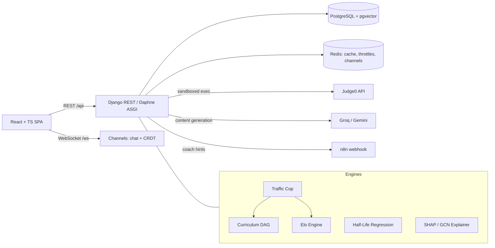

# SparkLM — Adaptive AI Learning Platform

[](https://github.com/Kurapati-Sai-Suhas/SparkLM/actions)
[](https://spark-lm-3y3e.vercel.app)

SparkLM is a full-stack learning platform whose core is an **adaptive competitive-programming Coding Hub**: instead of serving a static problem list, it models each student's skill (Elo), memory (spaced-repetition half-life), and curriculum position (prerequisite DAG), then routes them to the next problem that maximizes learning — and explains *why* it chose it.

Built with Django REST Framework + Channels (ASGI), React + TypeScript, and PostgreSQL.

---

## Why it's different

Platforms like LeetCode treat every user identically. SparkLM makes three bets:

1. **Routing should be earned by data.** A probabilistic *Traffic Cop* inspects the mean and the streakiness (Wald–Wolfowitz runs test) of your last 20 submissions. Oscillating pass/fail or struggling? You get Elo-matched flat practice to rebuild confidence. Consistent — or breaking through after a failure streak? You advance through a prerequisite curriculum graph. Every decision is logged with its predicted success probability and closed out with the real outcome — and a retraining pipeline learns which engine actually works for which students.
2. **Grades should reflect engineering quality, not just correctness.** The Elo engine reads Judge0's execution telemetry: an O(n) solution under 60 ms earns a 1.5× rating multiplier; a memory-hungry brute force gets penalized. Re-solving an old problem earns exactly zero (anti-farming), while still refreshing your spaced-repetition schedule.
3. **Recommendations should explain themselves.** Every served problem ships with an explainability payload — a four-axis radar (time, space, logic, recency), the dominant factor (real SHAP attributions over a trained graph network when enabled), and a concrete coaching line: *"Your weakest area is Hash Table (55%) — practice hash-map lookups that replace nested loops."*

## Feature highlights

| Area | What's inside |
|---|---|
| **Adaptive routing** | Hybrid Traffic Cop (heuristic + trained outcome model), 19-node curriculum DAG with DB-enforced acyclicity, Elo-nearest problem selection, placeholder-content quarantine |
| **Skill modeling** | Elo with efficiency multipliers and anti-farming clamps, per-topic mastery (accuracy ≥ 80% over ≥ 3 reviews), inactivity decay with double-charge protection |
| **Memory modeling** | SM-2 style half-life regression `P(t) = 2^(−t/h)`, graph-decay cross-pollination (failing a foundation penalizes dependent topics), **Review Queue**: practiced topics ranked by predicted recall with due-for-review flags and effective mastery (skill × retention) |
| **Explainability** | SHAP over a trained PyTorch-Geometric GCN (feature-flagged), torch-free heuristic fallback with identical schema, weak-topic coach recommendations |
| **Grading pipeline** | Judge0 sandbox, per-language harnesses (Python/Java/JavaScript generic + per-question wrappers), normalized output comparison, honest status mapping (TLE/compile/runtime) |
| **AI coach** | Escalating hints on consecutive failures: Socratic nudge (3) → pseudocode (5) → worked example (7+), via n8n/LLM webhook with resilient fallbacks |
| **Content pipeline** | 2,900+ problem bank maintained by quota-aware, idempotent LLM batch commands (generation, validation gates, multi-language starter code, backfill, restore) |
| **Collaboration** | JWT-authenticated WebSocket group chat, CRDT (Yjs) collaborative editor, study groups, quizzes, flashcards, document RAG, visual search |
| **Auth** | Google Sign-In (server-verified ID token, account linked by email) alongside password auth with enforced complexity (length + uppercase + number + symbol), case-insensitive unique username/email |
| **Ops discipline** | 104-test offline suite (all third parties mocked, incl. threaded race tests), CI with a Postgres service container, scoped API throttling (incl. spoof-resistant auth brute-force brake), composite index catalog, monthly-partitioned submissions table with self-healing maintenance, row-locked learner-state transactions (race-free Elo/mastery updates), Sentry error tracking + per-request access log, environment-driven config, tested backup/restore |

## Architecture



---

## Tech stack — what, and why

Every choice below was made against a real alternative, not by default. The short version: Django because the ORM/admin/Channels combo beats hand-wiring a faster framework for a solo-maintained project; Postgres+pgvector because relational integrity and vector search can live in one database instead of two; a modulith (one deployable backend, strictly layered internals) instead of microservices, because operational cost is unjustified below roughly a ten-engineer team.

### Backend

| Technology | What it's for | Why this, not something else |
|---|---|---|
| **Python 3.12 + Django 5.2** | Web framework, ORM, admin site | The admin site alone (question-bank curation, submission inspection) would take weeks to hand-build; a FastAPI rewrite was considered and rejected — it would trade the ORM, admin, and Channels integration for a latency gain nobody would notice |
| **Django REST Framework 3.17** | API layer — serializers, permissions, throttling | Declarative validation and object-level permissions for ~50 endpoints without hand-rolling request parsing on every view |
| **Django Channels 4 + Daphne (ASGI)** | WebSocket layer — chat, notifications, collaborative editing | Lets *one* process serve REST and WebSocket traffic together. The alternative — a separate Node/Socket.io service — means a second deployable, a second auth story, and a second thing to keep in sync; not worth it before there's a reason to scale them independently |
| **PostgreSQL 15+ with pgvector** | Primary datastore, incl. vector similarity search | Relational integrity (DAG-acyclicity constraints, uniqueness, the locked multi-row learner-state transaction) is load-bearing here — a document store would make that *harder*, not easier. pgvector means visual-search embeddings live in the same database as everything else instead of a bolted-on vector DB |
| **Redis 7** | Cache, DRF throttle storage, Channels layer | One instance backs three different subsystems — cheaper to run and reason about than three |
| **SimpleJWT** | Stateless access/refresh token auth | A decoupled SPA + API doesn't want server-side session state |
| **scikit-learn (RandomForest)** | The Traffic Cop's trained routing classifier | Deliberately *not* a deep model: 4 engineered features (accuracy, runs-test z-score, Elo, engine flag) don't need one, and a shallow model is cheap to retrain nightly, easy to inspect, and needs no GPU in the serving path |
| **NetworkX** | Curriculum prerequisite DAG | Real cycle-detection and graph traversal instead of hand-rolled adjacency-list code that would eventually reinvent NetworkX badly |
| **PyTorch + PyTorch-Geometric** *(optional, `requirements-ml.txt`)* | The GCN knowledge-graph engine, SHAP explanations | Deliberately isolated from the web tier — production runs `requirements.txt` alone (torch-free), ~2 GB lighter and no PyTorch cold-start tax on a free-tier instance. The heuristic explainer covers the same response schema when this isn't installed |
| **ONNX Runtime** | Serving the trained GCN without PyTorch | Export once, then infer without the ~2 GB PyTorch dependency in the request path |
| **Judge0 (RapidAPI)** | Sandboxed code execution | Untrusted student code must never run in-process — Judge0 isolates it completely, in 4 languages |
| **Groq (Llama 3.3 70B)** | Quiz/flashcard/question-content generation | Fast, cheap, strong structured-JSON output — the right tool for "generate 4 test cases as JSON," not the right tool for open-ended reasoning |
| **Google Gemini** | Vision (image explanation), text embeddings | Groq doesn't do multimodal; Gemini's `gemini-2.5-flash` and `text-embedding-004` cover the vision and embedding gaps |
| **Google Identity Services + google-auth** | OAuth sign-in | Token verified server-side against Google's public keys — the frontend's claim of identity is never trusted on its own |

### Frontend

| Technology | What it's for | Why this, not something else |
|---|---|---|
| **React 18 + TypeScript 5 + Vite** | SPA framework, type safety, build tooling | TypeScript pays for itself against a REST/WebSocket API surface this large — catching a renamed response field at compile time beats finding it in production. Next.js/SSR was considered and rejected: this app is authenticated end-to-end, so SSR buys nothing, and a static SPA on Vercel is simpler to host |
| **Tailwind CSS + shadcn/ui (Radix primitives)** | Styling and component library | A real, accessible design system (keyboard nav, ARIA roles) instead of hand-rolled CSS and custom dropdown/dialog logic |
| **TanStack Query** | Server-state fetching, caching, dedup | Adopted as the standard for new data-fetching; a number of older pages still call the Axios client directly and are migrated opportunistically rather than in one disruptive pass |
| **Axios (single client wrapper)** | All network calls | One place owns the auth header injection and the token refresh-and-retry logic, instead of that logic (and its bugs) being copy-pasted per component |
| **Monaco Editor** | The code editor | The actual VS Code editor component — real syntax highlighting, real keybindings — not a `<textarea>` with a syntax-highlighting overlay |
| **Yjs + y-monaco + y-websocket** | Real-time collaborative editing (CRDT) | Two students can type in the same file at once; a CRDT resolves that conflict-free on each client without a server-side merge step |
| **Recharts** | XAI radar chart, analytics dashboards | Declarative charting that composes with React state instead of imperative canvas/D3 code |
| **React Router** | Client-side routing | Every route is `React.lazy()`-split so the login page's bundle doesn't include the code editor, the collaborative-editing stack, or the charting library it doesn't need |
| **@react-oauth/google** | Google Identity Services React bindings | The official bindings for the button + credential flow, rather than hand-wiring the underlying JS SDK |

### Infrastructure

| Service | Role | Why this, not something else |
|---|---|---|
| **Neon** | Managed Postgres (+ pgvector) | Serverless Postgres that scales to zero — no cost for a project without steady 24/7 traffic yet |
| **Upstash** | Managed Redis (TLS) | Same reasoning as Neon: pay-per-request Redis instead of a paid always-on instance |
| **Render** | Daphne ASGI hosting | `render.yaml` blueprint deploy — the whole service definition is configuration, not manual dashboard clicks |
| **Vercel** | SPA hosting | Instant global CDN, zero-config Vite detection, free preview deployments per branch |
| **GitHub Actions** | CI + keepalive | Pytest against a real Postgres *service container* (not SQLite) on every push, plus a 5-minute healthz ping keeping both Render and Neon's free tiers warm |

The staged scaling plan (Celery workers, a self-hosted judge fleet, a read replica) is triggered by *measured load* — thread saturation, submission volume — not a calendar date; none of it is provisioned today because none of it is needed yet.

---

## How each feature is actually built

**Adaptive Coding Hub.** Per request, `compute_routing_telemetry` pulls the user's last 20 submissions (served by a composite Postgres index, not a full scan) and computes a Wald–Wolfowitz runs-test z-score in plain Python/NumPy — a real streakiness statistic, replacing an earlier version that fed `np.var()` into the router and was mathematically incapable of distinguishing "oscillating" from "streaky-improving" (variance of a binary sequence is fully determined by its mean). The scikit-learn `RandomForestClassifier` scores both candidate engines; NetworkX walks the prerequisite DAG for the hierarchical path. The whole submission — grade, Elo update, mastery update, spaced-repetition update — happens inside one Postgres transaction with `select_for_update` row locks in a fixed order, so two concurrent submissions from the same user can't corrupt each other's read-then-write.

**Grading pipeline.** Code is base64-encoded and posted to Judge0, which compiles/runs it in an isolated sandbox across 4 languages. For questions without a hand-authored wrapper, a generic per-language template reads stdin, JSON-decodes it into arguments, and reflectively calls the student's `Solution` class. Output is normalized (Judge0's trailing newline vs. the stored expected value) and diffed against hidden test cases stored as Postgres JSON — which never leaves the server in any API response.

**Explainability (XAI).** By default, a torch-free heuristic normalizes four signals (time/space/logic/recency) from recent submission telemetry into a radar chart and a dominant factor. When `ENABLE_SHAP_XAI` is on, a trained PyTorch-Geometric GCN produces real SHAP attributions instead — this path genuinely needs PyTorch (gradient-based attribution requires the differentiable model itself, not just an inference session), so it only runs where the ML extras are installed. The GCN's plain recommendation inference is separate and lighter: it *can* run off an exported ONNX graph instead of full PyTorch. Both XAI paths return the identical JSON shape, so the React radar component never needs to know which one ran, and a SHAP failure falls back to the heuristic instead of a 500.

**Real-time collaboration.** Django Channels and the REST API share one Daphne ASGI process; Redis is the channel layer, so any instance can publish a message to a group and every subscriber across every instance receives it. Group chat, personal notifications, and the collaborative code editor are three separate WebSocket consumers. The editor relays raw Yjs CRDT sync payloads between clients (binary or text, sender excluded from the echo) — conflict resolution happens entirely client-side in each browser's Yjs document, so the server doesn't need to understand or merge the edits at all.

**AI study tools.** Uploaded PDFs/DOCX are text-extracted (PyPDF2/PyMuPDF) and sent to Groq's structured-JSON mode to generate flashcards or quizzes; every LLM response is schema-validated before being trusted, and malformed output is never persisted. The RAG doubt-solver chunks a document (`langchain-text-splitters`) and routes the chunks directly into the LLM's context window. Every prompt in the system explicitly fences user/document content in an `<UNTRUSTED_CONTENT>` block with instructions to treat it as data, not commands — a consistent prompt-injection defense applied to every AI feature, not bolted onto just one.

**Visual semantic search.** An uploaded image runs through a CLIP model (`transformers`) to produce a 512-dimensional embedding, stored via pgvector. A query image is embedded the same way, and the nearest neighbors are found with a single pgvector L2-distance SQL query — no separate vector database, no separate indexing service.

**Authentication.** Password login issues a SimpleJWT access/refresh pair after Django's `validate_password` runs a custom complexity validator (length + uppercase + digit + symbol). Google Sign-In independently verifies the ID token's signature and audience server-side against Google's public keys, then links to an existing account by email or creates a new one with an unusable local password (Google-only accounts have no local secret to brute-force). Both paths share the same throttle scope so neither becomes an unthrottled side door around the brute-force brake; anonymous throttle identity respects a configured proxy count so a spoofed `X-Forwarded-For` header can't mint unlimited fresh rate-limit buckets.

**Gamification.** Streaks, badges, and the Elo leaderboard are deliberately plain Postgres aggregates and queries (`UserCodingProfile.elo_rating` ordering, `Badge`/`UserBadge` rows) — no separate scoring service, because there's no need for one yet.

**Content pipeline.** The ~2,900-question bank is maintained entirely by idempotent Django management commands driving Groq: generate full question content, backfill missing per-language starter code, validate output shape before persisting, and resume automatically after hitting the LLM's daily token quota (detected explicitly via a `DailyQuotaExhausted` signal, rather than retrying into a wall of failures).

---

## Quickstart (local development)

**Prerequisites:** Python 3.12, Node 20, Docker Desktop.

```bash
# 1. Database
docker compose up -d          # Postgres (pgvector) on :5432

# 2. Backend
cd backend
python -m venv .venv && .venv/Scripts/activate    # Windows (source .venv/bin/activate on Unix)
pip install -r requirements.txt -r requirements-ml.txt   # ML extras optional; web tier runs without them
cd LearnLM
# create .env with your API keys (see table below)
python manage.py migrate
python manage.py seed_dsa_dag # build the curriculum graph
python manage.py createsuperuser
python manage.py runserver    # or: daphne LearnLM.asgi:application

# 3. Frontend (new terminal)
cd studysphere-ai-11
npm install
npm run dev                   # http://localhost:5173
```

### Environment variables

| Variable | Required | Purpose |
|---|---|---|
| `SECRET_KEY` | prod | Django/JWT signing (startup refuses the dev fallback in production) |
| `DJANGO_DEBUG`, `DJANGO_ALLOWED_HOSTS` | prod | `false` + real hosts in production |
| `POSTGRES_DB/USER/PASSWORD/HOST/PORT` | — | Defaults match the Docker compose file |
| `REDIS_URL` | prod | Shared cache, throttle store, and channel layer (multi-instance) |
| `JUDGE0_API_KEY`, `JUDGE0_API_HOST` | yes | Code execution (RapidAPI) |
| `GROQ_API_KEY`, `GEMINI_API_KEY` | yes | Content generation and AI study tools |
| `N8N_WEBHOOK_URL` | optional | LLM coach hints (fallback hints without it) |
| `ENABLE_SHAP_XAI` | optional | Real SHAP attributions (needs `requirements-ml.txt`) |
| `CORS_ALLOWED_ORIGINS`, `CSRF_TRUSTED_ORIGINS` | prod | SPA origin(s); API origin for admin-over-HTTPS |
| `GOOGLE_CLIENT_ID` (+ `VITE_GOOGLE_CLIENT_ID` on the frontend) | optional | Google Sign-In; button hidden and endpoint 503s without it |
| `VITE_API_URL`, `VITE_WS_URL` | frontend | Backend origins at build time |

## Content pipeline

The problem bank is maintained by idempotent management commands — all dry-run-friendly, all resume automatically after the daily LLM quota:

| Command | Purpose |
|---|---|
| `seed_dsa_dag` | (Re)build the curriculum DAG over existing topics — never cascades into question data |
| `reseed_questions --topic "Tree" --delay 2` | Generate full content + test cases + 4-language starter code for placeholder questions |
| `backfill_boilerplate` | Add missing language stubs to already-seeded questions (~5× cheaper than regeneration) |
| `restore_questions` | Re-import missing rows for named topics from the canonical CSV |
| `cleanup_question_bank --apply` | Remove junk topics with their questions (dry-run by default) |
| `calculate_decay` | Checkpointed inactivity Elo decay sweep |
| `retrain_ai` | Retrain the routing classifier on real recommendation outcomes (≥100 required) |
| `ensure_submission_partitions` | Keep monthly partitions of the submissions table ahead of the calendar; relocates any rows stranded in the DEFAULT partition (idempotent, run monthly) |

## Testing

```bash
cd backend/LearnLM
python -m pytest groups common # 104 tests, fully offline (Judge0 + LLMs mocked)
```

The suite covers routing telemetry and thresholds, mastery rules, grading statuses, the anti-farming guard, coach escalation, XAI schema guarantees, cache invalidation (including queryset deletes), every content-ops command, and the physical schema itself (partition routing, index catalog, partition maintenance). CI runs it against a real Postgres service container on every push. After pulling schema changes, refresh your local test database once with `--create-db` (the default `--reuse-db` keeps the old schema).

## Deployment

Everything is configuration, not code. The zero-cost stack — **Neon** (Postgres) + **Upstash** (Redis) + **Render** (Daphne via `render.yaml`) + **Vercel** (SPA via `vercel.json`) — is fully scripted: follow [`docs/DEPLOYMENT.md`](docs/DEPLOYMENT.md). The web tier deploys torch-free (`requirements.txt` only, ~2 GB lighter); SHAP falls back to the heuristic explainer with the identical response schema, and visual search degrades cleanly. ML artifacts (e.g. the routing classifier) load once per process — after `retrain_ai`, restart the service (deliberate: models never hot-swap past the evaluation gate).

A full Software Requirements Specification lives in [`docs/SparkLM_SRS_v2.docx`](docs/SparkLM_SRS_v2.docx) — architecture, every adaptive-learning formula, the full API/data model, security model, and real engineering case studies.

## Roadmap

- Elo-matched 1v1 duels; post-solve LLM code review feeding the IRT latents
- Router prediction-accuracy dashboard on the existing recommendation/outcome logs
- Async grading queue (Celery) with per-test-case progress over WebSockets
- Migration off the deprecated `google-generativeai` SDK; generated-question verification harness

## Author

**Kurapati Sai Suhas** — [GitHub](https://github.com/Kurapati-Sai-Suhas) · [LinkedIn](https://www.linkedin.com/in/sai-suhas-kurapati-52b1482bb/)
