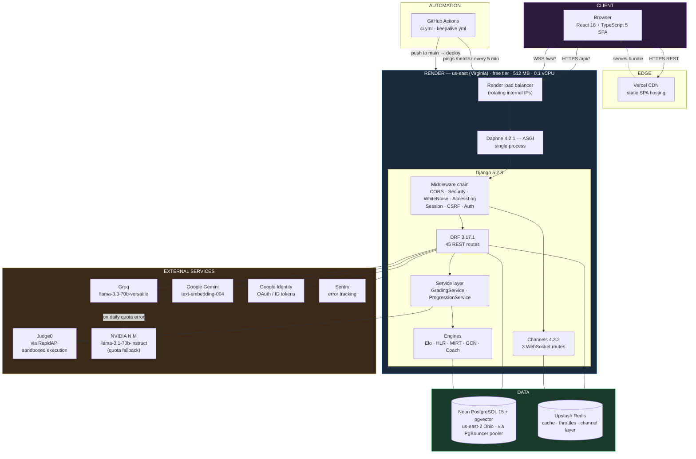
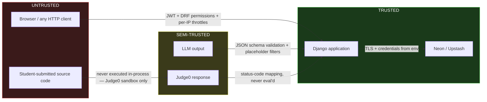
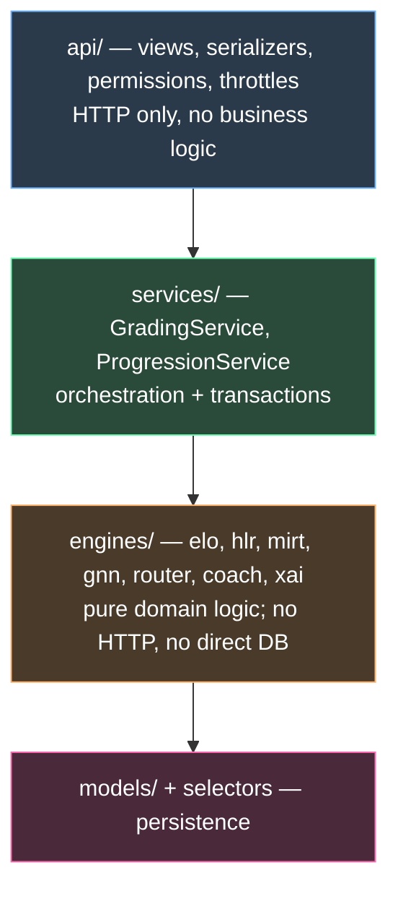
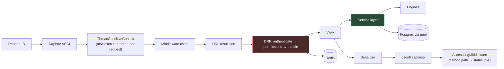
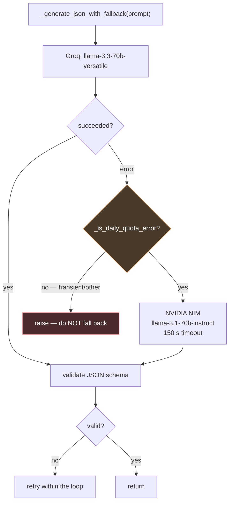
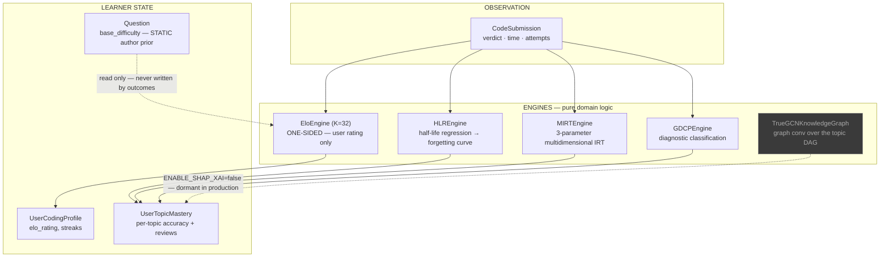
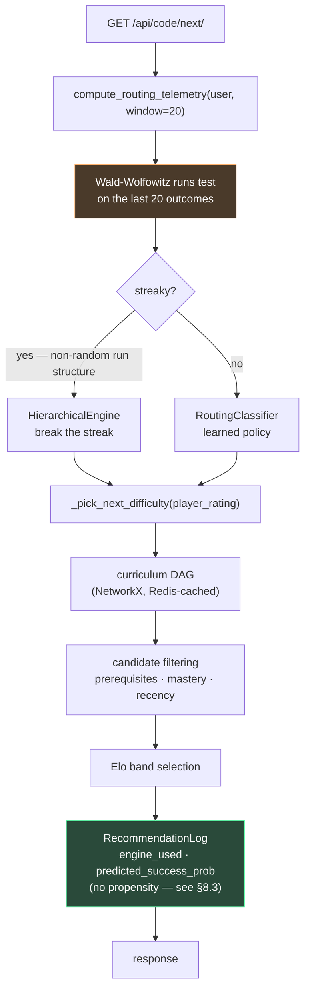
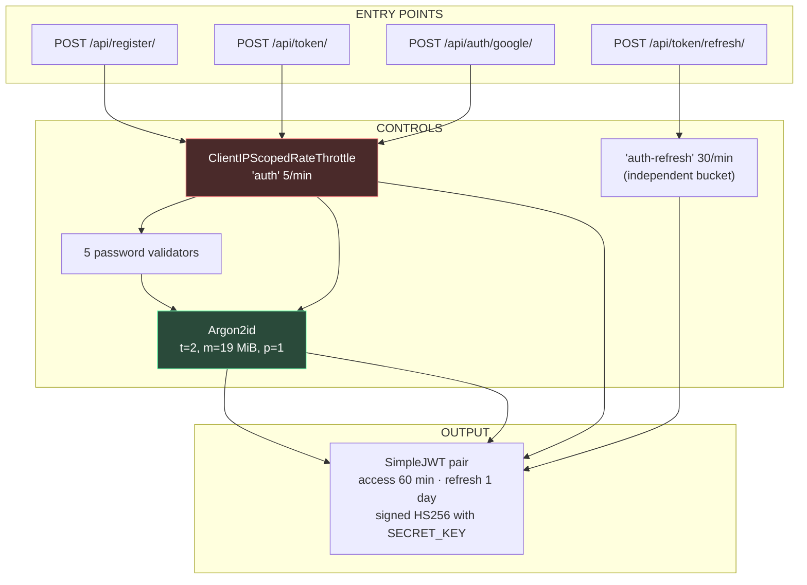
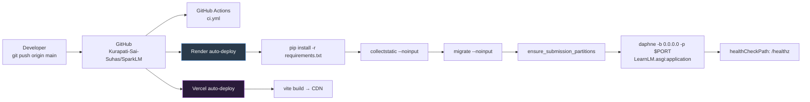

# SparkLM — Document 1: System Architecture

**Status:** Production baseline as of Milestone 3 completion (2026-08-01)
**Audience:** engineers joining the project; reviewers; future-you in an interview
**Authority:** `docs/ARCHITECTURE_V2.md` is the *frozen specification* — it says what the
system **must** be. This document describes what the system **is**, as measured from the
repository at commit `96e5c21`. Where they disagree, that is a bug in one of them; §14
tracks known divergences.

**Companion documents:** 02 Backend Workflow · 03 AI Pipeline · 04 Database Design ·
05 Security · 06 Performance Engineering · 07 Testing · 08 Decision Log · 09 Handbook ·
10 Interview Handbook

---

## Table of Contents

1. [What SparkLM Is](#1-what-sparklm-is)
2. [High-Level Architecture](#2-high-level-architecture)
3. [Component Interactions](#3-component-interactions)
4. [Frontend Architecture](#4-frontend-architecture)
5. [Backend Architecture](#5-backend-architecture)
6. [AI Services](#6-ai-services)
7. [Adaptive Learning](#7-adaptive-learning)
8. [Recommendation Engine](#8-recommendation-engine)
9. [Judge0 — Code Execution](#9-judge0--code-execution)
10. [Authentication](#10-authentication)
11. [Database](#11-database)
12. [Redis](#12-redis)
13. [Deployment](#13-deployment)
14. [Background Jobs](#14-background-jobs)
15. [External APIs](#15-external-apis)
16. [Known Divergences and Architectural Debt](#16-known-divergences-and-architectural-debt)

---

## 1. What SparkLM Is

SparkLM is an **adaptive coding-practice platform**. A student solves programming problems;
the system observes each outcome and continuously re-estimates two things — *how strong the
student is* and *how hard each problem is* — then uses those estimates to choose what to
serve next. Around that core sit study-group collaboration, an AI tutor, quiz/flashcard
generation, and a document-search feature.

The engineering interest is concentrated in three places:

1. **The adaptive loop.** Not a difficulty slider. A layered stack of statistical models
   (Elo, half-life regression, MIRT, a runs-test streak detector) that disagree with each
   other by design, arbitrated by a router.
2. **Untrusted code execution.** Student code runs in a sandbox (Judge0) behind a generic
   wrapper layer that adapts one canonical test-case format to six languages.
3. **Operating a real system on a free tier.** 512 MB RAM, 0.1 shared vCPU, a database in
   another region, and a host that stops the container after 15 minutes idle. Most of the
   engineering in Milestones 1–3 exists because of these constraints, and most of it was
   driven by measurement rather than intuition — several conclusions in this repository
   are recorded *reversals* of earlier assumptions.

### 1.1 Scale and shape

| Dimension | Value |
|---|---|
| Backend Python (excl. migrations) | 14,477 lines |
| Frontend TypeScript/TSX files | 90 |
| Django models | 27 |
| Migrations | 33 |
| REST routes | 45 |
| WebSocket routes | 3 |
| Automated tests | 220 |
| Deployable units | 1 backend + 1 static SPA |

### 1.2 The governing philosophy

The codebase is a **modulith** — one deployable backend with strictly layered internals.
Microservices were rejected explicitly: operational cost is unjustified below roughly a
ten-engineer team, and the module seams are preserved so extraction stays possible later.
The tradeoff accepted is one blast radius per backend deploy, in exchange for one CI
pipeline, one test suite, and one mental model.

The second governing rule, from the frozen spec: **new code lands in v2 modules
(`learning/`, `common/`); `groups/` shrinks by extraction and never grows.**

---

## 2. High-Level Architecture



### 2.1 Why this topology

Each choice is a response to a specific constraint, not a default.

| Decision | Driver |
|---|---|
| SPA on Vercel, API on Render | Static assets should never occupy the 512 MB backend or its CPU quota. Vercel serves the bundle from a CDN for free. |
| Neon rather than Render Postgres | Render's free Postgres expires after 90 days. Neon's free tier persists, and ships `pgvector` — required for document embedding search. |
| Upstash rather than Render Redis | Render's free plan has no Redis. Throttle counters and the Channels layer must survive across requests; a per-process `LocMemCache` silently breaks both (see §12.2). |
| Daphne (ASGI) rather than Gunicorn (WSGI) | WebSockets. Channels requires ASGI. The cost is real and documented in §5.4. |
| Single process | 512 MB. Multiple workers would multiply the ~202 MB resident set. |

### 2.2 The physical latency map

Geography is a first-order cost here, and it is asymmetric:

```
Student's browser ──── ~250 ms ────► Render (Virginia)
                                        │
                                        ├── ~33-67 ms ──► Neon (Ohio, us-east-2)
                                        ├── ~50 ms ─────► Upstash Redis
                                        └── variable ───► Judge0 / Groq / Gemini
```

Render is in **Virginia**; Neon is in **Ohio**. These are different regions. `render.yaml`
carries a comment claiming they are co-located ("Same coast as the Neon database"), which is
true only in the loose sense — the measured round-trip is real and is why a single trivial
`SELECT 1` costs tens of milliseconds rather than one.

---

## 3. Component Interactions

### 3.1 The four principal flows

```mermaid
sequenceDiagram
    autonumber
    participant U as Browser (SPA)
    participant D as Daphne / Django
    participant R as Redis
    participant PG as Neon Postgres
    participant J as Judge0
    participant L as LLM (Groq/NIM)

    rect rgba(80,140,200,0.12)
    Note over U,PG: FLOW 1 — Authentication
    U->>D: POST /api/token/ {username, password}
    D->>R: throttle check (scope 'auth', 5/min per client IP)
    D->>PG: SELECT user WHERE username=…
    D->>D: Argon2id verify (~127 ms)
    D->>PG: rehash + save if stored hash was PBKDF2
    D-->>U: {access, refresh} JWT pair
    end

    rect rgba(80,200,140,0.12)
    Note over U,PG: FLOW 2 — Get the next problem (adaptive)
    U->>D: GET /api/code/next/ (Bearer access)
    D->>R: throttle 'recommend' (30/min) + read curriculum DAG cache
    alt DAG cache miss
        D->>PG: load Topic + TopicPrerequisite
        D->>R: cache the NetworkX graph
    end
    D->>PG: load UserCodingProfile, UserTopicMastery, recent submissions
    D->>D: routing — runs-test → RoutingClassifier → Elo band
    D->>PG: INSERT RecommendationLog (engine_used, predicted_success_prob)
    D-->>U: question + sample_case + boilerplate_code (hidden cases withheld)
    end

    rect rgba(200,160,80,0.12)
    Note over U,J: FLOW 3 — Submit a solution
    U->>D: POST /api/code/submit/ {question_id, language, code}
    D->>R: throttle 'judge0' (10/min — protects a metered paid API)
    D->>PG: load Question + hidden test cases
    D->>D: wrap user code in the language's generic wrapper
    loop each test case
        D->>J: POST /submissions (base64, wait=true)
        J-->>D: {status, stdout, stderr, time, memory}
    end
    D->>PG: BEGIN; SELECT FOR UPDATE profile → mastery (ordered)
    D->>D: Elo update (K=32) · HLR half-life · mastery recompute
    D->>PG: INSERT CodeSubmission (partitioned by month); COMMIT
    D-->>U: verdict + per-case results + updated mastery
    end

    rect rgba(180,100,200,0.12)
    Note over U,L: FLOW 4 — AI assistance
    U->>D: POST /api/ai/doubt/rag/ {question}
    D->>PG: pgvector similarity search over Document.feature_vector
    D->>L: prompt + retrieved context
    L-->>D: completion
    D-->>U: answer + cited sources
    end
```

### 3.2 Trust boundaries

Four boundaries matter, and each has a distinct enforcement mechanism:



The critical invariant: **student code never executes inside the Django process.** It is
string-templated into a wrapper and shipped to Judge0. There is no `eval`, no `exec`, no
subprocess. A sandbox escape is Judge0's problem, not SparkLM's.

The second invariant: **LLM output is never trusted.** Every generation path validates
structure (`_valid_test_cases`), filters placeholder text, and retries. An LLM that returns
prose instead of JSON produces a retry, not a crash.

---

## 4. Frontend Architecture

### 4.1 Stack

React 18 · TypeScript 5 · Vite 7 · Tailwind CSS · shadcn/ui (Radix primitives) ·
Monaco Editor · deployed on Vercel.

### 4.2 Layout

```
studysphere-ai-11/src/
├── App.tsx              # route table, providers, auth gate
├── main.tsx             # entry
├── pages/               # 19 route-level components
│   ├── Auth.tsx                     # login / register / Google Sign-In
│   ├── Dashboard.tsx                # single bootstrap call (see §4.4)
│   ├── AdaptiveCodingPortal.tsx     # the core product surface
│   ├── CodingHub.tsx
│   ├── AITutor.tsx  AIQuiz.tsx  AIFlashcards.tsx  DoubtSolver.tsx
│   ├── StudyGroups.tsx  GroupDetail.tsx  DirectChat.tsx  Friends.tsx
│   ├── LiveCollaborativeWorkspace.tsx
│   ├── FileLibrary.tsx  Schedule.tsx  Notifications.tsx  Settings.tsx
│   ├── QuizTaking.tsx
│   └── NotFound.tsx
├── components/          # shared UI; shadcn/ui primitives + app components
├── hooks/               # use-mobile, use-toast, useGroupChat (WebSocket)
├── services/api.js      # single HTTP client — token attach + refresh
└── lib/utils.ts
```

### 4.3 The critical surface: `AdaptiveCodingPortal.tsx`

This is where a student spends their time, and it carries the most domain logic on the
client:

- **Monaco editor** with per-language syntax modes.
- **`BOILERPLATE_KEYS`** — an alias map (`js: ['javascript','js']`) that reconciles the
  several spellings a language acquired across generations of seed data.
- **`EMPTY_STUB`** — compilable skeletons per language. C and C++ receive a full `main()`
  because they have no generic wrapper (§9.3).
- **`SELF_CONTAINED_LANGUAGES = new Set(['c','cpp'])`** — these languages require the
  student to write a whole program, not just a method body.
- **`templateFor()` / `availableLanguages()` / `templateMissing`** — a language with no
  stored template is *labelled as such and disabled*, rather than silently opening an empty
  editor. This behaviour exists because it was once broken: students were shown a blank
  editor and expected to reconstruct a `Solution` class from nothing (M2-D2).

### 4.4 Data-fetching strategy

Fetching goes through one module, `services/api.js`, which attaches the access token and
transparently refreshes it on 401.

The dashboard originally issued **five** parallel requests on load. On a single-worker ASGI
backend where requests queue rather than parallelise (§5.4), five requests cost five times
one request. They were collapsed into a single `/api/dashboard/bootstrap/` endpoint —
measurably the largest frontend-visible latency win of the project.

> **Frozen-spec divergence.** The spec mandates TanStack Query for all new data fetching.
> The current code uses raw `fetch` through `services/api.js`. Recorded in §16.

### 4.5 Real-time

Three WebSocket consumers, connected from the SPA:

| Route | Consumer | Purpose |
|---|---|---|
| `ws/chat/<group_id>/` | `GroupChatConsumer` | study-group chat |
| `ws/notifications/` | `NotificationConsumer` | push notifications |
| `ws/code/<group_id>/` | `CodeCollabConsumer` | collaborative editing |

---

## 5. Backend Architecture

### 5.1 Layering (enforced in review)



The rules, verbatim from the frozen spec:

- Views never mutate learner state directly.
- Engines never import DRF.
- Services own transactions and locking.
- Selectors own reusable read queries.
- External I/O (Judge0, LLMs) is **injected into services as callables**.

That last rule is what keeps the test suite fully offline. No test reaches the network.

### 5.2 Module map

```
backend/LearnLM/
├── LearnLM/              # project config
│   ├── settings.py       # the single most decision-dense file in the repo
│   ├── asgi.py           # ASGI entrypoint; forces eager URLconf resolution at boot
│   ├── urls.py  wsgi.py
├── groups/               # v1 monolith app — shrinks by extraction, never grows
│   ├── models.py             # all 27 models
│   ├── views.py              # general REST
│   ├── coding_views.py       # the adaptive coding surface
│   ├── services.py           # GradingService, ProgressionService, wrappers
│   ├── hybrid_router.py      # recommendation arbitration
│   ├── ai_services.py        # Groq / Gemini / NIM integration
│   ├── engines/              # elo, hlr, mirt, gnn, coach, shap, tensor_builder
│   ├── consumers.py routing.py   # WebSockets
│   ├── serializers.py permissions.py validators.py utils.py
│   ├── wrapper_contract.py   # wrapper ↔ template compatibility checking
│   ├── management/commands/  # 16 operational commands
│   └── migrations/           # 33
├── common/               # v2 shared services (no models)
│   ├── hashers.py            # TunedArgon2PasswordHasher
│   ├── throttling.py         # ClientIP* throttle classes
│   ├── apps.py               # boot probes
│   ├── health.py             # /healthz
│   ├── auth_views.py google_auth_views.py dashboard_views.py review_views.py
│   ├── logging_middleware.py # one access-log line per request
│   └── management/commands/  # ensure_submission_partitions, password_hash_status
└── learning/             # v2 domain modules — memory.py, router.py
```

### 5.3 Request lifecycle



Middleware order (from `settings.py`, order is significant):

1. `CorsMiddleware` — must precede everything that can short-circuit
2. `SecurityMiddleware`
3. `WhiteNoiseMiddleware` — serves admin static assets; there is no separate web server
4. `AccessLogMiddleware` — Daphne has no access log, so this supplies one
5. Session → Common → CSRF → Authentication → Messages → XFrameOptions

### 5.4 The concurrency model — the single most important backend fact

**Django's ASGI handler wraps every request in `async with ThreadSensitiveContext()`, and
sync views are serialised onto one thread-sensitive worker.** Requests do not run in
parallel; they queue.

Measured directly (32 concurrent requests through the real handler): **one thread, peak
overlap of one, at every concurrency level.** Production agrees — the `/healthz`
wall-clock curve is linear in concurrency, not flat:

| Concurrent K | 1 | 2 | 4 | 8 | 16 | 32 |
|---|---|---|---|---|---|---|
| Wall clock | 0.76 s | 0.71 s | 1.18 s | 1.24 s | 1.94 s | 3.88 s |

Three consequences that shape everything else:

1. **Throughput is capped at 1/W**, where W is per-request server time. It does not grow
   with arrival rate.
2. **Every millisecond of per-request work is multiplied by queue depth.** This is why
   Milestone 3's latency work mattered so much more than its absolute numbers suggest.
3. **Rate limits are a capacity control, not only a security control.** They are set below
   measured capacity precisely because the queue has no other brake.

There is **no admission control anywhere in the stack**. Daphne has no concurrency flag;
`asgiref` 3.11.1 has no `ASGI_THREADS` knob. The queue is unbounded, which is why overload
manifests as 502s rather than fast rejections.

> **An honest caveat.** A later measurement against real Daphne showed 12 sequential
> requests landing on 12 *distinct* thread ids, which sits in tension with the single-thread
> conclusion above. Both observations are recorded; the production scaling curve is the
> stronger evidence for queueing behaviour. Resolving this is open work (§16).

### 5.5 Boot probes

`common/apps.py::CommonConfig.ready()` runs two advisory probes on every process start —
including the `migrate` and `collectstatic` steps of the Render start chain:

| Probe | Detects | On failure |
|---|---|---|
| `verify_cache_backend()` | a cache that accepts writes and returns nothing | one actionable `ERROR`; never raises |
| `verify_password_hashers()` | Argon2 hasher missing → every migrated user locked out | one actionable `ERROR`; a deliberate rollback logs `WARNING` instead |

Both are **advisory by design**. A service that refuses to start helps nobody, particularly
when the operator is mid-rollback. Each exists because the corresponding failure is
otherwise *completely silent*: a dead cache disables all rate limiting with no error, and a
missing hasher surfaces as ordinary "wrong password" for every user.

---

## 6. AI Services

`groups/ai_services.py` is the single integration point for all LLM and embedding work.

### 6.1 Providers

| Provider | Model | Role |
|---|---|---|
| **Groq** | `llama-3.3-70b-versatile` | primary generation — questions, test cases, stubs, tutoring, quizzes |
| **NVIDIA NIM** | `meta/llama-3.1-70b-instruct` | fallback, **daily-quota errors only** |
| **Google Gemini** | `models/text-embedding-004` | embeddings for document search |

### 6.2 The fallback contract



The narrowness is deliberate. Falling back on *any* error would mask transient faults and
double every failure's latency. Falling back only on daily quota exhaustion — the one
condition retrying cannot fix — keeps the fallback rare and meaningful.

The 150-second NIM timeout is empirical: `llama-3.3-70b-instruct` was observed queueing for
over two minutes on NIM's shared capacity, so the model was pinned to `llama-3.1-70b-instruct`
and the timeout widened to match observed behaviour.

### 6.3 Validation discipline

Generated content is never trusted:

- `_valid_test_cases()` — structural validation, including a string type-check on `stdin`
  and `expected_output` (a model returning integers once broke downstream grading).
- Placeholder filtering — generations containing stub text are rejected and retried.
- Language-aware stub checking — `(lang == "c" or "Solution" in code)`, because C has no
  `Solution` class and would otherwise fail a universal check.
- Validation happens **inside** the retry loop, returning `(ai_data, last_error)`, so an
  invalid generation is retried rather than persisted.

---

## 7. Adaptive Learning

### 7.1 The engine stack

Five engines, each modelling a different aspect of learning. They are intentionally not
unified — they disagree, and the router arbitrates.



### 7.2 Elo — one-sided, as built

`EloEngine.calculate_new_rating(user_rating, question_difficulty, is_correct, …)` computes an
expected score from the rating difference, applies `K=32`, and modulates the gain by execution
time and memory with the result clamped to `[0, 50]`. It returns a **new user rating and
nothing else.**

**The question side is not updated.** `Question.base_difficulty` is a
`FloatField(default=1200.0)` written only by the seed commands (`bulk_seed`, `seed_data`,
`restore_questions`). No code path writes it from an outcome. A mislabelled problem stays
mislabelled indefinitely, and Elo-band selection inherits the error.

> **⚠ Correction (2026-08-02).** An earlier revision of this section described a *two-sided*
> Elo in which item difficulty calibrates against the population, and stated that `Question`
> carries `rating`, `rating_deviation` and `attempt_count`. **Those fields do not exist.** The
> claim came from reading the "v2 additions" table in `ARCHITECTURE_V2.md` §4.2 — a
> specification of *planned* schema — and recording it as as-built. Two-sided Elo with item
> calibration is roadmap **M10**, still open, and is Phase A of
> [MILESTONE_4_PLAN.md](MILESTONE_4_PLAN.md).

The rating clamp is worth noting as a real anti-gaming measure that *is* implemented: an
earlier version had a `+2` floor on any accepted solution, which let users inflate Elo by
grinding problems far below their level. The floor was removed so the expected-score curve
makes trivial wins worth approximately zero.

### 7.3 Half-life regression — forgetting

HLR models retention decay: each topic has a half-life that lengthens with successful
recall and shortens with failure. This is what makes the system a *spaced-repetition*
system rather than a difficulty ladder — it can decide a mastered topic needs revisiting
because the estimated retention has decayed below threshold.

### 7.4 Mastery gate

```python
MASTERY_ACCURACY_THRESHOLD = 0.8
MASTERY_MIN_REVIEWS = 3
```

Both conditions must hold. Three reviews is a small sample deliberately — the gate is a
progression signal, not a certification.

`CURRICULUM_GATE_ENFORCE=false` in production: prerequisite gating is **computed and
surfaced but not enforced**. Students see the DAG and their unlock state; nothing blocks
them. This is a product decision (a hard gate on a noisy signal frustrates users), not an
incomplete implementation.

### 7.5 Concurrency and integrity

All learner-state mutation happens inside one `transaction.atomic` block with
`select_for_update` on the profile and mastery rows, in a **fixed lock order: profile →
mastery (topic-id ascending)**. Consistent ordering is what prevents deadlock between two
concurrent submissions touching overlapping topics.

**Network calls are forbidden inside that block.** Judge0 and the coach webhook complete
*before* the transaction opens. Holding a row lock across a multi-second HTTP call to a
third party would serialise the entire user base behind the slowest external request.

---

## 8. Recommendation Engine

`groups/hybrid_router.py`. The question it answers: *given everything known about this
student, which problem next?*

### 8.1 Arbitration flow



### 8.2 Why a runs test

The original implementation used **variance** of recent outcomes to detect struggle. Variance
cannot distinguish `1010101010` from `1111100000` — identical variance, completely different
learner states. The first is a student oscillating at their level; the second is a student
who hit a wall.

The **Wald-Wolfowitz runs test** examines *run structure*, and separates them. Replacing
variance with the runs test was mandate #1 of the frozen spec's Phase A engineering list.

### 8.3 The flywheel — what is logged, and what is not

`RecommendationLog` records `recommended_topic`, `engine_used` (`hierarchical` or `flat`),
`problem_id`, `predicted_success_prob`, and `actual_result_correct`. That last field is
written back inside the submission transaction, which closes the loop: the router chose this
problem for this state, and here is what happened. That much is real, and it is enough to run
a **calibration** study — bucket by `predicted_success_prob`, compare against observed pass
rate.

**What is absent is `propensity` and `policy_version`.**

> **⚠ Correction (2026-08-02).** An earlier revision of this section stated that
> `RecommendationLog` records propensity and policy version, and that off-policy evaluation is
> therefore possible. **Neither field exists**, so inverse-propensity weighting cannot be
> computed for any traffic logged to date. Same root cause as §7.2 — the `ARCHITECTURE_V2.md`
> §4.2 specification was read as as-built.

The consequence is worth stating plainly, because it is time-sensitive. Propensity has to be
recorded **at decision time**; it cannot be reconstructed afterwards. Every day the platform
runs without it accumulates recommendations that can be described but never counterfactually
evaluated. Roadmap **M12**, and Phase A of [MILESTONE_4_PLAN.md](MILESTONE_4_PLAN.md).

A second-order point: propensity is only meaningful if the policy is **stochastic**. The
current router is deterministic given its inputs, so adding the column alone would log a
constant `1.0`. Exploration and propensity are one change, not two.

### 8.4 The DAG cache

The curriculum is a NetworkX graph built from `Topic` + `TopicPrerequisite`. Rebuilding it
per request is wasteful, so it is cached in Redis; `invalidate_dag_cache(subject)` clears it
on curriculum edits.

Acyclicity is enforced in `TopicPrerequisite.clean()` — at the model layer, so no code path
can introduce a cycle.

**This cache is one of the three features that silently died when the production cache was
misconfigured** (§12.2): the graph was rebuilt from the database on every single
recommendation request, with nothing reporting a problem.

### 8.5 Dormant machinery

`gnn_engine.py` (graph convolutional network over the topic DAG), `shap_explainer.py`
(SHAP-based explainability) and `export_onnx.py` exist and are functional, but
`ENABLE_SHAP_XAI=false` in production. The web tier is deliberately **torch-free** — the
`requirements.txt` used by Render excludes PyTorch, because the dependency alone would not
fit the 512 MB instance. The code is retained for the future worker tier.

---

## 9. Judge0 — Code Execution

### 9.1 Path

```mermaid
sequenceDiagram
    autonumber
    participant U as Student
    participant V as CodeSubmitView
    participant S as GradingService
    participant W as Wrapper layer
    participant J as Judge0 (RapidAPI)
    participant P as ProgressionService
    participant DB as Postgres

    U->>V: POST /api/code/submit/
    V->>V: throttle 'judge0' — 10/min (metered paid API)
    V->>S: grade(question, language, code)
    S->>DB: load hidden test cases
    S->>W: wrapper_for(question, lang_key)
    W-->>S: executable source (user code + harness)
    loop each test case
        S->>J: POST /submissions?wait=true (base64)
        J-->>S: {status_id, stdout, stderr, compile_output, time, memory}
    end
    S-->>V: GradeResult (verdict + per-case)
    V->>P: apply(user, question, result)
    P->>DB: BEGIN; SELECT FOR UPDATE profile → mastery
    P->>P: Elo · HLR · mastery
    P->>DB: INSERT CodeSubmission; COMMIT
    V-->>U: verdict + results
```

### 9.2 The wrapper system

One canonical test-case format (`stdin` / `expected_output`) must drive six languages. The
wrapper is the adapter.

| Language | Strategy |
|---|---|
| Python | `GENERIC_PYTHON_WRAPPER` — runtime reflection finds the solution method |
| Java | `GENERIC_JAVA_WRAPPER` — reflection over the `Solution` class |
| JavaScript | `GENERIC_JS_WRAPPER` — runtime introspection |
| C / C++ | **no wrapper** — the student writes a complete self-contained program |

`WRAPPER_LANGUAGE_ALIASES` normalises the several spellings languages acquired across seed
generations. `wrapper_for(question, lang_key)` treats blank strings, `None`, and non-dict
values as *absent* — defensive because seed data is inconsistent.

### 9.3 Wrapper/template compatibility

`wrapper_contract.py` exists because of a real production defect. A Java template was
authored against the *problem statement* rather than against the *wrapper*, and shipped
broken on the deterministic first problem every new user receives — every submission
returned `compile_error`.

The module provides:

- `wrapper_call_contract()` — what the wrapper will invoke
- `template_declaration(template, method, language)` — what the template actually declares
  (**language-aware**: it drops Python's `self`/`cls`, because an earlier version
  false-positived on every Python template by counting `self` as a parameter)
- `check_pair()` — compatibility assertion

`manage.py audit_wrapper_templates` runs this read-only across production data.

**The lesson, recorded because it was expensive:** a template that has never been executed
is not a template, it is a guess.

### 9.4 Security posture

Student code is never executed in-process. Judge0 provides the sandbox, resource limits and
timeouts. The `judge0` throttle scope (10/min) exists for two reasons at once: it caps abuse
of a metered paid API, and it bounds the fan-out — one submission triggers N Judge0 calls.

---

## 10. Authentication

### 10.1 Mechanisms



### 10.2 Password hashing

`common/hashers.py::TunedArgon2PasswordHasher` — Argon2id at `time_cost=2`,
`memory_cost=19456 KiB (19 MiB)`, `parallelism=1`.

**Not Django's stock `Argon2PasswordHasher`.** Its defaults are 100 MiB and parallelism 8.
The web tier's measured resident set is ~202 MiB on a 512 MB instance, so four concurrent
logins at stock parameters would exceed the limit, OOM the container, and cost every
subsequent visitor a ~93 s cold start. The chosen parameters sit at the OWASP minimum
(19 MiB, t=2, p=1) — the point where security guidance and the memory budget intersect.

PBKDF2 remains listed **second**. Legacy accounts migrate transparently on next successful
login: Django verifies with the stored algorithm, then rehashes and saves via the setter
`AbstractBaseUser.check_password` supplies.

> **⚠️ Rollback is a REORDER, never a REMOVAL.** Once a user has logged in post-migration,
> their stored hash *is* Argon2. Removing the hasher makes `identify_hasher()` raise, which
> Django reports as an ordinary failed login — every migrated account locked out, with
> nothing in the logs. `verify_password_hashers()` (§5.5) exists to catch exactly this.

Migration status: `manage.py password_hash_status`. Currently **1/13 migrated (8%)**; the
6 Google SSO accounts hold unusable passwords and are correctly excluded from the
denominator.

### 10.3 Rate limiting — and why it is not `NUM_PROXIES`

`common/throttling.py` provides `ClientIPScopedRateThrottle`, `ClientIPAnonRateThrottle`,
`ClientIPUserRateThrottle`. They key on the **first** `X-Forwarded-For` hop.

DRF's `NUM_PROXIES=1` keys on the **last** hop. On Render the last hop is a *rotating
internal load balancer*: twelve sequential requests to `/token/` were measured landing in
**three different buckets**, none of which ever reached the limit. Throttling was therefore
**completely inert in production** while appearing correctly configured and while its tests
passed (tests use `LocMemCache`, which works).

Current scopes:

| Scope | Rate | Protects |
|---|---|---|
| `auth` | 5/min | login + Google SSO — credential stuffing |
| `auth-refresh` | 30/min | refresh (independent, so it cannot starve logins behind a NAT) |
| `judge0` | 10/min | metered paid API + fan-out |
| `recommend` | 30/min | LLM test-case generation |
| `anon` | 15/min | general anonymous |
| `user` | 120/min | authenticated browsing |

**Accepted cost:** a client rotating its own `X-Forwarded-For` entry evades the limit. This
is a genuine weakening versus `NUM_PROXIES=1` — chosen deliberately, because the prior
behaviour required *no* evasion effort at all. Both the fix and the limitation are
test-pinned.

**The limits are also a capacity control.** The previous ceiling permitted `anon(30) +
auth(10) = 40 req/min` from one IP, and 40 concurrent auth requests was measured returning
32×502 with a ~60 s outage. The limit authorised the outage. The ceiling is now 20/min —
the highest burst measured to complete with zero failures.

---

## 11. Database

### 11.1 Platform

Neon PostgreSQL 15 with `pgvector`, region us-east-2 (Ohio), reached through Neon's
**PgBouncer pooler** endpoint.

### 11.2 Model families (27 total)

| Family | Models |
|---|---|
| Identity | `User` (AbstractUser), `Profile` |
| Curriculum | `CodingPortal`, `Topic`, `TopicPrerequisite`, `Question` |
| Learner state | `UserCodingProfile`, `UserTopicMastery`, `CodeSubmission` |
| Adaptive telemetry | `RecommendationLog`, `AgenticCoachLog` |
| Gamification | `Badge`, `UserBadge` |
| Study groups | `StudyGroup`, `Subject`, `StudyMaterial`, `GroupMessage` |
| Social | `Connection`, `DirectMessage`, `Notification` |
| Learning tools | `QuizResult`, `AssignedQuiz`, `DoubtChatHistory`, `StudySession` |
| Documents | `Document` (with `VectorField(dimensions=512)`) |
| Activity | `UserActivityLog`, `UserActivity` |

### 11.3 Partitioning

`CodeSubmission` is **partitioned by month from day one** — cheap now, painful to retrofit.
Consequences:

- DB-level primary key is `(id, submitted_at)`; Postgres requires the partition key inside
  every unique constraint of a partitioned table.
- `id` is **sequence-backed** (`DEFAULT nextval`), not an IDENTITY column — PostgreSQL < 17
  forbids IDENTITY on partitioned tables. Insert semantics are identical.
- A **DEFAULT partition** backstops the monthly ranges so an insert can never fail for lack
  of a partition.
- `manage.py ensure_submission_partitions` maintains the horizon and relocates strays. It is
  idempotent and self-healing after downtime, and runs in the Render start chain.

### 11.4 Connection pooling

```python
'CONN_MAX_AGE': 0,
'CONN_HEALTH_CHECKS': True,
'OPTIONS': {'pool': {'min_size': 2, 'max_size': 10, 'timeout': 10,
                     'max_idle': 300, 'max_lifetime': 1800}}
```

`CONN_MAX_AGE` **never worked under Daphne.** Each request runs on a fresh
`ThreadSensitiveContext` thread, and `django.db.connections` is thread-critical
(`Local(thread_critical=True)`), so every request began with no connection and dialled Neon
again — a TCP + TLS + Postgres startup handshake worth roughly 7.2 network round-trips.

Measured: **20 requests opened 21 TCP sockets** before; **25 requests reuse 3** after.
Production `/healthz` p50 fell 699 → 391 ms; the DB stage specifically fell 421 → 109 ms.

The pool works because `psycopg_pool` lives in `DatabaseWrapper._connection_pools`, a
**class attribute** shared by every per-thread wrapper — so it outlives the request threads
that thread-local connections cannot.

`CONN_HEALTH_CHECKS: True` is **mandatory, not cosmetic**. Neon's pooler drops idle
connections and free-tier compute auto-suspends, so a pooled connection can be dead on
checkout. With it disabled this was observed twice:
`WARNING pool discarding closed connection: <Connection [BAD]>` followed by
`ERROR Service Unavailable: /healthz` — the pool discards the corpse only *after* the
request has already failed.

---

## 12. Redis

### 12.1 Roles

Upstash Redis serves three distinct purposes through one instance:

| Role | Consumer |
|---|---|
| Django cache | curriculum DAG cache, 60-second leaderboard cache |
| DRF throttle store | every throttle scope's request history |
| Channels layer | cross-process WebSocket group messaging |

Configured via `REDIS_URL`. When unset, Django falls back to `LocMemCache` and Channels to
an in-memory layer — correct for development, **catastrophic in production**.

### 12.2 The silent-failure incident

Production once ran with a cache that **accepted writes and returned nothing**. Django's
cache API has no failure signal for that, so three features degraded in total silence:

1. **All DRF throttling.** History lives in the cache, so `cache.get(key, [])` returned `[]`
   on every request and no limit was ever reached. The credential-stuffing brake and the
   cap on the metered Judge0 API were both inert.
2. **The curriculum DAG cache** — the NetworkX graph rebuilt from Postgres on every
   recommendation request.
3. **The leaderboard cache.**

Nothing errored. The test suite stayed green, because tests use `LocMemCache`, which works —
an environment-only fault is structurally invisible to them.

`verify_cache_backend()` (§5.5) is the response: a boot-time write-then-read probe that
turns a silent misconfiguration into one line in the deploy log.

---

## 13. Deployment

### 13.1 Topology



Blueprint: `render.yaml`. Region **virginia**, plan **free**, `rootDir: backend`.
Secrets are `sync: false` — set in the dashboard, never in git.

Migrations run **in the start chain** rather than a pre-deploy hook. Safe here because there
is exactly one instance; it would be unsafe the moment a second is added.

### 13.2 Free-tier constraints

| Constraint | Value | Consequence |
|---|---|---|
| Memory | 512 MB | drives Argon2 parameters; forbids torch; forbids multiple workers |
| CPU | 0.1 vCPU shared | measured **6.8× slower** than commodity hardware |
| Idle stop | ~15 min | cold wake measured at **92.9 s** TTFB |
| DB region | Ohio vs Virginia | cross-region round-trip on every query |

The 92.9 s figure is itself a lesson: an earlier measurement of 43.8 s was **confounded by a
concurrent deploy**. A clean 21-minute quiesce test produced the true, worse number.

### 13.3 `/healthz`

```python
with connection.cursor() as cursor:
    cursor.execute("SELECT 1")
```

It **round-trips the database on purpose**. A health check that only proves Python is
running is a health check that lies. The cost is that pinging it also keeps Neon awake and
consumes Neon's compute budget — an accepted trade, because a Neon wake costs seconds while
a Render wake costs ~93 s.

---

## 14. Background Jobs

### 14.1 The warm-keeper

`.github/workflows/keepalive.yml` + `scripts/keepalive.sh`.

GitHub Actions cron on the free tier is **heavily throttled** — a 5-minute schedule was
measured firing at gaps of 54 to 213 minutes, far longer than Render's ~15-minute idle
timeout. A naive cron-only keepalive therefore does not keep anything alive.

The fix is an **in-run loop**: each invocation runs for 45 minutes (`LOOP_SECONDS=2700`)
pinging every 5 minutes (`INTERVAL_SECONDS=300`), with `timeout-minutes: 55` and
`concurrency: cancel-in-progress: false`. Measured duty cycle improved **10.7% → 42.7%**.

Design details that matter:

- Logic lives in `scripts/keepalive.sh`, not inline YAML — inline logic cannot be tested.
  `common/test_keepalive_contract.py` (18 tests) exercises the script against a stub server
  with programmable delays and status sequences.
- Ping-first ordering means `LOOP_SECONDS=0` performs exactly one ping — a kill switch.
- Millisecond arithmetic via awk helpers; an earlier integer version reported "max: 1s" for
  1.432 s.
- The job **fails on cold-after-warm**, so a regression is visible rather than silent.

Reaching ~100% duty cycle requires an external uptime monitor — a user action, not code.

### 14.2 Operational commands

16 management commands. Load-bearing ones:

| Command | Purpose |
|---|---|
| `ensure_submission_partitions` | partition horizon maintenance (runs at deploy) |
| `password_hash_status` | M3 migration progress; exits **2** if any hash is unreadable |
| `audit_wrapper_templates` | read-only wrapper/template compatibility matrix |
| `reseed_questions` | LLM generation of questions, test cases, stubs |
| `backfill_boilerplate` | fill missing per-language templates |
| `recompute_mastery` · `calculate_decay` | adaptive-state recomputation |
| `send_spaced_repetition` | review notifications |

> **Not scheduled.** `calculate_decay` and `send_spaced_repetition` model time-dependent
> behaviour but nothing invokes them periodically. Recorded in §16.

### 14.3 CI

`.github/workflows/ci.yml` runs the 220-test suite. There is **no frontend test runner** —
the frozen spec calls for Vitest + React Testing Library on four critical flows; not
implemented (§16).

---

## 15. External APIs

| Service | Endpoint / model | Auth | Failure mode |
|---|---|---|---|
| **Judge0** | RapidAPI | `JUDGE0_API_KEY`, `JUDGE0_API_HOST` | grading unavailable → `GradingUnavailable` |
| **Groq** | `llama-3.3-70b-versatile` | `GROQ_API_KEY` | quota → NIM fallback; other → raise |
| **NVIDIA NIM** | `integrate.api.nvidia.com/v1/chat/completions` | `NIM_API_KEY` | 150 s timeout |
| **Google Gemini** | `models/text-embedding-004` | `GEMINI_API_KEY` | embedding unavailable → degraded search |
| **Google Identity** | ID-token verification | `GOOGLE_CLIENT_ID` | 503 when unconfigured (fails loudly, by test) |
| **Sentry** | error tracking | `SENTRY_DSN` | no-op without a DSN |
| **n8n** | coach webhook | `N8N_WEBHOOK_URL` | falls back to `_get_fallback_hint()` |

### 15.1 Configuration surface

23 environment variables:

```
SECRET_KEY · DJANGO_DEBUG · DJANGO_ALLOWED_HOSTS · CSRF_TRUSTED_ORIGINS
CORS_ALLOWED_ORIGINS · DRF_NUM_PROXIES
POSTGRES_{DB,USER,PASSWORD,HOST,PORT} · REDIS_URL
JUDGE0_API_{KEY,HOST} · GROQ_API_KEY · GEMINI_API_KEY · NIM_API_KEY
GOOGLE_CLIENT_ID · N8N_WEBHOOK_URL
SENTRY_{DSN,ENV,TRACES_RATE}
EMAIL_HOST_{USER,PASSWORD}
ENABLE_SHAP_XAI · CURRICULUM_GATE_ENFORCE
```

`SECRET_KEY` has a production guard: booting with `DJANGO_DEBUG=false` on the well-known dev
key raises `ImproperlyConfigured`. A leaked `SECRET_KEY` invalidates sessions, password-reset
tokens and JWT signing simultaneously.

### 15.2 Graceful degradation

Every external dependency has a defined failure behaviour, and none of them takes the
service down. The pattern is consistent: **fail the feature, not the request; and never fail
silently.** The agentic coach falls back to a static hint keyed on failed-attempt count.
Sentry no-ops. Gemini degrades document search. Only Judge0 has no fallback — grading
without execution is meaningless, so it raises `GradingUnavailable` and says so.

---

## 16. Known Divergences and Architectural Debt

Recorded so nobody has to rediscover them.

### 16.1 Frozen-spec divergences

| Spec says | Reality | Notes |
|---|---|---|
| TanStack Query for all new fetching | raw `fetch` via `services/api.js` | §4.4 |
| Vitest + RTL on four critical flows | no frontend test runner | §14.3 |
| Access token in memory, refresh via httpOnly cookie | localStorage | spec marks localStorage "deprecated, removed in Phase B" |
| Routes under `/api/v1/*` | routes under `/api/*` | unversioned |

### 16.2 Operational debt

- **Item difficulty never calibrates** — `Question.base_difficulty` is a static author prior
  written only by seed commands; the Elo is one-sided (§7.2). Roadmap M10.
- **No propensity logging** — off-policy evaluation is impossible for all traffic logged to
  date, and the gap cannot be backfilled (§8.3). Roadmap M12.
- **Decay jobs unscheduled** — `calculate_decay`, `send_spaced_repetition` (§14.2).
- **Multi-language coverage ~35%** — many questions lack templates for most languages;
  the UI now labels these rather than showing an empty editor.
- **Migration 8% complete** — by design; closes as users sign in.
- **Curriculum progression frozen** — `CURRICULUM_GATE_ENFORCE=false` (§7.4); intentional,
  but means the DAG is decorative in production.
- **CASCADE counter drift** — deleting a user can leave denormalised counters stale.

### 16.3 Architectural limits

- **Single worker, ceiling ~20 concurrent** (§5.4). Raising it requires a paid instance.
- **No admission control** — overload becomes 502, not a fast 503.
- **Throttles spoofable** via client-controlled `X-Forwarded-For` (§10.3, accepted).
- **No in-container observability** — memory and CPU are inferred from external symptoms;
  Render's Metrics tab is the missing instrument.
- **DRF throttling is a non-atomic read-modify-write** — concurrent bursts can slip past
  even with correct keying.
- **Thread-model tension** (§5.4) — unresolved, flagged.

---

## Appendix A — Version Matrix

| Component | Version |
|---|---|
| Python | 3.12.7 |
| Django | 5.2.8 |
| Django REST Framework | 3.17.1 |
| Channels / Daphne | 4.3.2 / 4.2.1 |
| SimpleJWT | 5.5.1 |
| psycopg / psycopg-pool | 3.3.4 / 3.2.6 |
| argon2-cffi | 25.1.0 |
| asgiref | 3.11.1 |
| PostgreSQL | 15 (Neon) + pgvector |
| React / TypeScript / Vite | 18 / 5 / 7 |

## Appendix B — Milestone History

| Milestone | Delivered |
|---|---|
| M1 | Warm-keeper — duty cycle 10.7% → 42.7%; cold start characterised at 92.9 s |
| M2 | Editor templates — no empty/stale editors; wrapper contract checking; q3307 repair |
| M3 Phase A | Argon2id at pinned parameters; transparent migration; rollback safety |
| M3 Phase B | Production validation → found SEC-B1, rate-limit/capacity inversion |
| M3 R1 | Connection pooling — `/healthz` 699 → 391 ms |
| M3 Phase C | Disabled-account coverage, pool concurrency, migration tooling, boot probe, spec correction |

---

*End of Document 1.*
