# SparkLM — Document 2: Backend Workflow

**Status:** Production baseline at commit `96e5c21`
**Scope:** every REST route and every WebSocket consumer, traced through the canonical
six-stage pipeline
**Prerequisite reading:** Document 1 §5 (Backend Architecture) and §5.4 (the concurrency
model) — several decisions here only make sense once you know requests queue rather than
parallelise.

---

## Table of Contents

1. [How to Read This Document](#1-how-to-read-this-document)
2. [The Universal Request Pipeline](#2-the-universal-request-pipeline)
3. [Cross-Cutting Concerns](#3-cross-cutting-concerns)
4. [Complete Route Inventory](#4-complete-route-inventory)
5. [Authentication APIs](#5-authentication-apis)
6. [Dashboard APIs](#6-dashboard-apis)
7. [Coding APIs — the Core Loop](#7-coding-apis--the-core-loop)
8. [AI APIs](#8-ai-apis)
9. [Visual Search APIs](#9-visual-search-apis)
10. [Study Group & Material APIs](#10-study-group--material-apis)
11. [Social & Messaging APIs](#11-social--messaging-apis)
12. [Quiz & Analytics APIs](#12-quiz--analytics-apis)
13. [Settings, Schedule, Notifications](#13-settings-schedule-notifications)
14. [Observability APIs](#14-observability-apis)
15. [WebSocket Consumers](#15-websocket-consumers)
16. [Error Contract](#16-error-contract)
17. [Per-Endpoint Performance Profile](#17-per-endpoint-performance-profile)
18. [Gotchas and Landmines](#18-gotchas-and-landmines)

---

## 1. How to Read This Document

Every endpoint is traced through the same six stages the brief specifies:

```
Request Flow  →  Authentication  →  Business Logic  →  Database  →  Caching  →  Response
```

Endpoints get depth proportional to their complexity. `POST /api/code/submit/` receives a
full page with a sequence diagram and a transaction map; `GET /api/friends/` receives four
lines, because four lines is all it is. Documenting a trivial endpoint at length would bury
the ones that matter.

**Notation used throughout:**

| Symbol | Meaning |
|---|---|
| 🔓 | `AllowAny` — no authentication |
| 🔒 | `IsAuthenticated` — Bearer JWT required |
| ⏱ *scope* | throttle scope applied |
| 💾 | touches the cache |
| 🌐 | makes an outbound network call |
| ⚠️ | carries a known landmine (see §18) |

---

## 2. The Universal Request Pipeline

Every HTTP request — without exception — traverses this path. Understanding it once means
you only need the *deltas* for each endpoint.

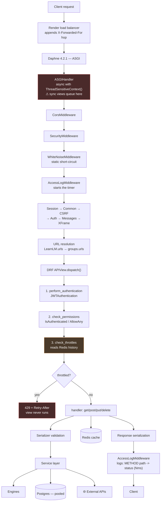

### 2.1 The DRF `dispatch()` ordering, and why it matters

DRF runs `initial()` in a fixed order before any handler:

1. **Authenticate** — resolve `request.user`
2. **Check permissions** — 401/403
3. **Check throttles** — 429

**The throttle runs after authentication but before the view body.** Two consequences:

- A throttled request pays JWT verification but **not** the expensive work. On `/code/submit/`
  that means a 429 costs ~50 ms instead of a multi-second Judge0 fan-out. The brake is in
  front of the cost, which is the entire point.
- The throttle *can* see `request.user`, which is how `UserRateThrottle` keys per-user while
  `AnonRateThrottle` keys per-IP.

### 2.2 Measured cost of each stage

From production measurement (Document 6 has the full derivation). Server-side, p50,
excluding the ~250 ms client↔Render round-trip:

| Stage | Cost | Share of a login |
|---|---|---|
| Django middleware chain | ~8 ms | 1% |
| DRF dispatch + Redis throttle read | ~50 ms | 8% |
| First DB touch (post-pooling) | ~109 ms | ~35% |
| Additional query | ~33 ms each | — |
| Argon2id verify | ~127 ms | 20% |
| JWT sign + serialize + response | ~20 ms | 3% |

**These numbers are additive and they queue.** With requests serialised, a 200 ms endpoint
under 10 concurrent callers produces a 2-second tail for the last caller. This is why the
`anon`/`auth` ceiling is set from measured capacity rather than from security intuition.

---

## 3. Cross-Cutting Concerns

### 3.1 Authentication

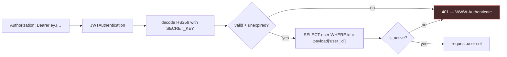

| Setting | Value |
|---|---|
| `ACCESS_TOKEN_LIFETIME` | 60 minutes |
| `REFRESH_TOKEN_LIFETIME` | 1 day |
| `SIGNING_KEY` | `SECRET_KEY` |
| `AUTH_HEADER_TYPES` | `Bearer` |

**Every authenticated request costs one user SELECT.** SimpleJWT does not cache the user
object. On the serialised single worker this is ~33 ms of the budget on every protected
endpoint — a non-obvious but material cost.

`SIGNING_KEY = SECRET_KEY` couples three failure domains: leak the key and you have
simultaneously compromised sessions, password-reset tokens, and every issued JWT. This is
why `settings.py` refuses to boot with `DJANGO_DEBUG=false` on the well-known dev key.

### 3.2 Throttling

All throttle classes derive from `ClientIPIdentMixin`, which keys on the **first**
`X-Forwarded-For` hop rather than DRF's `NUM_PROXIES` behaviour (Document 1 §10.3 explains
why; Document 5 covers the threat model).

| Scope | Rate | Applied to |
|---|---|---|
| `auth` | 5/min | `/token/`, `/auth/google/` |
| `auth-refresh` | 30/min | `/token/refresh/` |
| `judge0` | 10/min | `/code/run/`, `/code/submit/` |
| `recommend` | 30/min | `/code/next/` |
| `anon` | 15/min | global default (unauthenticated) |
| `user` | 120/min | global default (authenticated) |

Throttle state is a Redis list per `(scope, ident)`. `SimpleRateThrottle.allow_request`
reads `self.cache.get(self.key, [])` — **a cache that returns nothing yields an empty
history, so no limit is ever reached and nothing errors.** That is not hypothetical; it
happened in production, and `verify_cache_backend()` exists because of it.

⚠️ DRF's throttle is a non-atomic read-modify-write. Truly simultaneous requests can both
read the same pre-increment history and both pass. It is a rate limiter, not a semaphore.

### 3.3 Permissions

The permission surface is deliberately small:

| Class | Where |
|---|---|
| `AllowAny` | `/register/`, `/token/`, `/token/refresh/`, `/auth/google/` |
| `IsAuthenticated` | everything else |
| `IsOwnerOrReadOnly` | object-level on `StudyGroup` / `StudyMaterial` |
| `[]` (empty) | `/health/`, `/healthz` — public by design for automated checkers |

`IsOwnerOrReadOnly` resolves the owner defensively:

```python
owner = getattr(obj, 'creator', getattr(obj, 'uploaded_by', None))
```

One class covers two models with different owner field names. If `owner` resolves to `None`
the comparison fails closed — no owner means no write.

### 3.4 Caching

| Key | TTL | Written by | Read by |
|---|---|---|---|
| `gamification_leaderboard_top3` | 60 s | `GamificationDashboardView`, `DashboardBootstrapView` | both |
| curriculum DAG (per subject) | until invalidated | `get_curriculum_graphs()` | `route_recommendation()` |
| `throttle_<scope>_<ident>` | window | DRF | DRF |
| `sparklm:startup:cache-probe` | 30 s | boot probe | boot probe |

**The leaderboard key is deliberately shared** between two endpoints. Whichever runs first
populates it and serves the other — a small thing that halves the cost when a user loads the
dashboard and the gamification panel together.

### 3.5 Database access pattern

Every request that touches the database checks out a pooled connection
(`min_size=2, max_size=10`), validated on checkout via `CONN_HEALTH_CHECKS`. It is returned
at request end. See Document 1 §11.4 for why `CONN_MAX_AGE` could never work here.

---

## 4. Complete Route Inventory

Project level (`LearnLM/urls.py`):

| Route | View | Auth |
|---|---|---|
| `/admin/` | Django admin | staff session |
| `/api/…` | `include('groups.urls')` | varies |
| `/healthz` | `common.health.healthz` | 🔓 none |

Application level (`groups/urls.py`) — 44 routes plus two router-generated ViewSets:

| # | Method(s) | Route | View | Auth | Throttle |
|---|---|---|---|---|---|
| 1 | POST | `/api/token/` | `ThrottledTokenObtainPairView` | 🔓 | ⏱ auth |
| 2 | POST | `/api/token/refresh/` | `ThrottledTokenRefreshView` | 🔓 | ⏱ auth-refresh |
| 3 | POST | `/api/register/` | `CreateUserView` | 🔓 | ⏱ anon |
| 4 | POST | `/api/auth/google/` | `GoogleAuthView` | 🔓 | ⏱ auth |
| 5 | GET | `/api/dashboard/stats/` | `UserDashboardStats` | 🔒 | user |
| 6 | GET | `/api/dashboard/bootstrap/` | `DashboardBootstrapView` | 🔒 | user 💾 |
| 7 | GET/PUT | `/api/user/profile/` | `UserProfileView` | 🔒 | user |
| 8 | * | `/api/groups/` | `StudyGroupViewSet` | 🔒 | user |
| 9 | * | `/api/materials/` | `MaterialViewSet` | 🔒 | user |
| 10 | GET | `/api/groups/<id>/members/` | `getGroupMembers` | 🔒 | user |
| 11 | GET | `/api/groups/<id>/messages/` | `GroupMessageHistoryView` | 🔒 | user |
| 12 | POST | `/api/ai/flashcards/` | `AIFlashcardView` | 🔒 🌐 | user |
| 13 | POST | `/api/ai/quiz/` | `AIQuizView` | 🔒 🌐 | user |
| 14 | POST | `/api/ai/doubt/` | `AIDoubtView` | 🔒 🌐 | user |
| 15 | POST | `/api/ai/doubt/rag/` | `RAGDoubtView` | 🔒 🌐 | user |
| 16 | POST | `/api/ai/recommend/` | `HybridRouterView` | 🔒 | user 💾 |
| 17 | GET | `/api/ai/mastery-map/` | `MasteryMapView` | 🔒 | user 💾 |
| 18 | GET | `/api/review/queue/` | `ReviewQueueView` | 🔒 | user |
| 19 | GET | `/api/coding-portals/` | `CodingPortalListView` | 🔒 | user |
| 20 | GET | `/api/coding-portals/gamification/` | `GamificationDashboardView` | 🔒 | user 💾 |
| 21 | POST | `/api/code/run/` | `CodeRunView` | 🔒 🌐 | ⏱ judge0 |
| 22 | POST | `/api/code/submit/` | `CodeSubmitView` | 🔒 🌐 | ⏱ judge0 |
| 23 | GET | `/api/code/profile/` | `CodingProfileView` | 🔒 | user |
| 24 | GET | `/api/code/next/` | `NextProblemView` | 🔒 | ⏱ recommend 💾 |
| 25 | POST | `/api/code/onboard/` | `CodingOnboardingView` | 🔒 | user |
| 26 | GET | `/api/mlops/telemetry/` | `MLOpsTelemetryView` | 🔒 staff | user |
| 27 | POST | `/api/visual-search/upload/` | `VisualSearchUploadView` | 🔒 | user |
| 28 | POST | `/api/visual-search/query/` | `VisualSearchQueryView` | 🔒 | user |
| 29 | GET | `/api/analytics/charts/` | `analytics_data` | 🔒 | user |
| 30 | POST | `/api/quiz/save/` | `QuizResultCreateView` | 🔒 | user |
| 31 | POST | `/api/quizzes/assign/` | `AssignedQuizCreateView` | 🔒 | user |
| 32 | GET | `/api/quizzes/assigned/` | `ListAssignedQuizView` | 🔒 | user |
| 33 | GET/PUT/DELETE | `/api/quizzes/assigned/<pk>/` | `ManageAssignedQuizView` | 🔒 | user |
| 34 | GET | `/api/users/search/` | `UserSearchView` | 🔒 | user |
| 35 | GET | `/api/friends/` | `FriendsListView` | 🔒 | user |
| 36 | POST | `/api/friends/request/` | `FriendRequestView` | 🔒 | user |
| 37 | POST | `/api/friends/request/<id>/action/` | `FriendRequestActionView` | 🔒 | user |
| 38 | POST | `/api/upload-pdf/` | `process_document` | 🔒 | user |
| 39 | POST | `/api/user/activity/` | `update_user_activity` | 🔒 | user |
| 40 | GET | `/api/health/` | `HealthCheckView` | 🔓 | **none** |
| 41 | GET/PUT | `/api/settings/profile/` | `ProfileSettingsView` | 🔒 | user |
| 42 | POST | `/api/settings/email/` | `TestEmailView` | 🔒 🌐 | user |
| 43 | GET/POST | `/api/schedule/` | `ScheduleView` | 🔒 | user |
| 44 | GET/POST | `/api/notifications/` | `NotificationView` | 🔒 | user |
| 45 | GET | `/api/messages/friends/` | `DirectMessageFriendsView` | 🔒 | user |
| 46 | GET/POST | `/api/messages/<friend_id>/` | `DirectMessageView` | 🔒 | user |

WebSocket (`groups/routing.py`):

| Route | Consumer |
|---|---|
| `ws/chat/<group_id>/` | `GroupChatConsumer` |
| `ws/notifications/` | `NotificationConsumer` |
| `ws/code/<group_id>/` | `CodeCollabConsumer` |

---

## 5. Authentication APIs

### 5.1 `POST /api/register/` — `CreateUserView` 🔓 ⏱ anon

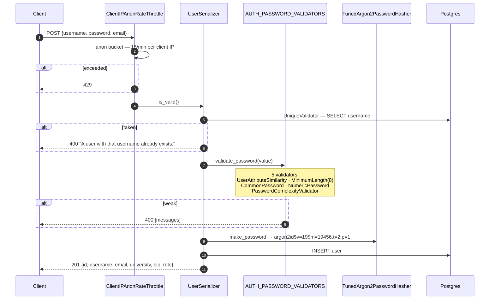

**Stage breakdown**

| Stage | Detail |
|---|---|
| Request | JSON body; `username`, `password`, `email` |
| Authentication | none (`AllowAny`) |
| Business logic | `UserSerializer.validate_password` explicitly invokes Django's validator chain |
| Database | 1 uniqueness SELECT + 1 INSERT |
| Caching | throttle history only |
| Response | 201 with the created user; **the password is never echoed** |

⚠️ **The landmine this endpoint already stepped on.** `AUTH_PASSWORD_VALIDATORS` is
configured in `settings.py`, but **DRF does not wire it in automatically.** Before
`validate_password()` existed on the serializer, every validator was dead configuration and
registration accepted literally any password. The serializer comment records this so nobody
"simplifies" it away:

```python
# AUTH_PASSWORD_VALIDATORS is configured in settings but nothing
# calls it unless a serializer does so explicitly — DRF does not
# wire this in automatically.
```

This endpoint is also an intentional **username-enumeration oracle** — a duplicate username
returns a distinct 400. That is standard registration UX; the mitigation is the throttle,
not concealment.

### 5.2 `POST /api/token/` — `ThrottledTokenObtainPairView` 🔓 ⏱ auth

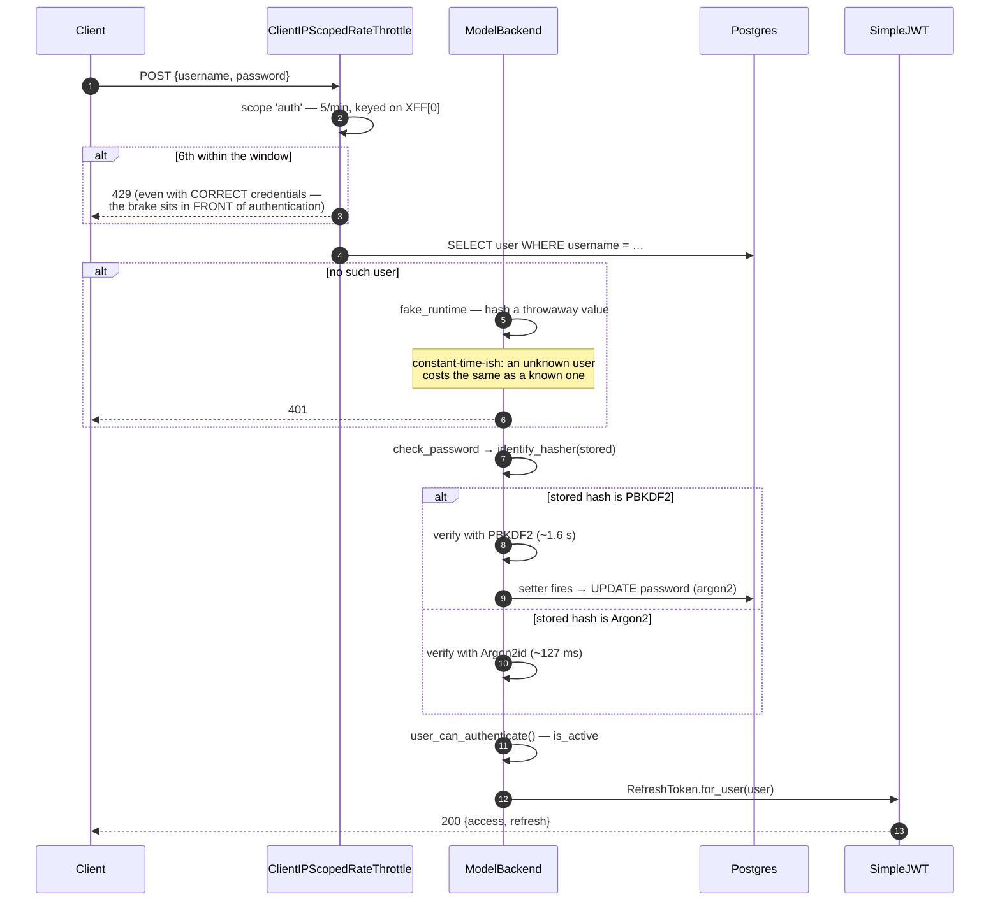

**Two behaviours worth internalising.**

**Transparent rehash.** `AbstractBaseUser.check_password` accepts a setter that Django calls
when `hasher_changed → must_update`. The account is upgraded to Argon2 and saved with
`save(update_fields=["password"])` — no reset email, no bulk migration, no user-visible step.

**Rehash precedes the `is_active` check.** `ModelBackend.authenticate()` evaluates
`user.check_password(password) and self.user_can_authenticate(user)`. Python's `and`
short-circuits left to right, so `check_password` — carrying the rehash setter — runs
**first**. A *disabled* account presented with the correct password is migrated to Argon2 even
though authentication then fails. Benign, but it means "migrated" ≠ "signed in", which is why
`manage.py password_hash_status` says so explicitly. Pinned by
`test_disabled_account_is_still_rehashed_on_a_correct_password`.

### 5.3 `POST /api/token/refresh/` — `ThrottledTokenRefreshView` 🔓 ⏱ auth-refresh

A **separate bucket** from login, at 30/min. The reasoning is recorded in the frozen spec:
refresh presents an existing token rather than guessable credentials, so it is not a
credential-guessing surface — and behind a shared NAT, routine hourly refresh traffic from
many users must never starve sign-ins. A shared bucket would let ordinary usage lock out
logins.

No database write. Verifies the refresh signature and mints a new access token.

### 5.4 `POST /api/auth/google/` — `GoogleAuthView` 🔓 ⏱ auth 🌐

```mermaid
sequenceDiagram
    autonumber
    participant C as Client (Google Identity Services)
    participant V as GoogleAuthView
    participant G as Google public keys
    participant DB as Postgres
    participant J as SimpleJWT

    C->>V: POST {credential: "<Google ID token>"}
    V->>V: throttle scope 'auth' — SAME bucket as password login
    alt credential missing
        V-->>C: 400
    end
    alt GOOGLE_CLIENT_ID unset
        V-->>C: 503 "not configured" + logger.error
        Note over V: fails LOUDLY — misconfiguration<br/>must not look like success
    end
    V->>G: verify_oauth2_token(credential, audience=GOOGLE_CLIENT_ID)
    alt bad signature / expired / wrong audience
        G-->>V: ValueError
        V-->>C: 401 "Invalid Google credential"
    end
    G-->>V: payload {email, email_verified, …}
    alt email missing
        V-->>C: 400
    else email_verified false
        V-->>C: 401
    end
    V->>DB: BEGIN; SELECT user WHERE email ILIKE …
    alt no local account
        V->>DB: INSERT user(username=_unique_username_from_email(email))
        V->>DB: set_unusable_password() → UPDATE
    end
    V->>DB: COMMIT
    V->>J: RefreshToken.for_user(user)
    J-->>C: 200 {access, refresh, created}
```

**Design decisions, each load-bearing:**

- **The frontend is never trusted to assert identity.** The ID token's signature and
  *audience* are verified against Google's public keys server-side. A client that fabricates
  a token, or replays one minted for a different application, fails the audience check.
- **Email is the join key.** A Google sign-in matching an existing local account reuses it,
  so a user who registered with a password can later sign in with Google and reach the same
  account.
- **`set_unusable_password()`**, not a random password. Django stores a `!` sentinel;
  `check_password` against it always returns `False`. There is no local secret to guess,
  leak, or brute-force. The 6 SSO accounts in production hold exactly this.
- **Same `auth` throttle scope as password login** — otherwise SSO becomes an unthrottled
  side-door around the brute-force brake. Pinned by
  `test_google_login_is_rate_limited_same_scope_as_password_login`.
- **`_unique_username_from_email`** sanitises with `[^\w.@+-]` to satisfy Django's
  `UnicodeUsernameValidator` (an email local-part may legally contain characters a username
  may not), truncates to 140 characters to leave room for a numeric suffix under the
  150-character limit, and loops until unique.
- **503 when unconfigured**, pinned by `test_unconfigured_server_fails_loudly_not_silently`.
  The failure mode being prevented: accepting tokens with no audience check.

---

## 6. Dashboard APIs

### 6.1 `GET /api/dashboard/bootstrap/` — `DashboardBootstrapView` 🔒 💾

The single most consequential *frontend-visible* performance change in the project.

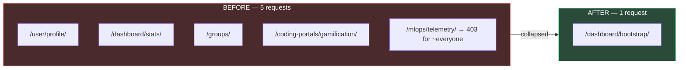

The module docstring states the reasoning precisely:

> On a CPU-constrained single instance, requests fired "in parallel" from the browser still
> queue for the same limited compute — 5 requests pay the per-request tax 5 times even
> though the browser dispatched them together.

**Stage breakdown**

| Stage | Detail |
|---|---|
| Request | `GET`, Bearer token |
| Authentication | `IsAuthenticated` → 1 user SELECT |
| Business logic | assembles stats + groups + gamification + badges |
| Database | 7 queries |
| Caching | reads/writes `gamification_leaderboard_top3` (60 s) — **same key as `GamificationDashboardView`** |
| Response | one combined JSON payload |

Two query-shaping details worth copying elsewhere:

```python
.annotate(members_count=Count("members", distinct=True))
.only("id", "name", "capacity")[:4]
```

The full `/groups/` endpoint nests every member's serialized user object purely so the
frontend can call `.length` on the array. `annotate()` gets the same number **without
materialising those rows at all**, and `.only()` keeps the column set minimal.

The view deliberately **duplicates** a few small, stable queries from `groups/views.py` and
`groups/coding_views.py` rather than importing across view modules — so it can be deleted
later without touching them. That is an explicit, documented trade of DRY for deletability.

Measured: p50 **1207 ms → 833 ms** after connection pooling.

### 6.2 `GET /api/dashboard/stats/` and `GET|PUT /api/user/profile/` 🔒

Straightforward. `stats` aggregates group counts; `profile` reads and updates the `User` and
`Profile` rows. Both retained for compatibility with pages that have not migrated to
`bootstrap`.

---

## 7. Coding APIs — the Core Loop

This is the product. Three endpoints carry it: **get a problem → run it → submit it.**

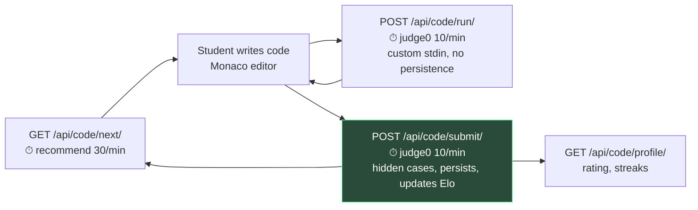

### 7.1 `GET /api/code/next/` — `NextProblemView` 🔒 ⏱ recommend 💾

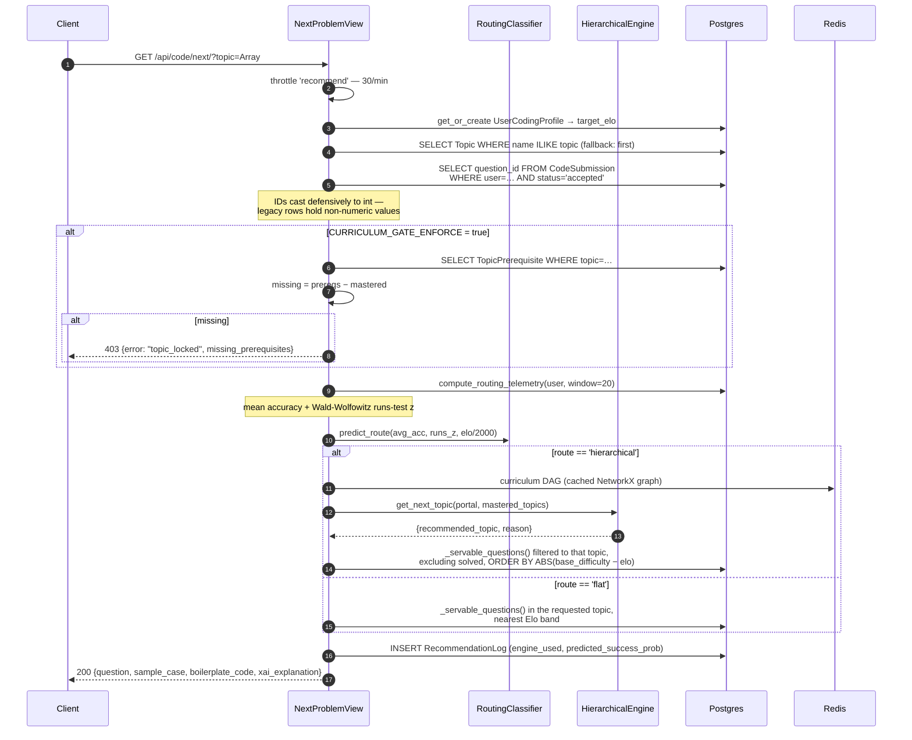

**The `_servable_questions()` double quarantine.** Two independent classes of bad content
must never reach a student:

```python
return Question.objects.exclude(
    content__icontains=Question.PLACEHOLDER_MARKER
).exclude(hidden_test_cases=[]).exclude(hidden_test_cases__isnull=True)
```

1. **Placeholder rows** — generated but never filled with a real description.
2. **~1,100 CSV-imported rows** that carry a genuine description but **zero test cases**.
   These are the dangerous ones: they *look* seeded, so the reseed pipeline skips them, and
   serving one yields an empty sample case followed by a guaranteed submit failure.

Both stay invisible until the content pipeline arms them. This is content safety enforced at
the query layer rather than trusted to data hygiene.

**Hidden test cases are never sent to the client.** The response carries `sample_case` only —
frozen-spec mandate #3, and the reason `hiddenTestCases` survives in the codebase as what the
spec calls "the cautionary fossil" of camelCase JSON.

**The mastery definition was once unsatisfiable.** The DAG route originally gated on
per-topic `elo_rating >= 1300`, but per-topic Elo is **never updated anywhere** — so the
condition could never be met and the DAG recommended the root topic forever. It now uses the
shared definition: `accuracy >= 0.8` over at least 3 reviews.

**`CURRICULUM_GATE_ENFORCE` is staged off.** The gate is computed and returned but not
enforced in production, deliberately: flipping request behaviour immediately before a demo
window was judged the wrong risk. The frontend already prevents starting a locked topic.

### 7.2 `POST /api/code/run/` — `CodeRunView` 🔒 ⏱ judge0 🌐

The "Run" button. Executes against **user-supplied stdin**, persists nothing, updates no
learner state.

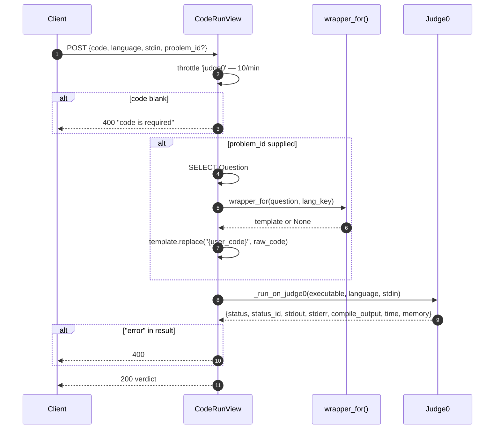

Critically, Run uses **the same alias-aware `wrapper_for()` lookup as Submit**, so the two
paths cannot disagree about which wrapper applies. A student whose code "works" on Run and
fails on Submit for wrapper reasons would have no way to diagnose it.

### 7.3 `POST /api/code/submit/` — `CodeSubmitView` 🔒 ⏱ judge0 🌐 ⚠️

The most complex path in the system. The view itself is a **thin orchestrator**; grading,
persistence, coaching and learning updates live in `groups/services.py`. The call order is
the behavioural contract.

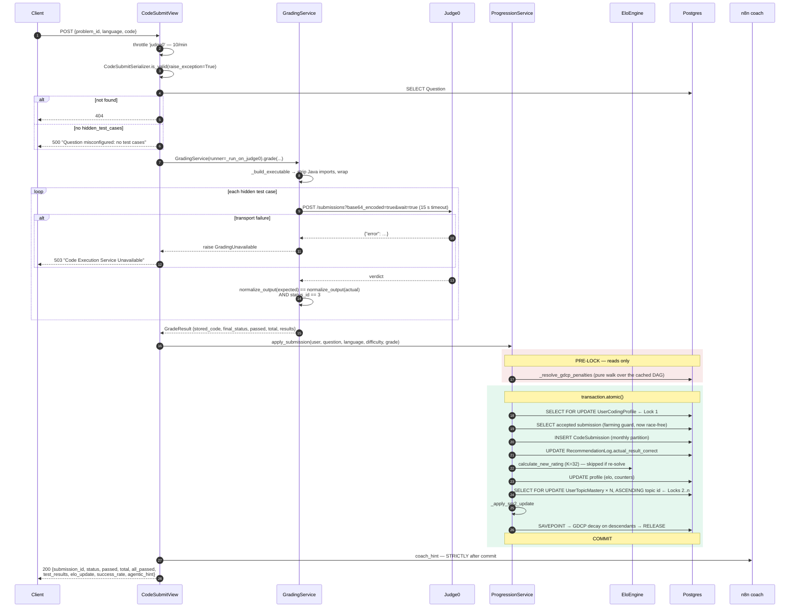

#### 7.3.1 Grading detail

**Java imports are stripped before wrapping *and* before storage:**

```python
if lang_key == "java":
    raw_code = re.sub(r'^\s*import\s+.*?;', '', raw_code, flags=re.MULTILINE)
```

Imports inside a wrapper cause compile errors. `GradeResult.stored_code` is the *stripped*
source, and the dataclass comment flags this as "a detail the extraction must not silently
change" — persisting the pre-strip source would mean the stored code is not what ran.

**Comparison is normalised then status-checked:**

```python
ok = (actual_norm == expected_norm) and verdict.get('status_id') == 3
```

Both conditions. Matching output from a non-zero exit is not a pass.

**Final status is derived by scanning, not defaulting:**

| `status_id` | Meaning | `final_status` |
|---|---|---|
| 3 | Accepted | `accepted` (only if all cases pass) |
| 5 | Time limit exceeded | `time_limit` |
| 6 | Compilation error | `compile_error` |
| 7–12 | Runtime errors (SIGSEGV, SIGXFSZ, SIGFPE, SIGABRT, NZEC, other) | `runtime_error` |
| otherwise | — | `wrong_answer` |

⚠️ `status_id` **must** be carried through into each per-case result. Without it the scan
finds nothing and every non-pass collapses to `wrong_answer` — TLE, compile errors and
crashes all reported as "wrong answer". The code comment says exactly this.

**AI-generated test cases contain literal `\n`:**

```python
tc.get('stdin', '').replace('\\n', '\n')
```

#### 7.3.2 The transaction, and why it is shaped this way

| Phase | Operation | Why here |
|---|---|---|
| Pre-lock | Judge0 calls (all of them) | ⚠️ network calls are **forbidden** inside the lock — holding a row lock across a multi-second third-party call would serialise the whole user base behind the slowest request |
| Pre-lock | `_resolve_gdcp_penalties` | pure walk over the cached graph; reads no learner state, so no lock is needed |
| Lock 1 | `SELECT FOR UPDATE` profile | the per-user serialisation point |
| Under lock | Elo farming guard | ⚠️ **must** be inside — a concurrent first solve has either committed (visible) or is blocked behind us. Outside the lock, two simultaneous first solves could both earn rating |
| Under lock | `INSERT CodeSubmission` | routed to its monthly partition |
| Under lock | close the flywheel | `RecommendationLog.actual_result_correct = all_passed` — this is the label the routing classifier trains on |
| Locks 2..n | mastery rows, **ascending topic id** | ⚠️ fixed order is the deadlock preclusion |
| Savepoint | GDCP decay | best-effort enrichment; a failure rolls back only this savepoint, never the submission |
| Post-commit | coach webhook | network again — must be outside |

**The Elo farming guard:**

```python
if all_passed and already_solved:
    elo_result = {..., "rating_change": 0.0,
                  "insight": "✅ Solved again! Repeat solves keep your memory fresh but don't change your rating."}
```

Re-solving is *legitimate spaced repetition* — mastery and HLR still update — but it must not
farm rating. The distinction between "this action is disallowed" and "this action is allowed
but does not score" is the right one for a learning product.

### 7.4 `_run_on_judge0` — the transport

```python
payload = {
    "source_code":    base64.b64encode(source_code.encode()).decode(),
    "language_id":    LANGUAGE_IDS[language.lower()],
    "stdin":          base64.b64encode(stdin.encode()).decode() if stdin else "",
    "base64_encoded": True,
    "wait":           True,
}
```

| Language | Judge0 ID |
|---|---|
| python | 71 |
| java | 62 |
| cpp | 54 |
| c | 50 |
| js / javascript | 63 |

⚠️ Both `js` **and** `javascript` map to 63. The serializer validates `javascript` while the
map originally held only `js`, so **every JavaScript submission failed with "Unsupported
language"**. Two spellings of one language, in two places, disagreeing.

`JUDGE0_HOST` and `JUDGE0_BASE` are config-driven, and the host header **must** match the
RapidAPI product the key is registered for — `settings.py` once defaulted to
`judge0-extra-ce` while this module hardcoded `judge0-ce`.

Timeout 15 s. `requests.Timeout` and `RequestException` both return `{"error": …}`, which
`GradingService` converts to `GradingUnavailable` → **503**. Base64 decoding of Judge0's
response fields is defensive (`errors='replace'`, falling back to the raw value).

### 7.5 Remaining coding endpoints

| Endpoint | Behaviour |
|---|---|
| `GET /api/code/profile/` 🔒 | `UserCodingProfile` — Elo, submission counts, success rate |
| `POST /api/code/onboard/` 🔒 | seeds initial profile/portal selection |
| `GET /api/coding-portals/` 🔒 | list available portals |
| `GET /api/coding-portals/gamification/` 🔒 💾 | leaderboard (shared 60 s cache key) + badges |
| `GET /api/mlops/telemetry/` 🔒 staff | model telemetry; 403 for non-staff — which is *why* it was removed from the dashboard bootstrap |

---

## 8. AI APIs

All five call an external model provider and therefore have a latency floor set by someone
else's infrastructure.

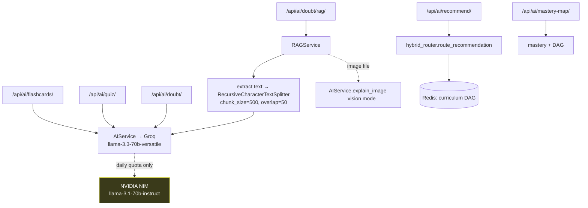

### 8.1 `POST /api/ai/doubt/rag/` — `RAGDoubtView` 🔒 🌐

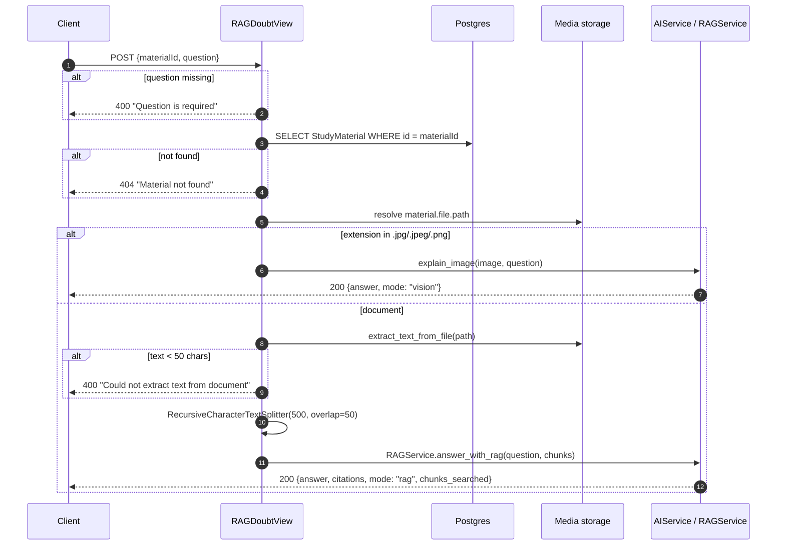

Two distinct modes behind one endpoint, dispatched on file extension. The `mode` field in the
response tells the client which path ran — useful, because vision answers have no citations.

⚠️ **Chunking happens per request.** The document is re-read from disk, re-extracted and
re-split on every question. There is no persisted chunk index. `Document.feature_vector`
(`VectorField(512)`) exists for the visual-search path but is not used here. On the serialised
worker this is a genuinely expensive endpoint, and it is a natural Milestone 4 target.

### 8.2 `POST /api/ai/recommend/` and `GET /api/ai/mastery-map/` 🔒 💾

`HybridRouterView` exposes `route_recommendation()` directly; `MasteryMapView` returns nodes
with `mastered / unlocked / depth / accuracy_pct / effective_mastery`. Both read the
Redis-cached curriculum DAG. Document 3 covers the routing internals.

### 8.3 `GET /api/review/queue/` — `ReviewQueueView` 🔒

Spaced-repetition queue: topics whose HLR-estimated retention has decayed below threshold.

⚠️ `calculate_decay` and `send_spaced_repetition` are **not scheduled** (Document 1 §14.2),
so the decay this queue reads is only as fresh as the last manual invocation.

---

## 9. Visual Search APIs

| Endpoint | Behaviour |
|---|---|
| `POST /api/visual-search/upload/` 🔒 | ingest an image/document; extract features into `Document.feature_vector` (512-dim) |
| `POST /api/visual-search/query/` 🔒 | pgvector similarity search over stored vectors |

Both carry `ClientIPUserRateThrottle` + `ClientIPAnonRateThrottle` explicitly. Embeddings come
from Gemini `text-embedding-004`; when the key is absent, search degrades rather than erroring.

---

## 10. Study Group & Material APIs

Two DRF `ModelViewSet`s registered on a `DefaultRouter`, giving the standard six routes each.

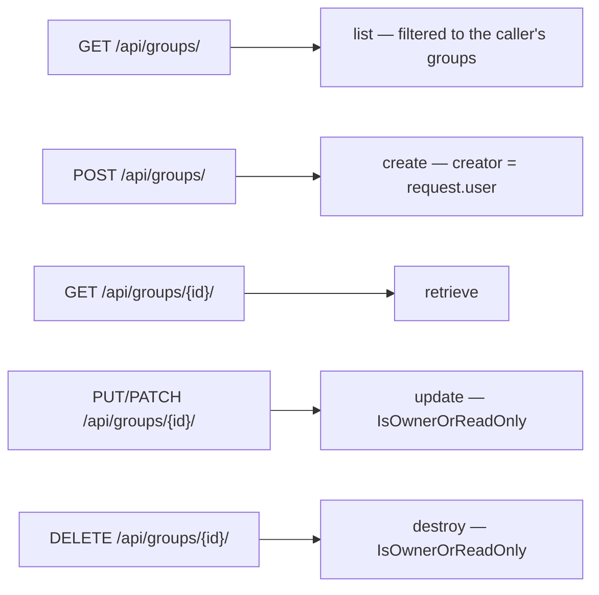

`MaterialViewSet` additionally runs `extract_images_from_document()` on upload, feeding the
visual-search index.

⚠️ **The N+1 that `bootstrap` exists to avoid.** `StudyGroupSerializer` nests every member's
serialized user object. The dashboard only needed `members.length`, so it was paying full
serialization of every member of every group to compute an integer. See §6.1.

Two extra non-router routes: `/groups/<id>/members/` and `/groups/<id>/messages/` (WebSocket
chat backfill, so a client joining a room can render history before the socket delivers
anything).

---

## 11. Social & Messaging APIs

| Endpoint | Flow |
|---|---|
| `GET /api/users/search/` 🔒 | username/email search for the add-friend UI |
| `POST /api/friends/request/` 🔒 | create a `Connection` in `pending` |
| `POST /api/friends/request/<id>/action/` 🔒 | accept/reject — validates the caller is the *recipient* |
| `GET /api/friends/` 🔒 | accepted connections in both directions |
| `GET /api/messages/friends/` 🔒 | conversation list |
| `GET|POST /api/messages/<friend_id>/` 🔒 | thread read/write |

`Connection` is directional in storage (`from_user` → `to_user`) but symmetric in meaning, so
every friend query is an `OR` across both columns. That asymmetry is the usual source of bugs
in this area — a query that checks only one direction silently loses half the friend list.

---

## 12. Quiz & Analytics APIs

| Endpoint | View class | Notes |
|---|---|---|
| `POST /api/quiz/save/` | `QuizResultCreateView` | generic `CreateAPIView` |
| `POST /api/quizzes/assign/` | `AssignedQuizCreateView` | assign to a group |
| `GET /api/quizzes/assigned/` | `ListAssignedQuizView` | caller's assignments |
| `GET|PUT|DELETE /api/quizzes/assigned/<pk>/` | `ManageAssignedQuizView` | `RetrieveUpdateDestroyAPIView` |
| `GET /api/analytics/charts/` | `analytics_data` (function view) | aggregates for dashboard charts |

These use DRF generics almost verbatim — the right choice, and worth noting precisely because
there is nothing clever here. Not every endpoint needs to be interesting.

---

## 13. Settings, Schedule, Notifications

| Endpoint | Notes |
|---|---|
| `GET|PUT /api/settings/profile/` 🔒 | profile preferences |
| `POST /api/settings/email/` 🔒 🌐 | sends a test email via `EMAIL_HOST_*` |
| `GET|POST /api/schedule/` 🔒 | `StudySession` CRUD |
| `GET|POST /api/notifications/` 🔒 | list/mark-read; the write side also pushes over `ws/notifications/` |

---

## 14. Observability APIs

### 14.1 `GET /healthz` 🔓 — the deployment health check

```python
def healthz(request):
    try:
        with connection.cursor() as cursor:
            cursor.execute("SELECT 1")
            cursor.fetchone()
    except Exception:
        return JsonResponse({"status": "unhealthy", "database": "unreachable"}, status=503)
    return JsonResponse({"status": "ok"})
```

Plain Django — **no DRF, no throttle, no authentication**. It is `healthCheckPath` in
`render.yaml` and the target of the warm-keeper.

**It round-trips the database on purpose.** A health check that only proves Python is running
is a health check that lies. The cost is that pinging it keeps Neon awake and consumes Neon's
compute budget — an accepted trade, because a Neon wake costs seconds and a Render wake costs
~93 s.

Production p50: **391 ms** (was 699 ms before connection pooling). The DB stage specifically:
**109 ms**, down from 421 ms.

### 14.2 `GET /api/health/` 🔓 — `HealthCheckView`

```python
permission_classes = []   # Publicly accessible for automated checkers
throttle_classes  = []
```

A second, DRF-flavoured health endpoint. Both `permission_classes` and `throttle_classes` are
explicitly emptied — a throttled health check would report the service down under exactly the
load where you most need the truth.

---

## 15. WebSocket Consumers

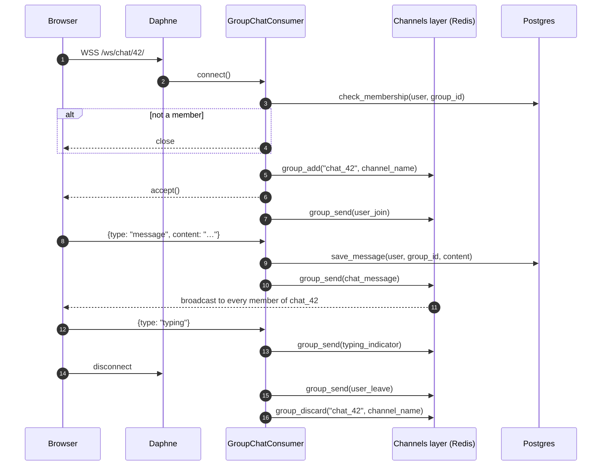

| Consumer | Route | Group key | Handlers |
|---|---|---|---|
| `GroupChatConsumer` | `ws/chat/<group_id>/` | `chat_<id>` | `chat_message`, `user_join`, `user_leave`, `typing_indicator` |
| `NotificationConsumer` | `ws/notifications/` | per-user personal group | push |
| `CodeCollabConsumer` | `ws/code/<group_id>/` | `code_<id>` | collaborative edit broadcast |

**Membership is authorised at `connect()`, before `accept()`.** A non-member's socket is
closed rather than joined — authorisation happens once at handshake rather than per message.

**Redis is not optional here.** The Channels layer carries `group_send` between processes.
With the in-memory fallback, a message published by one process is invisible to sockets held
by another — today that is masked by there being exactly one process, and it will break
silently the moment a second is added.

`check_membership`, `save_message` and `get_chat_history` are sync ORM calls wrapped for the
async consumer — the standard Channels pattern.

---

## 16. Error Contract

| Status | Meaning | Emitted by |
|---|---|---|
| 200 / 201 | success | all |
| 400 | validation failure | serializers; `{"error": "…"}` or DRF's field-keyed dict |
| 401 | bad/absent/expired credentials | JWT auth, `/token/`, `/auth/google/` |
| 403 | authenticated but not permitted | `IsOwnerOrReadOnly`, staff-only, `topic_locked` |
| 404 | resource absent | `Question`, `StudyMaterial`, … |
| 415 | unsupported media type | file-upload endpoints |
| **429** | throttled | `ClientIP*` throttles; includes `Retry-After` |
| 500 | server fault | includes **`Question misconfigured: no test cases`** ⚠️ |
| **503** | dependency unavailable | `GradingUnavailable`, `/healthz` DB down, Google unconfigured |

⚠️ **Inconsistency worth fixing.** A question with no test cases returns **500**, but it is a
data-integrity problem, not a server fault — the client can do nothing with it and it pollutes
error metrics. It should be a 409 or 422. Left as-is here because Document 2 documents the
system, and changing behaviour is out of scope; logged in §18.

Error *shape* is also inconsistent: hand-written views emit `{"error": "..."}` while DRF
serializer failures emit `{"field": ["message"]}`. The frontend handles both. A uniform
envelope would be a reasonable Milestone 4 item.

---

## 17. Per-Endpoint Performance Profile

Production p50, measured post-Milestone 3 (Document 6 has methodology).

| Endpoint | Queries | External | p50 | Dominated by |
|---|---|---|---|---|
| `/healthz` | 1 | — | **391 ms** | network + one DB round-trip |
| 404 (unrouted) | 0 | — | **281 ms** | pure network floor |
| `/api/token/` | 1 | — | **551 ms** | Argon2 (~127 ms) + DB + Redis |
| `/api/token/refresh/` | 0 | — | **473 ms** | JWT verify + network |
| `/api/register/` | 2 | — | **~1100 ms** | 5 validators + Argon2 + INSERT |
| `/api/dashboard/bootstrap/` | 7 | — | **833 ms** | query count |
| `/api/code/next/` | ~16 | — | **1221 ms** | query count + routing |
| `/api/code/run/` | 0–1 | Judge0 ×1 | **~1283 ms** | Judge0 |
| `/api/code/submit/` | ~10 | Judge0 ×N | **N × Judge0 + txn** | Judge0 fan-out |
| `/api/ai/*` | 1–3 | LLM ×1 | **seconds** | provider |

**Marginal cost of one additional query: ~33 ms.** That single number explains most of the
optimisation work in this codebase — five dashboard requests were not five times a network
round-trip, they were five times the *whole* per-request tax on a queue that does not
parallelise.

---

## 18. Gotchas and Landmines

Recorded so nobody rediscovers them at cost.

| # | Landmine | Where |
|---|---|---|
| 1 | `AUTH_PASSWORD_VALIDATORS` does nothing unless a serializer calls `validate_password()` explicitly. It was dead configuration once. | `serializers.py` |
| 2 | `status_id` must be carried into per-case results, or TLE/compile/runtime errors all collapse to `wrong_answer`. | `services.py` |
| 3 | `js` and `javascript` both map to Judge0 ID 63. The serializer validates one spelling; the map once held only the other. | `coding_views.py` |
| 4 | `JUDGE0_API_HOST` must match the RapidAPI product the key is registered for. | `coding_views.py` |
| 5 | Java imports are stripped **before** wrapping *and* before storage. `stored_code` is the stripped source. | `services.py` |
| 6 | Network calls are forbidden inside the learner-state transaction. Judge0 before, coach after. | `services.py` |
| 7 | Mastery rows must be locked in **ascending topic id**. Any other order risks deadlock. | `services.py` |
| 8 | The Elo farming guard must be **inside** the profile lock or concurrent first solves both score. | `services.py` |
| 9 | Per-topic `elo_rating` is never updated. Any gate depending on it is unsatisfiable. | `hybrid_router.py` |
| 10 | `_servable_questions()` is the only safe base queryset. Bypassing it can serve a question with zero test cases. | `coding_views.py` |
| 11 | A throttle backed by a non-persisting cache is silently inert and its tests still pass (they use LocMemCache). | `throttling.py` |
| 12 | `Connection` is directional in storage, symmetric in meaning — friend queries need `OR` on both columns. | `views.py` |
| 13 | RAG re-extracts and re-chunks the document on every request; no persisted index. | `views.py` |
| 14 | "Question misconfigured" returns 500 for what is a data problem. | `coding_views.py` |
| 15 | Channels' in-memory fallback works only because there is exactly one process. | `settings.py` |

---

*End of Document 2. Document 3 — AI Pipeline — on approval.*
